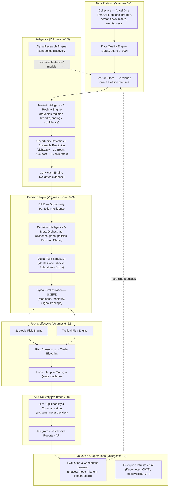
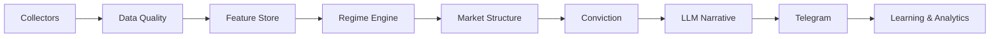
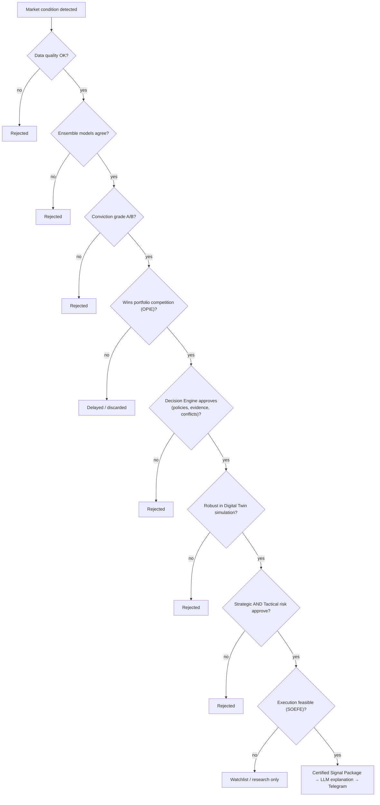

# System Architecture

QuantStack is organized as a layered pipeline of independent engines. Data flows downward from collectors to Telegram delivery; learning flows back upward through evaluation and retraining. Every layer is broker-agnostic, event-driven, versioned, and independently replaceable — the same philosophy used in enterprise software platforms.

## End-to-end architecture

## The nine logical layers

The platform's conceptual model expands the classic five-layer bot design into nine logical layers:

| Layer | Responsibility | Key rule |
|-------|---------------|----------|
| Collectors | Ingest every data source through a uniform lifecycle | Broker-agnostic; standard output schema |
| Data Quality | Score freshness, completeness, latency, reliability | Poor quality automatically reduces conviction |
| Feature Store | Versioned, reproducible features (online + offline) | Engines consume features only from the store |
| Regime Engine | Probabilistic multi-dimensional market state | Blended Bayesian regimes, never hard switches |
| Market Structure | Liquidity, volume profile, auction behavior | Institutional structure over retail indicators |
| Conviction | Weighted evidence scoring with grades | Every score fully explainable |
| LLM Narrative | Explanation, packaging, communication | Explains only — never changes entry/SL/target |
| Telegram Delivery | Signal packages, follow-ups, deduplication | Versioned delivery contract, not free text |
| Learning & Analytics | Outcome evaluation, drift detection, retraining | Deploy only when validation improves |

## Decision flow for a single signal

Every signal must survive a chain of independent gates before reaching a user:

## Core architectural objects

Three structured objects carry state through the pipeline:

1. **Decision Object** — the universal handoff format bundling market state, features, prediction, conviction, opportunity rank, risk, and the final decision with its reasons. Produced by the Meta-Orchestrator, consumed by simulation and risk.
2. **Trade Blueprint** — the executable plan: direction, entry, scaling, position size, stop, targets, management plan, execution plan, failure modes, and simulation summary. Produced by Volume 6, managed by the Trade Lifecycle Manager.
3. **Signal Package** — the delivery payload: instrument, direction, entry/stop/target, risk-reward, confidence, grade, regime, reason codes, and expiration, under a formal versioned Telegram contract. Structured JSON, never natural language.

## Technology foundations

- **Broker**: Angel One SmartAPI behind a broker-abstraction interface (future Zerodha/IBKR adapters swap in without touching business logic).
- **Storage**: PostgreSQL for relational state, Redis for online features and caching, Parquet for offline feature history.
- **ML**: LightGBM, CatBoost, XGBoost, Random Forest ensembles with Bayesian calibration; SHAP for explainability; MLflow/DVC for experiment and data versioning.
- **Messaging**: Event bus with retries, dead-letter queue, idempotency, and tracing; all inter-module communication is event-driven.
- **AI**: Multi-model LLM gateway (fast/reasoning/offline) constrained by governance rules and fact verification against platform evidence.
- **Operations**: Docker → Kubernetes, Terraform IaC, CI/CD with canary/blue-green, OpenTelemetry + Prometheus + Grafana observability.

## Where each layer is specified

| Layers | Specification |
|--------|---------------|
| Foundation, standards, event bus, config | [Volume 1](volumes/volume-1.md) |
| Collectors, broker adapter, data quality | [Volume 2](volumes/volume-2.md) |
| Feature store, registry, drift, replay | [Volume 3](volumes/volume-3.md) |
| Regimes, breadth, analogs, market confidence | [Volume 4](volumes/volume-4.md) |
| Opportunity detection, ensembles, conviction | [Volume 5](volumes/volume-5.md) |
| Research, portfolio, decision, simulation, orchestration, SDK | [Volumes 5.5–5.999](volumes/volume-5-5.md) |
| Risk, dual risk, trade lifecycle | [Volumes 6–6.5](volumes/volume-6.md) |
| LLM explainability and communication | [Volume 7](volumes/volume-7.md) |
| Workspace, delivery channels, dashboards | [Volume 8](volumes/volume-8.md) |
| Evaluation, backtesting, continuous learning | [Volume 9](volumes/volume-9.md) |
| Production infrastructure and operations | [Volume 10](volumes/volume-10.md) |
