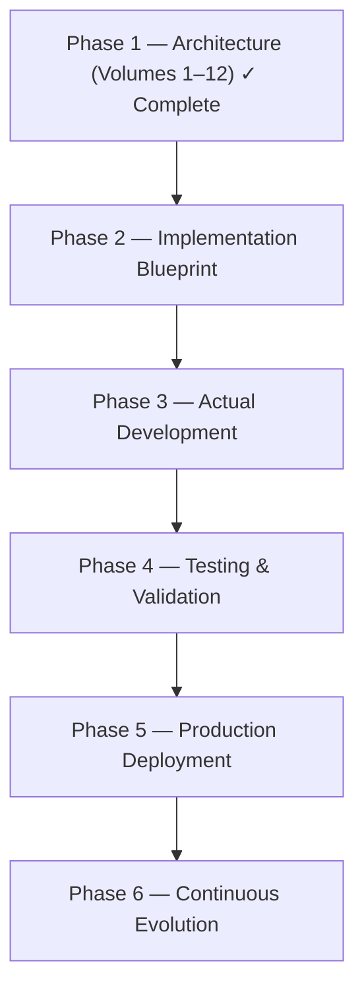
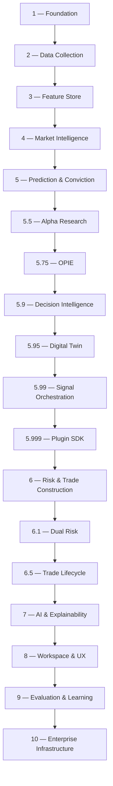

# Implementation Guide

This guide describes how to go from an empty repository to a production platform using the volume specifications. The volumes are written as **engineering design documents**: each contains architecture decisions, folder structures, database schemas, acceptance criteria, and production-ready implementation prompts that can be pasted directly into a coding assistant such as Claude Code.

## Project phases

Architecture design (Phase 1) is complete — it is this documentation. Implementation follows:



## Build order

Implement the volumes strictly in sequence. Each volume ends with **acceptance criteria** that must pass before starting the next — this is the single most important discipline in the whole project.



### Stage 1 — Data platform (Volumes 1–3)

Build the foundation first: repository structure, configuration hierarchy, event bus, broker abstraction, logging, testing pyramid, and the initial database schema ([Volume 1](volumes/volume-1.md)). Then the collector framework with the Angel One SmartAPI adapter and the Data Quality Engine ([Volume 2](volumes/volume-2.md)), and finally the versioned online/offline Feature Store with drift detection and historical replay ([Volume 3](volumes/volume-3.md)).

!!! warning "Do not skip ahead"
    Every ML model, conviction score, and Telegram signal depends entirely on the quality of collected data. **Bad collectors → bad features → bad ML → bad signals.**

### Stage 2 — Intelligence (Volumes 4–5.5)

Market regime detection, breadth, sector rotation, analogs, and the Market State Report ([Volume 4](volumes/volume-4.md)); then the prediction core — opportunity detection, ensemble models, calibration, and the Conviction Engine ([Volume 5](volumes/volume-5.md)); then the sandboxed Alpha Research Engine that keeps discovering new signals ([Volume 5.5](volumes/volume-5-5.md)).

### Stage 3 — Decision layer (Volumes 5.75–5.999)

Portfolio-level ranking of opportunities ([5.75](volumes/volume-5-75.md)), the Meta-Orchestrator that centralizes every decision ([5.9](volumes/volume-5-9.md)), Digital Twin stress-testing ([5.95](volumes/volume-5-95.md)), signal readiness and execution feasibility ([5.99](volumes/volume-5-99.md)), and the plugin SDK that freezes the architecture ([5.999](volumes/volume-5-999.md)).

### Stage 4 — Risk and lifecycle (Volumes 6–6.5)

Risk budgeting, position sizing, stop/target optimization, and the Trade Blueprint ([6](volumes/volume-6.md)); independent Strategic and Tactical risk engines with consensus voting ([6.1](volumes/volume-6-1.md)); and the live trade state machine with adaptive management ([6.5](volumes/volume-6-5.md)).

### Stage 5 — Communication and experience (Volumes 7–8)

The LLM explanation layer with governance and fact verification ([7](volumes/volume-7.md)), then multi-channel delivery, dashboards, reports, and the intelligence workspace ([8](volumes/volume-8.md)).

### Stage 6 — Learning and production (Volumes 9–10)

Evaluation of every prediction, decision, and trade with shadow-mode model promotion ([9](volumes/volume-9.md)), then microservices, Kubernetes, CI/CD, observability, security, and disaster recovery ([10](volumes/volume-10.md)).

## Working with the implementation prompts

Each volume contains numbered implementation prompts (e.g. Prompt 3.1–3.18). For each prompt:

1. Paste the prompt into your coding assistant in a fresh session with the repository open.
2. Review the generated code against the volume's coding standards and folder structure.
3. Write/verify tests before moving to the next prompt (the testing pyramid is defined in Volume 1).
4. Only advance to the next volume when its **acceptance criteria** admonitions all pass.

## Cross-cutting rules

These invariants apply at every stage:

- **The LLM never decides.** Entries, stops, targets, and sizes come from deterministic engines; the LLM receives a structured Explainability Package and produces communication only.
- **Everything is scored.** Collectors, features, models, decisions, and signals all carry quality/confidence scores, and low scores propagate into reduced conviction.
- **Everything is versioned and replayable.** Feature snapshots, model versions, decision objects, and market states can be reconstructed at any historical timestamp — this is what makes evaluation and debugging possible.
- **Human in the loop.** Model promotion, plugin approval, and high-impact decisions require human review; the platform delivers signals, the trader decides.

## The three companion books

Beyond the architecture volumes, the roadmap recommends three companion documents to produce during implementation:

| Book | Focus |
|------|-------|
| **A — Implementation Guide** | Repository organization, microservice layout, schemas, event contracts, API specs, Docker Compose, Kubernetes manifests, CI/CD, production checklists, security hardening, step-by-step build order |
| **B — Mathematical Foundation** | Probability, Bayesian inference, time-series analysis, optimization, portfolio theory, information theory, ML algorithms, calibration, Monte Carlo, risk and performance metrics |
| **C — Engineering Playbook** | Coding conventions, review checklists, ADRs, git workflow, release management, incident response, observability standards, documentation standards, performance and scalability patterns |

## Running this documentation site

```bash
pip install mkdocs-material
mkdocs serve        # live-preview at http://127.0.0.1:8000
mkdocs build        # static site in ./site
```
