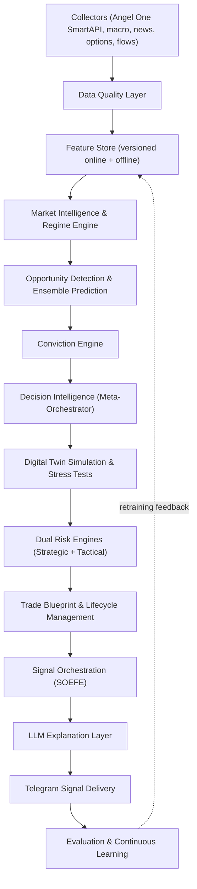

# QuantStack

**The Operating System for Quantitative Market Intelligence**

QuantStack is the complete architecture specification for an **enterprise-grade quantitative intelligence platform**: an AI-powered market research system for Indian markets that continuously collects data, analyzes markets with quantitative methods and machine learning, stress-tests every idea in simulation, and delivers high-quality trading signals — entry, stop loss, target, and reasoning — via Telegram.

!!! warning "Not an automated trading bot"
    QuantStack does **not** place trades. It behaves like an institutional research desk: every signal is fully explained, deterministic trading logic makes all decisions, the LLM only communicates them, and **the final decision always remains with the trader**.

## What the platform does

Instead of asking *"Should I buy?"*, the platform answers:

> "Based on 2,300 features, today's market regime, historical analogs, sector rotation, options positioning, macro conditions, and current market structure, this setup has an 83% probability of success with a 1.9:1 expected reward-to-risk ratio."

## Signal pipeline at a glance

## How this documentation is organized

The specification is delivered as a series of **volumes**, each an implementable engineering design document with folder structures, database schemas, acceptance criteria, and production-ready implementation prompts.

| Volume | Purpose |
|--------|---------|
| [1](volumes/volume-1.md) | Foundation & System Architecture |
| [2](volumes/volume-2.md) | Data Collection & Market Intelligence Layer |
| [3](volumes/volume-3.md) | Feature Store & Data Quality |
| [4](volumes/volume-4.md) | Market Intelligence & Regime Analysis |
| [5](volumes/volume-5.md) | Opportunity Detection, Prediction & Conviction |
| [5.5](volumes/volume-5-5.md) | Alpha Research Engine |
| [5.75](volumes/volume-5-75.md) | Opportunity Portfolio Intelligence (OPIE) |
| [5.9](volumes/volume-5-9.md) | Decision Intelligence & Meta-Orchestrator |
| [5.95](volumes/volume-5-95.md) | Simulation & Digital Twin Engine |
| [5.99](volumes/volume-5-99.md) | Signal Orchestration & Execution Feasibility (SOEFE) |
| [5.999](volumes/volume-5-999.md) | Enterprise SDK & Plugin Ecosystem |
| [6](volumes/volume-6.md) | Risk Intelligence & Trade Construction |
| [6.1](volumes/volume-6-1.md) | Dual Risk Intelligence Framework |
| [6.5](volumes/volume-6-5.md) | Trade Lifecycle & Adaptive Management |
| [7](volumes/volume-7.md) | AI Intelligence, Explainability & Communication |
| [8](volumes/volume-8.md) | Workspace & User Experience |
| [9](volumes/volume-9.md) | Evaluation & Continuous Learning |
| [10](volumes/volume-10.md) | Enterprise Infrastructure |

Start with:

- **[Architecture Review](overview/architecture-review.md)** — the assessment of the original design and the 17 missing institutional-grade components.
- **[Master Blueprint](overview/master-blueprint.md)** — the reorganized phase-by-phase build plan.
- **[Architecture](architecture.md)** — the layered system architecture.
- **[Implementation Guide](implementation-guide.md)** — the recommended build order from empty repository to production.
- **[Roadmap](roadmap.md)** — completed volumes and future productization (SaaS, autonomous quant platform).
- **[Glossary](glossary.md)** — definitions of every platform term.

## Design principles

1. **Deterministic before AI** — entries, stops, targets, and sizes come from testable quantitative logic; the LLM explains, it never decides.
2. **Modularity** — collectors, engines, and delivery are isolated, broker-agnostic, and independently replaceable.
3. **Measurability** — every collector, feature, model, and signal carries quality, confidence, and freshness scores.
4. **Versioning & reproducibility** — features, models, and decisions are versioned and replayable at any historical timestamp.

## Branding

The platform's recommended product name from the design sessions is **QuantOS** — *"The Operating System for Quantitative Market Intelligence"* — with **QuantStack** suggested for an open-source distribution. This repository uses the QuantStack name.
