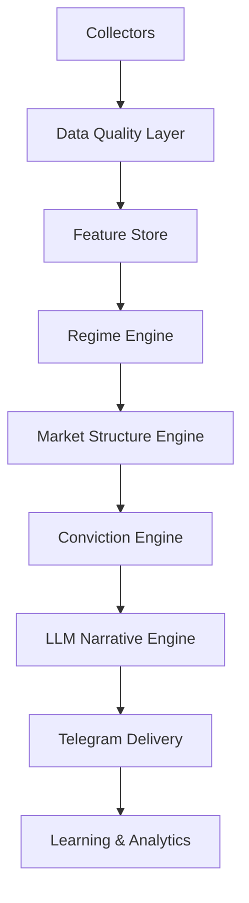

# Architecture Review

The QuantStack specification began as a review of an existing trading-bot prompt chain. The verdict: a very strong foundation — clean separation of data collection, feature engineering, regime detection, ML prediction, LLM explanation, Telegram delivery, and optional execution — but still missing several components required to produce **institutional-quality signals** rather than another indicator bot.

Because the system generates Telegram signals (Entry + SL + Target + Reasoning) and does **not** trade automatically, the design has extra freedom to invest in intelligence quality.

## Overall score

| Component | Score |
|-----------|-------|
| Architecture | 10/10 |
| Separation of concerns | 10/10 |
| Data Collection | 8.5/10 |
| Feature Engineering | 8/10 |
| ML Methodology | 9.5/10 |
| Risk Management | 8/10 |
| Signal Quality | 8/10 |
| Explainability | 10/10 |
| Production Ready | 9/10 |

**Overall: 9/10** — with the additions below, it can become 11/10.

## Biggest weakness: market structure

The original system understood market, macro, news, options, and volatility — but barely understood **market structure**. Institutional traders care far more about liquidity, order flow, participation, volume profile, and auction behavior than about RSI, EMA, or MACD. The original indicator engine was still slightly retail-oriented.

### Redesigned indicator engine

Instead of ATR / EMA / RSI / VWAP / support-resistance, build a **Market Structure Engine**:

- Swing Structure
- Liquidity Zones
- Volume Profile
- VWAP Bands
- Opening Range
- Initial Balance
- Market Profile
- Order Blocks
- Fair Value Gap
- Trend Strength
- Volatility Compression
- Breakout Probability
- Stop Hunt Detection

That alone dramatically improves signal quality.

## The 17 missing components

### 1. Market Breadth Engine

One of the biggest missing pieces: Advance/Decline ratio and line, new highs/lows, sector participation, % of stocks above 20/50/200 EMA, equal-weight vs cap-weight comparison, breadth momentum, and breadth divergence.

!!! example
    Nifty up 1% but only 20% of stocks green → bad rally → avoid longs.

### 2. Sector Rotation Engine

Institutional money rotates. Track Banking, IT, Auto, FMCG, Pharma, Energy, Metal, Realty, PSU, Capital Goods, Infra, and Defence. Measure relative strength, relative momentum, relative volume, relative rotation, and money flow — then score a **Sector Heat Score**. Instead of buying random stocks, buy the strongest stock inside the strongest sector.

### 3. Relative Strength Engine

Compare every stock against Nifty, Sensex, its sector, its industry, and its peers. HDFC up 2% while BankNifty is down is significant.

### 4. Liquidity Engine

Track bid-ask spread, market depth, average traded value, impact cost, delivery %, circuit probability, and auction volume. Avoid signals where liquidity is poor.

### 5. Event Risk Engine

Track far more than RBI/election/IPO: Fed, BoJ, ECB, BoE, US CPI, India CPI/WPI, GDP, PMI, NFP, OPEC, crude inventory, quarterly results, bonus/split/dividend, block deals, F&O/monthly/weekly expiry, holiday effects, budget, SEBI circulars, Supreme Court rulings, war, natural disaster, pandemic, cyber attack, currency intervention. Every event carries **expected volatility, risk level, confidence reduction, signal delay, and trading freeze** attributes.

### 6. Position Quality Engine

Instead of `Conviction = 82`, output an institutional-style **trade grade**: A+, A, B, C, D, Reject.

### 7. Signal Quality Score

Conviction alone is not enough. Add a Signal Quality score from data completeness, feature agreement, regime certainty, model confidence, indicator agreement, LLM agreement, historical similarity, and recent calibration — then report **both** overall confidence and signal quality.

### 8. Historical Analog Engine

Find the most similar days over the last 10 years based on VIX, SPI, breadth, sector, macro, flows, options, news, and regime using nearest-neighbor search:

```text
Current day resembles
2024-08-05  85%
2023-10-18  82%
2022-06-14  81%
```

### 9. Ensemble ML

Don't rely only on LightGBM. Use LightGBM, CatBoost, XGBoost, and Random Forest, and blend **probabilities** instead of predictions.

### 10. Feature Store

Don't recompute features. Build a feature store with feature versioning, training snapshots, and online/offline features. Makes retraining much easier.

### 11. Data Quality Engine

Mandatory: every collector produces freshness, latency, completeness, missing %, API health, confidence, and last-update metrics — and **conviction decreases when data quality decreases**.

### 12. Collector Confidence

Every collector outputs signal, confidence, freshness, latency, reliability, source trust, and historical accuracy — and those become model features too.

### 13. Richer Regime Detection

Replace Calm / Risk-Off / Crude / Rate with: Trending, Mean Reversion, Breakout, High Volatility, Low Volatility, Panic, Recovery, Rotation, Momentum, Distribution, Accumulation, Short Covering, Expiry, News Driven, Macro Driven, Liquidity Crunch.

### 14. Adaptive Thresholds

Don't hard-code `Conviction > 80`. Thresholds depend on regime, sector, volatility, liquidity, time, expiry, and event risk.

### 15. Multi-Timeframe Confirmation

Never rely on the 5-minute chart alone. Compute an agreement score across Daily, 4H, 1H, 15m, 5m, and 1m.

### 16. Learning Loop

The trade log should learn, not just record outcomes. Store the reason for failure — wrong target, wrong stop, late/early entry, macro shock, news, gap, low liquidity, model or indicator disagreement — and retrain from mistakes.

### 17. Explainability Dashboard

Don't only send Telegram messages. Build a dashboard with top SHAP values, feature trends, regime timeline, SPI history, sector heatmap, signal timeline, trade replay, collector health, latency, and model drift.

## Angel One adjustments

- Use **Angel One SmartAPI** for market data and authentication instead of Kite Connect throughout.
- Keep collector interfaces **broker-agnostic** so Angel One can be swapped later.
- Use Angel One for live quotes and historical OHLC; obtain macro data, RBI data, FRED, Yahoo Finance, and NSE/BSE announcements from their own sources.
- Cache market data aggressively and respect API rate limits with retry and backoff.

## Expanded layer architecture

Expand the original five layers into nine logical layers:



This separation makes future improvements — new models, new features, broker changes — much easier.

## Final assessment

The original design was already in the **top 5–10% of retail signal systems** thanks to regime awareness, proper ML validation, explainability, and optional execution. To move toward an institutional-grade research platform, prioritize:

1. Market Structure Engine (volume profile, liquidity, opening range, auction behavior)
2. Market Breadth Engine
3. Sector Rotation Engine
4. Data Quality and Collector Confidence layers
5. Historical Analog Search
6. Feature Store with versioning
7. Ensemble ML instead of a single model
8. Adaptive thresholds based on regime and volatility
9. Continuous learning from trade outcomes
10. A monitoring dashboard for feature health, SHAP, collector status, and model drift

!!! note "The LLM's role"
    These changes improve signal robustness more than adding technical indicators or another LLM. The LLM remains an **explanation and packaging layer**, never the decision-making engine.
