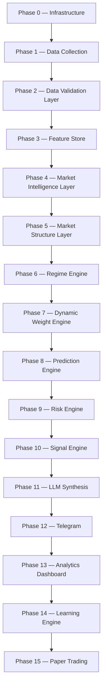

# Master Blueprint

Rather than appending the missing components to the original prompt chain, the specification **reorganizes the entire architecture** so every phase builds cleanly on the previous one — otherwise the result is a monolithic codebase that becomes hard to maintain within months. The blueprint below evolves the original chain into the structure of a professional quantitative research platform.

## Upgraded phase architecture

The original pipeline (Collectors → Normalization → Regime → SPI → Conviction → Indicators → LLM → Telegram) expands into sixteen phases:



This keeps every responsibility isolated and easier to extend.

## New sub-phases

Each sub-phase below was defined as a ready-to-use implementation prompt.

### Phase 2.5 — Data Quality Engine

Validates every collector output before it enters the feature pipeline.

```text
Build a Data Quality Engine that validates every collector output before it
enters the feature pipeline.

Each collector must output:
- freshness
- completeness
- latency
- missing fields
- confidence
- historical reliability
- API response time
- retry count
- source trust score

Generate a final Data Quality Score between 0 and 100.

Signals from collectors with poor data quality should automatically receive
reduced influence inside the Conviction Engine.

Store all validation metrics in a collector_health table.
Generate alerts when any collector begins degrading.
```

### Phase 3.5 — Feature Store

Store every engineered feature separately from raw events, with offline and online features, feature versioning, training snapshots, historical replay, and feature metadata. Each feature carries `feature_name`, `feature_version`, `calculation_timestamp`, a dependency graph, source collectors, and a quality score. The Conviction Engine consumes features **only** from the Feature Store, never directly from collectors.

### Phase 4.5 — Market Breadth Engine

Compute Advance/Decline ratio and line, new highs/lows, % above 20/50/200 EMA, equal-weight vs cap-weight index, sector participation, breadth momentum, and breadth divergence. Output: Breadth Score, Breadth Regime, Breadth Trend, Breadth Confidence.

### Phase 4.6 — Sector Rotation Engine

Track the twelve major Indian sectors (Banking, IT, Auto, Energy, Pharma, FMCG, PSU, Realty, Metal, Capital Goods, Infrastructure, Defence). Compute relative strength, relative momentum, relative volume, money flow, and relative rotation. Generate a sector heatmap, sector strength score, leading/weakening sectors, and sector rotation signals — all additional features for conviction scoring.

### Phase 4.7 — Relative Strength Engine

Compare every stock against Nifty, Sensex, its sector index, its industry index, and its peer group. Generate relative strength, relative momentum, out/under-performance, and a ranking percentile as model features.

### Phase 5.5 — Institutional Market Structure Engine

Replaces the retail indicator engine. Computes swing structure, liquidity zones, volume profile, VWAP bands, market profile, opening range, initial balance, order blocks, fair value gaps, liquidity sweeps, trend strength, volatility compression, breakout probability, stop hunt detection, and auction imbalance. Outputs entry zones, institutional liquidity zones, high-probability reversal zones, breakout probability, structural bias, and a liquidity score.

### Phase 6.5 — Event Risk Engine

Track RBI, Fed, ECB, BoJ, US/India CPI, GDP, PMI, budget, elections, OPEC, FII events, MSCI rebalancing, corporate results, block deals, bonus/split/dividend, IPO, expiry, war, natural disaster, pandemic, and cyber attack. Generate expected volatility, a trading-freeze flag, risk score, confidence reduction, and an event window. Signals inside high-risk windows automatically lose confidence.

### Phase 7.5 — Adaptive Regime Engine

Extend the regime classifier to detect Trending, Range, Mean Reversion, High/Low Volatility, Panic, Recovery, Distribution, Accumulation, Short Covering, Rotation, Expiry, News Driven, Macro Driven, and Liquidity Crunch. Allow **blended regimes**; each regime keeps its own feature weights; use Bayesian probability for smooth transitions instead of hard switching.

### Phase 8.5 — Ensemble Prediction Engine

Train LightGBM, CatBoost, XGBoost, and Random Forest; produce probability estimates from every model; blend with weighted averaging; store individual probability, ensemble probability, model disagreement, and prediction uncertainty. Only high-agreement predictions receive maximum conviction.

### Phase 9.5 — Signal Quality Engine

Compute feature agreement, model agreement, collector agreement, data quality, regime confidence, indicator agreement, and historical similarity into a **Signal Quality Score** graded A+, A, B, C, Reject. Telegram receives only A+, A, and configurable B signals.

### Phase 10.5 — Historical Analog Engine

Search historical market states using nearest-neighbor search, cosine similarity, and dynamic time warping. Output similar dates, similarity scores, historical outcomes, average return, and historical win rate — and pass these analogs to the LLM for richer explanations.

### Phase 11.5 — Learning Engine

Extend trade logging with signal outcome, target hit, stop hit, partial exit, late entry, false breakout, macro shock, news shock, gap risk, liquidity failure, execution delay, model error, and collector failure. Automatically generate failure labels and use them during weekly retraining.

### Phase 12.5 — Dashboard

Display collector health, feature store status, market breadth, sector heatmap, current regime, SPI, conviction timeline, model agreement, SHAP values, signal history, trade outcomes, feature drift, model drift, latency, queue status, Telegram statistics, and system health. Allow **replay of any generated signal**.

### Phase 13.5 — Continuous Retraining

```text
Every weekend:
- Recalculate features
- Retrain models
- Update regime weights
- Recompute SHAP baselines
- Recalibrate thresholds
- Validate against previous versions

Deploy only if:
- Sharpe improves
- Max drawdown decreases
- Calibration improves

Otherwise keep the current production model.
```

## Improvements to existing phases

- **Collectors** — broker-agnostic, so switching from Angel One SmartAPI to another broker only requires replacing adapters, not rewriting business logic.
- **Indicator Engine** — emphasize institutional market structure (volume profile, liquidity, opening range) over retail indicators like RSI; keep ATR and VWAP for risk management.
- **LLM Layer** — explanation only; require structured JSON output; prohibit changing computed entries, stops, or targets.
- **Telegram Layer** — confidence-based routing, message deduplication, signal expiry, and follow-up updates (stop moved to breakeven, target hit, invalidated).
- **Backtesting** — realistic slippage, brokerage, taxes, liquidity constraints, and walk-forward validation rather than only aggregate metrics.

## Additional database tables

| Table | Purpose |
|-------|---------|
| `collector_health` | API uptime, freshness, latency, quality |
| `feature_store` | Online/offline engineered features |
| `feature_versions` | Version tracking and reproducibility |
| `market_breadth` | Breadth metrics over time |
| `sector_rotation` | Sector strength and rotation data |
| `relative_strength` | Stock vs index/sector comparisons |
| `market_structure` | Liquidity zones, volume profile, structural analysis |
| `event_risk` | Upcoming macro/corporate event windows |
| `ensemble_predictions` | Per-model probabilities and uncertainty |
| `signal_quality` | Final quality grades and supporting metrics |
| `historical_analogs` | Similar historical market states |
| `collector_alerts` | Data quality and collector failures |
| `model_versions` | Model lineage, metrics, deployment history |
| `retraining_runs` | Weekly retraining logs and validation results |

## Outcome

With these additions, the roadmap evolves from a feature-rich trading bot into a **modular quantitative research and signal-generation platform**. It stays focused on delivering high-quality Telegram signals with well-justified entries, stops, and targets — while being far more robust, explainable, and maintainable. The LLM acts purely as a communication layer; all critical trading logic remains deterministic and testable.
