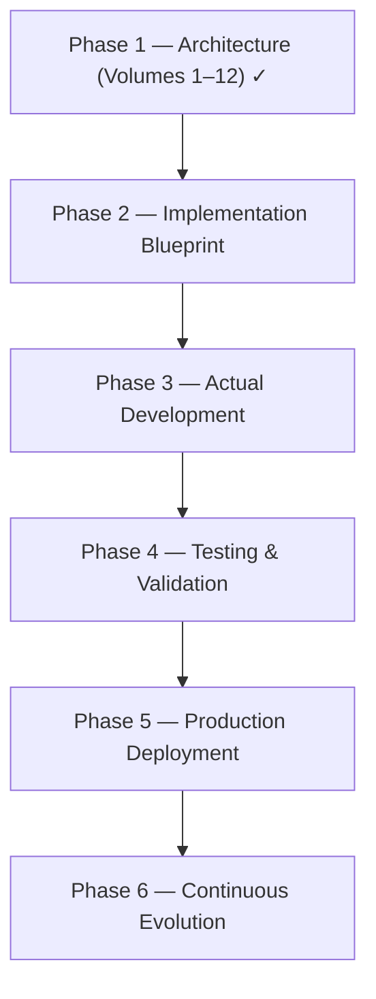

# Roadmap

The core technical architecture is complete. The final roadmap below tracks every architecture volume, the remaining productization volumes, and the recommended companion books.

## Completed architecture volumes

| Volume | Status | Purpose |
|--------|--------|---------|
| [1](volumes/volume-1.md) | ✅ | Foundation & Data Collection Platform |
| [2](volumes/volume-2.md) | ✅ | Data Processing & Market Intelligence Layer |
| [3](volumes/volume-3.md) | ✅ | Feature Store & Data Quality |
| [4](volumes/volume-4.md) | ✅ | Market Intelligence & Regime Analysis |
| [5](volumes/volume-5.md) | ✅ | Opportunity Detection & Prediction |
| [5.5](volumes/volume-5-5.md) | ✅ | Alpha Research Engine |
| [5.75](volumes/volume-5-75.md) | ✅ | Opportunity Portfolio Intelligence |
| [5.9](volumes/volume-5-9.md) | ✅ | Decision Intelligence |
| [5.95](volumes/volume-5-95.md) | ✅ | Digital Twin & Simulation |
| [5.99](volumes/volume-5-99.md) | ✅ | Signal Orchestration |
| [5.999](volumes/volume-5-999.md) | ✅ | Enterprise Plugin SDK |
| [6](volumes/volume-6.md) | ✅ | Risk & Trade Construction |
| [6.1](volumes/volume-6-1.md) | ✅ | Strategic + Tactical Risk |
| [6.5](volumes/volume-6-5.md) | ✅ | Trade Lifecycle Management |
| [7](volumes/volume-7.md) | ✅ | AI Intelligence & Explainability |
| [8](volumes/volume-8.md) | ✅ | Workspace & User Experience |
| [9](volumes/volume-9.md) | ✅ | Evaluation & Continuous Learning |
| [10](volumes/volume-10.md) | ✅ | Enterprise Infrastructure |

## Remaining volumes: productization

Instead of more architecture, the remaining volumes turn the platform into a product.

### Volume 11 — Enterprise SaaS & Platform Operations

A very large volume that transforms the project into a commercial SaaS platform:

- Multi-tenancy, organizations, and team workspaces
- RBAC/ABAC access control and tenant isolation
- Billing, subscription plans, and licensing
- API marketplace and enterprise integrations
- Customer onboarding, support portal, and usage analytics
- White-label deployments, audit & compliance, enterprise administration

### Volume 12 — Autonomous Quant Platform (Future Vision)

The long-term "future lab" — not required for an initial production release:

- AI research agents, AutoML, and neural architecture search
- Reinforcement learning and automated strategy discovery
- Autonomous feature engineering and experiment planning
- Self-healing infrastructure
- Cross-market intelligence, multi-asset trading, global exchange support
- Portfolio optimization and execution algorithms
- Federated and continual learning, knowledge graph expansion

## Companion books

Three books that dramatically increase the project's value:

| Book | Contents | Scale |
|------|----------|-------|
| **A — Implementation Guide** (most important) | Folder structure, repository organization, microservice layout, database schemas, event contracts, API specs, Docker Compose, Kubernetes manifests, CI/CD, coding standards, testing strategy, production checklists, security hardening, step-by-step build order | ~1,000–2,000 pages |
| **B — Mathematical Foundation** | Probability theory, Bayesian inference, statistics, time-series analysis, optimization, portfolio theory, information theory, feature-engineering math, ML algorithms, calibration, Monte Carlo, risk & performance metrics | grounds every model in well-understood methods |
| **C — Engineering Playbook** | Coding conventions, code-review checklists, architecture decision records, git workflow, release management, incident response, observability standards, testing guidelines, documentation standards, performance tuning, scalability patterns, security reviews | keeps the project maintainable as it grows |

## From architecture to product

!!! note "Stop adding architecture"
    The recommendation after Volume 12 is explicit: the highest-value next step is **not more architecture** — it is turning this architecture into an implementation blueprint and building it systematically.

## What this platform has become

The roadmap no longer describes a trading bot or a Telegram signal generator. It is the blueprint for an **enterprise quantitative intelligence platform** supporting institutional-grade data ingestion, quantitative research, machine learning, decision intelligence, simulation, risk management, AI-assisted explainability, enterprise operations, continuous learning, and production-scale deployment.

## Branding

The recommended product name is **QuantOS** — *"The Operating System for Quantitative Market Intelligence"* — chosen for being short, memorable, enterprise-sounding, and extensible into a product family (QuantOS Research, Studio, Cloud, Enterprise, SDK, API, Mobile, Dashboard, Marketplace). Alternatives considered included AlphaCore, NexusQuant, SigmaOS, and AlphaFabric, with **QuantStack** suggested for an open-source edition — the name this repository uses.
