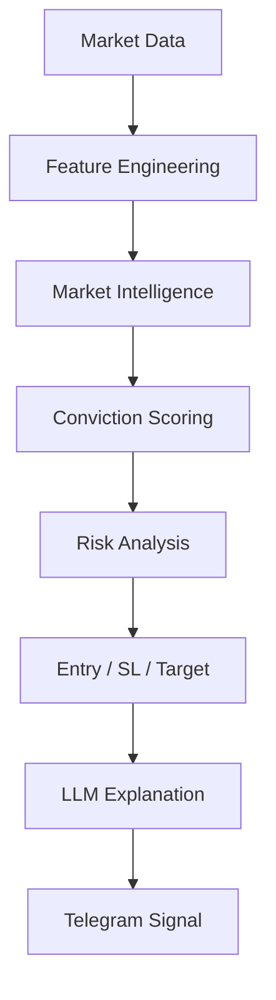
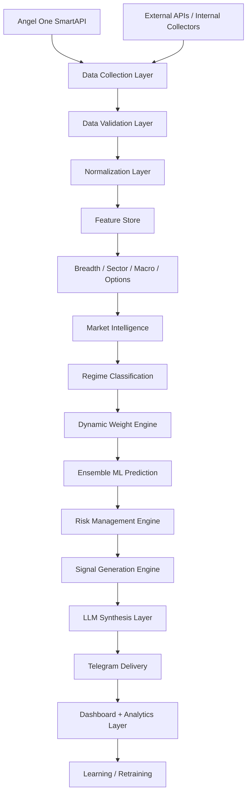

# Volume 1 — Foundation & System Architecture

This volume establishes the engineering foundation for QuantStack, an institutional-grade AI trading signal platform for Indian markets. No application business logic is written at this stage; instead, the volume defines the system philosophy, core architectural principles, technology stack, project structure, database skeleton, and operational standards that every later phase builds on. The platform continuously collects data via Angel One SmartAPI, analyzes markets with quantitative methods and machine-learning ensembles, synthesizes explanations with an LLM, and delivers high-quality trading signals via Telegram.

!!! warning "Not an automated trading bot"
    QuantStack does **not** place trades. It produces research-grade signals with entries, stops, targets, and explanations — the final decision always remains with the trader.

## Signal Pipeline Objective

The end-to-end objective of the platform is a single, auditable pipeline:



## 1. System Philosophy

The system should behave like an **institutional research desk** rather than a retail trading bot.

Instead of asking:

> "Should I buy?"

it should answer:

> "Based on 2,300 features, today's market regime, historical analogs, sector rotation, options positioning, macro conditions, and current market structure, this setup has an 83% probability of success with a 1.9:1 expected reward-to-risk ratio."

## 2. Core Principles

### Principle 1 — Everything is modular

Never allow one module to directly depend on another. Modules are composed in a pipeline:

```text
Collector → Feature Store → Model → Signal Engine
```

Every module communicates **only through interfaces**.

### Principle 2 — Deterministic before AI

Never let the LLM calculate:

- Entry
- Stop
- Target
- Position Size

These must always come from **deterministic mathematical models**. The LLM only explains.

### Principle 3 — Everything is measurable

Every module exposes:

- Latency
- Accuracy
- Confidence
- Health
- Version
- Quality

### Principle 4 — Everything is versioned

Every model, feature, collector, prompt, and configuration must have versions. **Never overwrite history.**

## 3. High-Level Architecture

Data flows from the broker and external sources through validation, normalization, and the feature store, into the intelligence and signal-generation layers, and finally out to delivery and continuous learning:



## 4. Technology Stack

| Layer | Technologies |
|---|---|
| **Backend** | Python 3.12, FastAPI, Uvicorn, SQLAlchemy 2.x, Alembic, Pydantic v2 |
| **Database** | PostgreSQL, Redis, TimescaleDB (optional later) |
| **Scheduling** | APScheduler |
| **Async** | asyncio, httpx, aiofiles, WebSockets |
| **ML** | LightGBM, CatBoost, XGBoost, Scikit-learn, Optuna, SHAP, NumPy, Pandas, Polars (preferred for larger datasets) |
| **Visualization** | Plotly, ECharts, React, Next.js |
| **Deployment** | Docker, Docker Compose, Nginx, GitHub Actions, AWS EC2 — later: Kubernetes |

!!! note "Scheduling policy"
    Never use cron jobs. Every scheduled task should be managed by **APScheduler**.

## 5. Project Structure

Top-level repository layout:

```text
trading-platform/
├── backend/
├── frontend/
├── infrastructure/
├── docker/
├── docs/
├── scripts/
├── tests/
├── configs/
├── notebooks/
├── models/
├── data/
├── logs/
└── feature_store/
```

Backend application layout:

```text
backend/
└── app/
    ├── api/
    ├── collectors/
    ├── core/
    ├── database/
    ├── events/
    ├── features/
    ├── market/
    ├── models/
    ├── prediction/
    ├── risk/
    ├── signals/
    ├── telegram/
    ├── llm/
    ├── scheduler/
    ├── dashboard/
    ├── utils/
    └── tests/
```

## 6. Configuration

Never hardcode. Everything is configurable. Required configuration keys include:

- `APP_NAME`
- `ENVIRONMENT`
- `DATABASE_URL`
- `REDIS_URL`
- `ANGEL_ONE_API_KEY`
- `ANGEL_ONE_CLIENT_ID`
- `ANGEL_ONE_PIN`
- `TELEGRAM_TOKEN`
- `OPENAI_KEY`
- `RATE_LIMITS`
- `CACHE_TIMEOUT`
- `LOG_LEVEL`
- `MAX_RETRY`

Configuration resolution priority (highest first):

1. Environment variables
2. `.env` file
3. `default.yaml`

## 7. Coding Standards

Every service must have:

- One responsibility
- One interface
- One logger
- One configuration
- One unit test folder

!!! note "Size limit"
    No service may exceed roughly 500–700 lines before being split into smaller components.

## 8. Dependency Injection

Never instantiate concrete classes (e.g. `Collector()`) inside services. Instead:

```text
Collector Interface → Dependency Injection → Implementation
```

This allows replacing Angel One later without changing business logic.

## 9. Broker Abstraction Layer

Do **not** call Angel One directly everywhere. All broker access goes through an abstraction:

```text
Broker Interface
    → Angel One Adapter
    → Future Zerodha Adapter
    → Future Interactive Brokers Adapter
```

Business logic never knows which broker is used.

## 10. Event Bus

The event bus is the **observability and audit spine**, not the call path for
scoring. Every intelligence and prediction engine publishes a domain event
(e.g. `intelligence.<name>.assessed`, `ensemble_prediction.result`,
`trade_candidate.generated`) each time it produces a result, so the full
decision history is queryable and consumers (dashboards, alerting, future
async subscribers) can tap in without touching the scoring path. Example
flow of *events emitted*, not function calls:

```text
Price Updated → Normalization → Feature Update → Prediction → Signal → Telegram
```

Within the synchronous scoring pipeline itself (feature engines →
intelligence engines → prediction/ensemble/conviction engines → candidate
generation), modules call each other directly via constructor DI, not
through the bus. This is deliberate: intraday F&O scoring needs a
deterministic, low-latency call chain, and routing it through async
pub/sub would trade that away for a decoupling benefit this system doesn't
need internally. "No module should directly invoke downstream modules"
applies across service/process boundaries (e.g. a future standalone
alerting or portfolio service reacting to published events) — not within
the in-process scoring pipeline.

## 11. Logging Strategy

Every module uses structured logging exclusively:

- `logger.info()`
- `logger.warning()`
- `logger.error()`
- `logger.exception()`

Logs are **structured JSON**. Never `print`.

## 12. Monitoring

Every module exposes:

- Latency
- Memory
- CPU
- Errors
- Queue Length
- API Failures
- Retries
- Health Score

## 13. Error Handling

The standard retry policy for network operations escalates through:

```text
Network → Retry → Exponential Backoff → Circuit Breaker → Fallback → Alert
```

## 14. Security

- Secrets are **never** committed to Git
- Encrypt credentials
- Rotate API keys
- Rate limiting
- Webhook verification
- Input validation
- SQL injection prevention

## 15. Testing Pyramid

Testing proceeds through progressively broader validation stages:

1. Unit Tests
2. Integration Tests
3. End-to-End Tests
4. Paper Trading Validation
5. Live Validation

## 16. Performance Targets

| Metric | Target |
|---|---|
| Market tick processing | < 100 ms |
| Signal generation | < 2 seconds |
| Telegram delivery | < 1 second after signal creation |
| Collector uptime | 99.9% |

## 17. Git Workflow

Branch model:

- `main`
- `develop`
- `feature/*`
- `release/*`
- `hotfix/*`

!!! warning
    Never develop on `main`.

## 18. CI/CD

Each pull request should automatically:

- Run linting
- Run unit tests
- Run integration tests
- Check type hints
- Validate migrations
- Build Docker image
- Generate coverage report

Deployment should occur **only after all checks pass**.

## 19. Initial Database Tables

The foundation creates **empty** tables only; business logic for these tables is implemented in later volumes.

| Domain | Tables |
|---|---|
| Collection & health | `collectors`, `collector_health`, `market_events` |
| Features | `feature_store`, `feature_versions` |
| Market intelligence | `market_regime`, `regime_weights`, `breadth_metrics`, `sector_rotation`, `relative_strength`, `market_structure`, `event_risk` |
| Prediction & signals | `prediction_results`, `signal_quality`, `trade_signals`, `trade_log` |
| Models & learning | `model_versions`, `retraining_runs` |
| Operations | `system_metrics`, `audit_log` |

## 20. Acceptance Criteria

!!! success "Acceptance criteria for Volume 1"
    Before moving to Volume 2, the project should satisfy all of the following:

    - A new developer can clone the repository and start the application with a single command (`docker compose up` or equivalent).
    - FastAPI starts successfully with health-check endpoints.
    - PostgreSQL, Redis, and configuration loading work correctly.
    - Alembic migrations initialize the complete base schema.
    - APScheduler starts and can execute a sample scheduled job.
    - Logging, dependency injection, and broker abstraction are in place.
    - CI runs successfully with basic tests.
    - The project structure and interfaces are stable enough that new collectors and engines can be added without restructuring the repository.

## Next Volume Preview

**Volume 2: Data Collection & Intelligence Layer** will design and implement:

- A generic collector framework
- Angel One SmartAPI adapter
- Market data ingestion
- Macroeconomic collectors
- Options and open-interest collectors
- News ingestion
- Corporate action collectors
- Economic calendar collectors
- Data quality scoring
- Collector orchestration
- Caching, retry, throttling, and observability

This will become the foundation that feeds every downstream intelligence and signal-generation component.
