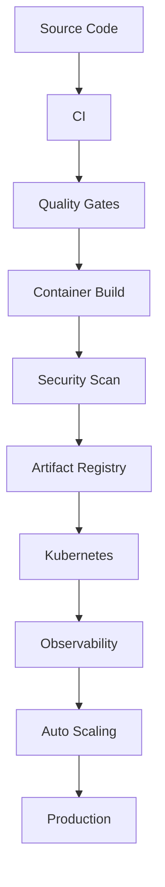
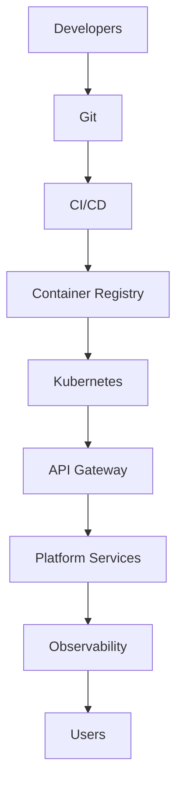

# Volume 10 — Enterprise Infrastructure, Platform Engineering & Production Operations

Volume 10 is the largest engineering volume in the QuantStack roadmap. Where Volumes 1–9 define *what* the platform does — quantitative intelligence, signal generation, AI communication, and continuous learning — this volume defines *how it survives in production*. It covers the full production stack: microservices, Kubernetes, CI/CD, event streaming, secrets management, observability, disaster recovery, security, and cost governance. Completing it transforms QuantStack from a research application into an enterprise-grade quantitative platform capable of supporting thousands of users and continuous AI workloads.

## Mission

Volumes 1–9 created an intelligent quantitative platform. Volume 10 ensures that platform is:

- Scalable
- Reliable
- Secure
- Observable
- Recoverable
- Deployable
- Maintainable

!!! note
    The goal is not simply to "run" the platform. The goal is to operate it like an enterprise SaaS platform that can support thousands of users and continuous AI workloads.

## Core Philosophy

Never deploy the naive way — `FastAPI → Docker → Server`. Instead, every release travels through an automated delivery pipeline:



Everything should be automated.

## Overall Architecture

The platform's end-to-end delivery and serving topology:



Every deployment is reproducible.

## Chapter 1 — Infrastructure Philosophy

Infrastructure is another product. Every infrastructure component should be:

- Versioned
- Tested
- Observable
- Recoverable
- Automated

!!! warning
    Manual production operations should be minimized.

## Chapter 2 — Microservice Architecture

Split the platform into independent services. Each service owns its own API contract. Examples:

| Service | Service |
|---|---|
| Collector Service | Risk Service |
| Feature Service | Trade Service |
| Market Intelligence | LLM Service |
| Prediction Service | Notification Service |
| Decision Service | Dashboard Service |
| Simulation Service | Research Service |
| Authentication | Gateway |

## Chapter 3 — API Gateway

### Prompt 10.1

```text
Build an API Gateway.

Responsibilities:
- Authentication
- Authorization
- Rate Limiting
- Routing
- Caching
- Request Validation
- Versioning
- Monitoring
- Load Balancing
- Audit Logging
```

## Chapter 4 — Container Platform

Every service is containerized.

### Prompt 10.2

```text
Create Docker strategy.

Support:
- Development
- Testing
- Production
- Multi-stage builds
- Image signing
- Image scanning
- Minimal runtime images
- Health checks
```

## Chapter 5 — Kubernetes Platform

### Prompt 10.3

```text
Deploy services using Kubernetes.

Support:
- Deployments
- StatefulSets
- DaemonSets
- Jobs
- CronJobs
- Namespaces
- Ingress
- Network Policies
- Pod Security
- Horizontal Pod Autoscaling
- Vertical Pod Autoscaling
```

## Chapter 6 — Service Mesh

Services should communicate securely.

### Prompt 10.4

```text
Integrate Service Mesh.

Support:
- mTLS
- Traffic Routing
- Retries
- Circuit Breakers
- Canary Releases
- Distributed Tracing
- Traffic Splitting
- Policy Enforcement
```

## Chapter 7 — Event Streaming Platform

Everything important becomes an event.

### Prompt 10.5

```text
Build Event Platform.

Support:
- Kafka
- NATS
- Redis Streams
- Dead Letter Queues
- Replay
- Schema Registry
- Event Versioning
- Event Replay
```

## Chapter 8 — Secrets Management

!!! warning
    Never store secrets in code.

### Prompt 10.6

```text
Implement Secrets Platform.

Support:
- API Keys
- Database Credentials
- Certificates
- LLM Keys
- Broker Tokens
- Automatic Rotation
- Encryption
- Audit Logs
```

## Chapter 9 — Infrastructure as Code

Infrastructure must be reproducible.

### Prompt 10.7

```text
Provision infrastructure using:
- Terraform
- Helm
- Ansible

Support:
- Cloud
- On-Premise
- Hybrid

Version every infrastructure change.
```

## Chapter 10 — CI/CD Platform

Every commit follows the same pipeline:

```text
Commit → Unit Tests → Integration Tests → Security Scan → Build
       → Container Scan → Deploy → Smoke Tests → Production
```

### Prompt 10.8

```text
Implement CI/CD.

Support:
- GitHub Actions
- GitLab CI
- Jenkins
- ArgoCD
- Rollback
- Canary
- Blue-Green Deployment
- Deployment Approval Gates
```

## Chapter 11 — Observability Platform

You cannot improve what you cannot observe.

### Prompt 10.9

```text
Collect:
- Metrics
- Logs
- Traces
- Events
- Profiles

Support:
- Prometheus
- Grafana
- OpenTelemetry
- Jaeger
- Loki
- Alertmanager
```

## Chapter 12 — Reliability Engineering

Implement SRE principles. Track:

| Metric | Meaning |
|---|---|
| SLI | Service Level Indicator |
| SLO | Service Level Objective |
| SLA | Service Level Agreement |
| Error Budget | Allowable unreliability within the SLO |
| MTTR | Mean Time To Recovery |
| MTBF | Mean Time Between Failures |
| Availability | Uptime of the platform |
| Recovery Time | Time to restore service after failure |

## Chapter 13 — Disaster Recovery

Assume failures will happen.

### Prompt 10.10

```text
Support:
- Backups
- Point-in-Time Recovery
- Cross-Region Replication
- Database Failover
- Automatic Recovery
- Runbooks
- Recovery Drills
```

## Chapter 14 — Security Platform

Security is built in. Support:

- OAuth2
- OIDC
- JWT
- RBAC
- ABAC
- MFA
- Audit Trails
- Encryption at Rest
- Encryption in Transit
- API Signing
- WAF
- DDoS Protection

## Chapter 15 — Data Platform

Support the following stores:

- PostgreSQL
- Redis
- ClickHouse
- MinIO
- Elasticsearch/OpenSearch

Implement across all of them:

- Backup policies
- Replication
- Partitioning
- Archiving
- Data retention
- Lifecycle management

## Chapter 16 — Platform Monitoring Dashboard

The platform monitoring dashboard displays:

- Service Health
- CPU
- Memory
- Queue Depth
- Event Throughput
- API Latency
- Error Rates
- LLM Usage
- Prediction Throughput
- Active Trades
- Notification Latency

## Chapter 17 — Operational Runbooks

Create documented procedures for:

- Service restart
- Database failover
- Broker outage
- Exchange outage
- LLM provider outage
- Redis failure
- Kafka failure
- Kubernetes node failure
- Secret rotation
- Incident response

## Chapter 18 — Cost Intelligence

Monitor:

- Cloud costs
- GPU costs
- Storage
- API usage
- LLM token consumption
- Notification costs
- Infrastructure utilization

Generate optimization recommendations.

## Chapter 19 — Platform Governance

Support:

- Change Management
- Release Management
- Configuration Management
- Asset Inventory
- Compliance Reports
- Security Policies
- Audit Reports

## Chapter 20 — Acceptance Criteria

!!! success "Acceptance criteria — before entering Volume 11"
    - All services are containerized.
    - Infrastructure is fully automated through Infrastructure as Code.
    - CI/CD supports safe, repeatable deployments.
    - Services expose health, metrics, logs, and traces.
    - Secrets are centrally managed.
    - Disaster recovery procedures are tested.
    - Security controls are enforced across every service.
    - Cost and operational metrics are continuously monitored.
    - Platform governance and operational documentation are complete.

## Recommended Enterprise Stack

| Layer | Tools |
|---|---|
| Infrastructure | Kubernetes, Docker, Helm, Terraform, ArgoCD |
| Messaging | Apache Kafka, NATS, Redis Streams |
| Observability | OpenTelemetry, Prometheus, Grafana, Loki, Tempo/Jaeger |
| Security | HashiCorp Vault, Keycloak, cert-manager, External Secrets Operator |
| CI/CD | GitHub Actions, ArgoCD, Trivy, SonarQube |
| Databases | PostgreSQL, Redis, ClickHouse, MinIO, OpenSearch |
| AI Infrastructure | vLLM (self-hosted models), Ollama (development), API gateway for commercial LLMs, GPU scheduling with Kubernetes |

## Architectural Observation

At this stage, the roadmap covers the complete lifecycle:

| Volumes | Focus |
|---|---|
| 1–6 | Quantitative intelligence and trading decision systems |
| 7–8 | AI communication and user experience |
| 9 | Continuous evaluation and learning |
| 10 | Enterprise production engineering |

From here onward, the focus shifts from **building the platform** to **operating it as a commercial, enterprise-grade product**. Volume 11 is therefore about productization, governance, and supporting multiple organizations rather than adding new analytical capabilities.

## Preview of Volume 11

Volume 11 introduces **Enterprise Platform Operations & Multi-Tenant SaaS Architecture**. Topics include:

- Organization management
- Multi-tenancy
- Team workspaces
- Subscription plans
- Billing
- API marketplace
- White-label deployments
- Enterprise RBAC
- Compliance
- Customer onboarding
- Licensing
- Usage analytics
- Enterprise integrations
- Support operations

!!! note
    Volume 11 transforms the platform from software you operate into a product that organizations can adopt at scale.
