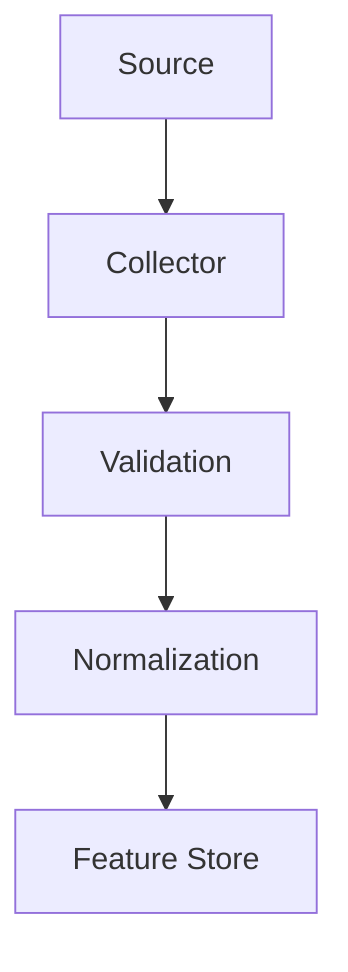
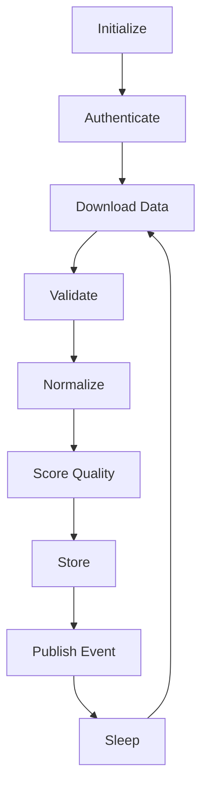

# Volume 2 — Data Collection & Market Intelligence Layer

This volume specifies the heart of QuantStack: a scalable, fault-tolerant, broker-agnostic data collection framework that continuously ingests, validates, normalizes, and stores market intelligence from dozens of heterogeneous sources. Every ML model, conviction score, and Telegram signal downstream depends entirely on the quality of the data collected here — bad collectors produce bad features, bad ML, and bad signals. Institutional firms spend the majority of their engineering effort on reliable market data infrastructure, and this design follows that discipline.

!!! note "Objective"
    Build a scalable, fault-tolerant, broker-agnostic data collection framework capable of continuously ingesting, validating, normalizing, and storing market intelligence from dozens of heterogeneous sources.

---

## Chapter 1 — Data Collection Philosophy

The platform must **never depend on a single API**. Instead, every data source is treated as a **collector** with a common lifecycle:



Every collector must:

- be independent
- be restartable
- have its own schedule
- expose health metrics
- produce standardized output
- never crash the system

---

## Chapter 2 — Collector Architecture

### Collector Categories

Rather than organizing by API vendor, collectors are organized by **market intelligence domain**. Each category owns multiple collectors.

- Market Data
- Options
- Breadth
- Sector
- Macro
- Economic Calendar
- Corporate Actions
- Order Flow
- News
- Sentiment
- Institutional Flow
- Global Markets
- Volatility
- Commodities
- Currency
- Government
- Alternative Data
- Technical Structure
- Liquidity
- Risk Events

---

## Chapter 3 — Collector Lifecycle

Every collector follows exactly the same pipeline. This consistency simplifies monitoring and testing.



---

## Chapter 4 — Standard Collector Interface

Every collector implements the same interface. No collector may bypass this lifecycle.

**Required methods:**

- `initialize()`
- `authenticate()`
- `collect()`
- `validate()`
- `normalize()`
- `calculate_confidence()`
- `publish()`
- `cleanup()`

---

## Chapter 5 — Standard Output Schema

Every collector emits the same normalized structure, which allows downstream components to remain completely agnostic to the original data source.

| Field | Purpose |
|-------|---------|
| `timestamp` | When the observation was made |
| `collector_name` | Identity of the emitting collector |
| `collector_category` | Market intelligence domain |
| `source` | Origin API/feed |
| `instrument` | Instrument the data refers to |
| `exchange` | Exchange identifier |
| `raw_value` | Original value as received |
| `normalized_value` | Standardized value for downstream use |
| `direction` | Directional interpretation of the data point |
| `confidence` | Collector's confidence in the reading |
| `quality_score` | Score assigned by the Data Quality Engine |
| `latency` | Collection latency |
| `freshness` | Age of the data |
| `metadata` | Additional source-specific context |

---

## Chapter 6 — Broker Abstraction

Only the **Market Data Adapter** knows about Angel One SmartAPI. Business logic never imports the broker SDK directly.

```text
Broker Interface
      ↓
Angel One Adapter
      ↓
Market Collectors
```

!!! note
    If the platform switches to another broker in the future, only the adapter changes — the rest of the system is untouched.

---

## Chapter 7 — Collector Scheduling

Do not schedule everything every minute. Refresh rates are defined by data volatility, and each collector owns its own schedule and retry policy.

| Category | Frequency |
|----------|-----------|
| Live price | Tick / WebSocket |
| Options chain | 30–60 sec |
| Breadth | 1 min |
| Sector rotation | 1 min |
| News | 2 min |
| Economic calendar | 30 min |
| Corporate actions | 1 hr |
| RBI | Daily |
| FII/DII | End of day |
| MSCI calendar | Daily |

---

## Chapter 8 — Market Data Collectors

**Objective:** collect raw market information with the lowest possible latency.

### Prompt 2.1 — Angel One SmartAPI Adapter

```text
Design a broker abstraction layer.

Implement a Broker Interface defining methods for:

- authentication
- instrument lookup
- historical candles
- live quotes
- WebSocket streaming
- options chain
- order book
- market depth

Create an Angel One SmartAPI implementation.

The rest of the system must depend only on the Broker Interface and never import SmartAPI directly.

Support automatic token refresh, reconnect logic, exponential backoff, and structured error reporting.

Include comprehensive unit tests using mocked broker responses.
```

### Prompt 2.2 — Live Market Collector

```text
Build a Live Market Collector using the Broker Interface.

Collect:

- LTP
- Open
- High
- Low
- Close
- Volume
- VWAP
- Bid
- Ask
- Bid Quantity
- Ask Quantity
- Market Depth (top 5 levels if available)

Stream data using WebSockets when possible, falling back to REST polling if disconnected.

Publish normalized market events into the event bus.

Persist raw ticks separately from aggregated candles.

Track collector latency, dropped packets, reconnect count, and data freshness.
```

### Prompt 2.3 — Historical Candle Collector

```text
Implement a Historical Candle Collector.

Support:

- 1m
- 3m
- 5m
- 15m
- 30m
- 1H
- Daily

Automatically backfill missing candles after outages.

Ensure no duplicate bars are stored.

Maintain separate OHLCV tables by timeframe or use efficient partitioning.

Validate continuity before committing data.
```

---

## Chapter 9 — Options Intelligence

!!! note
    Retail systems often stop at PCR. Institutional systems derive richer features from the options chain.

### Prompt 2.4 — Options Intelligence Engine

```text
Build an Options Intelligence Collector.

Collect:

- Open Interest
- Change in OI
- Put Call Ratio
- Max Pain
- ATM IV
- IV Skew
- IV Percentile
- Gamma Exposure
- Delta Exposure
- Call Writing
- Put Writing
- Long Buildup
- Short Covering
- Long Unwinding
- Short Buildup
- OI Concentration
- OI Distribution
- Volume Distribution

Generate normalized features rather than raw values.

Publish every minute during market hours.
```

---

## Chapter 10 — Market Breadth

### Prompt 2.5 — Market Breadth Collector

```text
Build a Market Breadth Collector.

Track:

- Advance Decline Ratio
- Advance Decline Line
- New Highs
- New Lows
- Percentage Above: 20 EMA, 50 EMA, 100 EMA, 200 EMA
- Equal Weight Index
- Cap Weight Index
- Breadth Momentum
- Breadth Divergence

Output:

- Breadth Score
- Breadth Trend
- Breadth Confidence
```

---

## Chapter 11 — Sector Rotation

### Prompt 2.6 — Sector Rotation Collector

```text
Build a Sector Rotation Collector.

Track every NSE sector.

Calculate:

- Relative Strength
- Relative Momentum
- Relative Volume
- Rolling Performance
- Capital Rotation
- Sector Leadership

Generate:

- Sector Heatmap
- Leading Sector
- Weakening Sector
- Sector Rotation Score

Publish every minute.
```

---

## Chapter 12 — Institutional Flow

### Prompt 2.7 — Institutional Flow Collector

```text
Build an Institutional Flow Collector.

Collect:

- FII Flow
- DII Flow
- ETF Flows (where available)
- Block Deals
- Bulk Deals
- Promoter Buying
- Promoter Selling
- SAST Filings
- Insider Transactions

Normalize every feature into standardized scores.

Generate an Institutional Participation Index.
```

---

## Chapter 13 — Macro Intelligence

### Prompt 2.8 — Macro Intelligence Collector

```text
Build a Macro Intelligence Collector.

Collect:

- USDINR
- DXY
- US10Y
- India10Y
- Crude Oil
- Gold
- Silver
- Natural Gas
- Global Equity Indices
- Crypto Market Cap (optional sentiment feature)

Normalize into macro factors.

Output a Macro Pressure Score.
```

---

## Chapter 14 — Event Calendar

### Prompt 2.9 — Event Calendar Collector

```text
Build an Event Calendar Collector.

Track:

- RBI
- Fed
- ECB
- BoJ
- US CPI
- India CPI
- GDP
- PMI
- Budget
- Election
- MSCI Rebalancing
- FTSE Rebalancing
- F&O Expiry
- IPO
- Corporate Results
- Dividend
- Bonus
- Split

Store:

- Expected Impact
- Expected Volatility
- Pre-event Window
- Post-event Window
- Confidence Reduction
- Trading Freeze Recommendation
```

---

## Chapter 15 — News Intelligence

### Prompt 2.10 — News Intelligence Collector

```text
Build a News Intelligence Collector.

Aggregate news from multiple trusted financial sources.

Classify by:

- Stock
- Sector
- Macro
- Global
- Policy
- Corporate

Use FinBERT or another finance-specific model to generate:

- Sentiment
- Entity Recognition
- Urgency
- Novelty
- Impact Score

Deduplicate semantically similar articles.

Maintain article provenance and timestamps.
```

---

## Chapter 16 — Data Quality Engine

Every collector passes through a quality gate before its output is trusted downstream.

### Prompt 2.11 — Data Quality Engine

```text
Build a Data Quality Engine.

Evaluate:

- Freshness
- Completeness
- Latency
- Schema Validity
- Duplicate Rate
- Missing Values
- API Reliability
- Historical Reliability

Generate:

- Quality Score (0–100)
- Confidence Adjustment
- Collector Health Status

Persist all quality metrics and expose them via monitoring endpoints.
```

---

## Chapter 17 — Collector Registry

Collectors must never be hardcoded — the registry manages discovery and lifecycle.

### Prompt 2.12 — Collector Registry

```text
Build a Collector Registry.

Requirements:

- automatic collector discovery
- metadata registration
- scheduling configuration
- dependency resolution
- enable/disable collectors
- priority ordering
- runtime status

Provide APIs to list registered collectors and their health.
```

---

## Chapter 18 — Event Bus

### Prompt 2.13 — Asynchronous Event Bus

```text
Implement an asynchronous event bus.

Every collector publishes standardized events.

Consumers subscribe without direct coupling.

Support:

- retries
- dead-letter queue
- idempotency
- event versioning
- tracing
```

---

## Chapter 19 — Caching Layer

### Prompt 2.14 — Redis Caching

```text
Implement Redis-backed caching for collector outputs.

Support:

- configurable TTLs
- cache invalidation
- stale-while-revalidate
- rate-limit protection
- cache metrics
```

---

## Chapter 20 — Observability

Every collector should expose the following metrics through a health API for the dashboard:

- Current status
- Last successful run
- Next scheduled run
- Average latency
- Failure rate
- Retry count
- Queue length
- Freshness
- Quality score

---

## Acceptance Criteria for Volume 2

!!! success "Acceptance criteria"
    Before moving to Volume 3, ensure that:

    - Broker communication is abstracted behind a clean interface.
    - Collectors are modular and independently schedulable.
    - Market, options, breadth, sector, macro, news, institutional flow, and event collectors all publish a common normalized schema.
    - Every collector is validated by the Data Quality Engine.
    - The Collector Registry manages discovery and lifecycle.
    - Events are published asynchronously through the event bus.
    - Redis caching reduces unnecessary API calls.
    - Health metrics are available for every collector.
    - The system can tolerate collector failures without affecting unrelated components.

---

## Preview of Volume 3

Volume 3 transforms raw events into a **Feature Store and Market Intelligence Platform**: feature engineering pipelines, online/offline feature storage, normalization, historical replay, feature versioning, drift detection, and the interfaces that feed the regime engine and machine learning models. This is where the platform begins evolving from a data collector into a quantitative research system.
