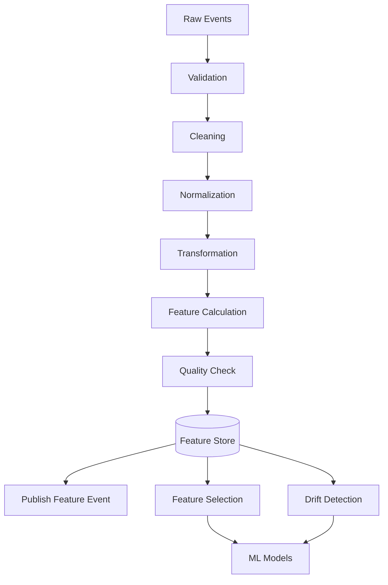
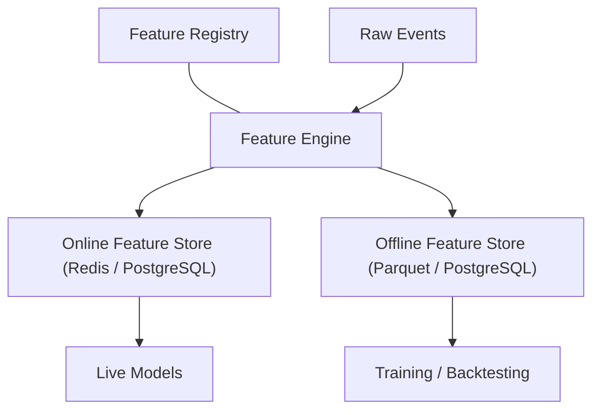

# Volume 3 — Feature Store & Market Intelligence Platform

Volume 3 transforms QuantStack from a data collector into a quantitative research platform. It specifies how validated raw market events are converted into versioned, reproducible, high-quality quantitative features that power every downstream model and analysis engine. The Feature Store defined here becomes the single source of truth: every model, backtest, dashboard, SHAP explanation, and signal consumes the exact same engineered features.

!!! note "Objective"
    Transform validated raw market events into versioned, reproducible, high-quality quantitative features that power every downstream model and analysis engine.

## Why This Layer Matters

Most retail ML trading systems follow a naive pipeline:

```text
Price → Indicator → Model
```

Institutional systems insert a rigorous feature layer between raw data and models:

```text
Raw Data → Validation → Normalization → Feature Engineering
        → Feature Store → Feature Selection → Feature Versioning
        → Drift Detection → Model
```



## Chapter 1 — Why a Feature Store?

Models must **not** read directly from collectors.

Bad architecture:

```text
Collector → ML Model
```

Good architecture:

```text
Collectors → Validation → Normalization → Feature Engineering
          → Feature Store → Every Other Module
```

Benefits:

- One place to calculate features.
- No duplicated feature logic.
- Training and live inference use identical features.
- Reproducible backtests.
- Easier debugging.
- Feature versioning.
- Drift monitoring.

## Chapter 2 — Feature Categories

Organize features by **domain** rather than by source. Each category becomes its own feature pipeline.

| Feature Category | Feature Category |
| --- | --- |
| Price Features | News Features |
| Volume Features | Sentiment Features |
| Options Features | Market Structure Features |
| Breadth Features | Event Features |
| Sector Features | Relative Strength Features |
| Macro Features | Institutional Flow Features |
| Liquidity Features | Time Features |
| Volatility Features | Risk Features |

## Chapter 3 — Feature Pipeline

Every engineered feature follows the same lifecycle:

1. Raw Events
2. Validation
3. Cleaning
4. Normalization
5. Transformation
6. Feature Calculation
7. Quality Check
8. Feature Store
9. Publish Feature Event

## Chapter 4 — Feature Store Architecture

```text
                Feature Registry
                        │
                        │
Raw Events ──► Feature Engine
                        │
                        │
         ┌──────────────┴─────────────┐
         │                            │
 Online Feature Store        Offline Feature Store
         │                            │
 Live Models              Training / Backtesting
```



The platform maintains **two stores**:

| Store | Storage | Characteristics | Consumers |
| --- | --- | --- | --- |
| **Online** | Redis, PostgreSQL | Fast lookup | Live prediction |
| **Offline** | Parquet, PostgreSQL | Historical features | ML training and backtesting |

## Chapter 5 — Feature Registry

Never hardcode features. Every feature registers metadata.

### Required Metadata

| Field | Purpose |
| --- | --- |
| `feature_name` | Unique identifier of the feature |
| `category` | Feature domain (price, volume, options, ...) |
| `description` | Human-readable explanation |
| `version` | Feature version identifier |
| `dependencies` | Upstream features this feature depends on |
| `calculation_frequency` | How often the feature is recalculated |
| `owner` | Responsible module/team |
| `quality_threshold` | Minimum acceptable quality score |
| `unit` | Unit of measurement |
| `expected_range` | Valid value range for sanity checks |

## Chapter 6 — Feature Versioning

Never overwrite a feature. Instead, publish successive versions:

```text
VWAP_v1 → VWAP_v2 → VWAP_v3
```

Models always specify a **Required Feature Version**.

!!! success "Guarantee"
    Pinning models to explicit feature versions guarantees reproducibility: a model trained on `VWAP_v2` will always be served `VWAP_v2`, regardless of later feature improvements.

## Chapter 7 — Feature Dependency Graph

Features often depend on other features. Example:

```text
Raw Price → Returns → Volatility → Rolling Volatility → Volatility Regime
```

The dependency graph allows **automatic recalculation**: when an upstream feature changes, every downstream feature can be recomputed in the correct order.

## Chapter 8 — Feature Metadata Database

Create the following new tables:

| Table | Contents |
| --- | --- |
| `feature_registry` | Master list of registered features and their metadata |
| `feature_versions` | Version history for every feature |
| `feature_dependencies` | Edges of the feature dependency graph |
| `feature_quality` | Quality scores per feature |
| `feature_statistics` | Distribution statistics per feature |
| `feature_drift` | Drift detection history |
| `feature_usage` | Which models/modules consume which features |

## Chapter 9 — Price Feature Engine

### Prompt 3.1

```text
Build a Price Feature Engine.

Generate:

Log Returns
Simple Returns
Gap %
ATR
Rolling High
Rolling Low
Price Distance from High
Price Distance from Low
VWAP Distance
Daily Range %
Intraday Range %
True Range
Momentum
Acceleration
Rolling Beta
Rolling Alpha
Rolling Correlation

Support multiple rolling windows:

5
10
20
50
100
200

Store every feature independently.
Version every calculation.
```

## Chapter 10 — Volume Feature Engine

### Prompt 3.2

```text
Build a Volume Feature Engine.

Calculate:

RVOL
Volume Spike
Rolling Average Volume
Volume Trend
Buying Pressure
Selling Pressure
Volume Delta
Volume Imbalance
Volume Oscillator
Accumulation Distribution
Chaikin Money Flow
OBV
Money Flow Index

Normalize every feature.
```

## Chapter 11 — Volatility Feature Engine

### Prompt 3.3

```text
Build a Volatility Feature Engine.

Generate:

Historical Volatility
ATR
Realized Volatility
Rolling Volatility
Volatility of Volatility
Volatility Regime
VIX Distance
Expected Move
Volatility Compression
Expansion Probability

Generate standardized z-scores.
```

## Chapter 12 — Liquidity Feature Engine

### Prompt 3.4

```text
Build a Liquidity Feature Engine.

Calculate:

Average Spread
Current Spread
Spread %
Order Book Imbalance
Bid Depth
Ask Depth
Market Impact Estimate
Turnover
Delivery %
Liquidity Score
Liquidity Trend
```

## Chapter 13 — Options Feature Engine

### Prompt 3.5

```text
Build an Options Feature Engine.

Generate:

OI Change %
PCR
Max Pain Distance
IV Rank
IV Percentile
Call Writing Score
Put Writing Score
Gamma Exposure
Delta Exposure
Option Volume Ratio
Expected Move
Dealer Positioning Score
```

## Chapter 14 — Breadth Feature Engine

### Prompt 3.6

```text
Build a Breadth Feature Engine.

Generate:

Breadth Strength
Breadth Momentum
Breadth Divergence
Participation %
Trend Breadth
Advance Decline Momentum
New High Momentum
New Low Momentum
Breadth Health Score
```

## Chapter 15 — Sector Feature Engine

### Prompt 3.7

```text
Build a Sector Feature Engine.

Generate:

Sector Relative Strength
Sector Momentum
Sector Leadership
Sector Rotation Index
Capital Rotation Score
Heat Score
Sector Participation
Sector Correlation
Winning Sector Rank
```

## Chapter 16 — Relative Strength Engine

### Prompt 3.8

```text
Build a Relative Strength Feature Engine.

Compare every stock against:

Nifty
Sensex
Sector
Industry
Peers

Generate:

Relative Strength
Relative Momentum
Relative Volatility
Relative Volume
Percentile Rank
Outperformance Score
```

## Chapter 17 — Market Structure Feature Engine

!!! note
    This is one of the most important additions to the platform — it encodes price-action structure (swings, liquidity, auction behavior) as machine-readable features.

### Prompt 3.9

```text
Build a Market Structure Feature Engine.

Generate:

Swing High
Swing Low
Trend Direction
Higher Highs
Lower Lows
Break of Structure
Change of Character
Liquidity Zones
Fair Value Gaps
Order Blocks
VWAP Bands
Opening Range
Initial Balance
Market Profile
Volume Profile
Auction Imbalance
Structural Bias
Breakout Probability
Liquidity Sweep Probability
```

## Chapter 18 — News Feature Engine

### Prompt 3.10

```text
Build a News Feature Engine.

Generate:

Sentiment Score
Novelty Score
Urgency
News Momentum
Entity Frequency
Headline Similarity
Topic Distribution
Market Impact Probability
Sector Impact
Stock Impact
```

## Chapter 19 — Event Risk Features

### Prompt 3.11

```text
Build an Event Risk Feature Engine.

Generate:

Hours Until Event
Risk Window
Expected Volatility
Event Category
Confidence Reduction
Trading Freeze Flag
Market Sensitivity
Historical Event Similarity
```

## Chapter 20 — Time Features

Often overlooked, but very useful — calendar and session context materially affect Indian market behavior (expiry weeks, budget windows, earnings seasons).

### Prompt 3.12

```text
Build a Time Feature Engine.

Generate:

Day of Week
Month
Quarter
Expiry Week
Monthly Expiry Flag
Weekly Expiry Flag
Market Open Minutes
Time Since Open
Time Until Close
Holiday Distance
Budget Window
Earnings Season Flag
```

## Chapter 21 — Feature Normalization Engine

!!! warning
    Never feed raw values into ML models. All features must pass through the normalization engine, and both raw and normalized versions are stored.

### Prompt 3.13

```text
Build a Feature Normalization Engine.

Support:

Rolling Z-Score
Min-Max Scaling
Robust Scaling
Percentile Rank
Log Transform
Winsorization

Handle:

Outliers
Missing Values
Cold Start
Look-ahead Bias Prevention

Store both raw and normalized versions.
```

## Chapter 22 — Feature Quality Engine

Every feature receives a quality score.

### Prompt 3.14

```text
Evaluate every feature.

Metrics:

Freshness
Completeness
Distribution Stability
Variance
Missing %
Correlation Stability
Noise
Predictive Power

Generate:

Feature Quality Score
Confidence Multiplier
Drift Warning
```

## Chapter 23 — Feature Drift Detection

This is a capability most retail systems lack: continuously monitoring whether feature distributions are shifting away from what models were trained on.

### Prompt 3.15

```text
Build a Feature Drift Engine.

Detect:

Distribution Drift
Covariate Drift
Concept Drift
Missing Pattern Drift

Alert when:

KS Statistic
PSI
Jensen-Shannon Distance
Population Shift

exceed thresholds.

Version drift history.
```

## Chapter 24 — Feature Selection Engine

Don't feed hundreds of weak features into every model — select the strongest predictors systematically.

### Prompt 3.16

```text
Build a Feature Selection Engine.

Evaluate:

Mutual Information
Permutation Importance
SHAP Importance
Correlation Filtering
Variance Threshold
Recursive Feature Elimination

Output:

Recommended Feature Set
Feature Ranking
Redundant Features
Highly Correlated Features
```

## Chapter 25 — Historical Replay Engine

Critical for debugging and reproducibility: the platform must be able to reconstruct its exact feature state at any past moment.

### Prompt 3.17

```text
Build a Historical Replay Engine.

Given any timestamp:

Reconstruct every feature exactly as it existed at that moment.

Prevent look-ahead bias.

Support replay for:

Training
Backtesting
Signal Review
SHAP Analysis
```

## Chapter 26 — Feature API

Expose all features through stable APIs so downstream modules never touch raw storage directly.

### Prompt 3.18

```text
Create Feature APIs.

Support:

Latest Features
Historical Features
Feature Metadata
Feature Versions
Feature Quality
Feature Drift
Feature Replay

Provide pagination and filtering.
```

## Chapter 27 — Acceptance Criteria

!!! success "Acceptance criteria — before moving to Volume 4"
    - Every raw event is transformed into engineered features.
    - Online and offline feature stores are synchronized.
    - Feature metadata and versions are tracked.
    - Every feature has a quality score.
    - Drift detection is operational.
    - Historical replay can reconstruct any point in time.
    - Feature APIs serve both live and historical consumers.
    - Feature selection identifies the strongest predictors.
    - No downstream module reads directly from collectors.

## Preview of Volume 4

Volume 4 will build the **Market Intelligence & Regime Analysis Layer**, which transforms hundreds of engineered features into a coherent understanding of the current market state. It will include:

- Multi-dimensional regime classification
- Bayesian regime transitions
- Market breadth intelligence
- Sector rotation intelligence
- Macro pressure synthesis
- Institutional flow aggregation
- Cross-asset correlation analysis
- Historical analog search
- Dynamic regime confidence
- Composite market intelligence scores

At that point, the platform begins to reason about the market rather than simply describing it, creating the contextual foundation for the prediction and signal engines that follow.
