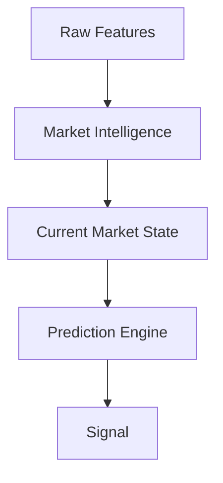
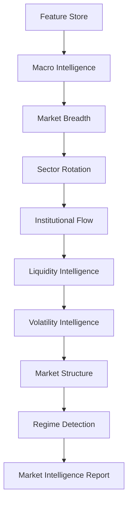

# Volume 4 — Market Intelligence & Regime Analysis Engine

Volume 4 builds the layer that separates QuantStack from typical retail trading systems: a Market Intelligence Engine that converts hundreds of engineered features into a unified, structured understanding of the market. Where Volumes 1–3 answered *"what is happening?"*, this volume answers *"what does it mean?"* — identifying market regimes probabilistically, measuring confidence in the platform's own assessment, detecting structural transitions, and producing a comprehensive Market State Report. That report becomes the single primary input to the Prediction & Conviction Engine built in Volume 5.

!!! note "Objective"
    Convert hundreds of engineered features into a unified understanding of the market by identifying market regimes, measuring confidence, detecting structural transitions, and producing a comprehensive Market Intelligence Report that becomes the primary input to the prediction engine.

---

## Chapter 1 — Why a Market Intelligence Layer?

Most retail systems follow a naive rule pipeline:

```text
RSI < 30 → Buy
```

Slightly better systems feed features directly into a model:

```text
100 Features → ML → Buy
```

Institutional systems insert an intelligence layer between features and prediction:



The prediction engine should never have to infer market context from scratch. Instead, it receives a structured, high-level description of the current environment.

---

## Chapter 2 — Market Intelligence Architecture

The engine is a pipeline of specialized intelligence components, each consuming the Feature Store and contributing to a final intelligence score.



Every component contributes to a final intelligence score.

---

## Chapter 3 — Regime Philosophy

The market is not always in the same state. Instead of a simple classification (Bull / Bear / Sideways), QuantStack builds a **multidimensional regime model** in which each dimension is evaluated independently:

- Trend
- Volatility
- Liquidity
- Participation
- Macro
- Institutional Positioning
- Market Structure
- Event Risk
- Momentum
- Correlation

This produces a far richer representation of market state than a single label.

---

## Chapter 4 — Regime Taxonomy

The engine recognizes multiple independent regime dimensions, each with its own vocabulary of states.

| Dimension | Regimes |
|---|---|
| **Trend** | Strong Bull Trend, Weak Bull Trend, Strong Bear Trend, Weak Bear Trend, Range Bound, Mean Reversion, Breakout, Breakdown, Transition |
| **Volatility** | Extremely Low, Low, Normal, Elevated, High, Extreme, Compression, Expansion |
| **Liquidity** | Highly Liquid, Healthy, Thin, Illiquid, Stress, Auction Driven |
| **Participation** | Broad Participation, Narrow Participation, Institutional Accumulation, Institutional Distribution, Retail Driven, Mixed |
| **Macro** | Risk On, Risk Off, Inflation, Disinflation, Rate Hike, Rate Cut, Growth, Recession, Stagflation |
| **Market Structure** | Accumulation, Markup, Distribution, Markdown, Liquidity Sweep, Stop Hunt, Expansion, Consolidation |

---

## Chapter 5 — Trend Intelligence Engine

### Implementation Prompt 4.1

```text
Build a Trend Intelligence Engine.

Consume:
- Moving averages
- ADX
- Slope
- Higher highs
- Lower lows
- Swing structure
- Volume confirmation

Generate:
- Trend Direction
- Trend Strength
- Trend Age
- Trend Stability
- Trend Confidence
- Trend Exhaustion
- Trend Acceleration

Output a normalized Trend Score.
```

---

## Chapter 6 — Volatility Intelligence

### Implementation Prompt 4.2

```text
Build a Volatility Intelligence Engine.

Consume:
- VIX
- Historical Volatility
- ATR
- Realized Volatility
- Expected Move
- Volatility Compression
- Volatility Expansion

Output:
- Current Volatility Regime
- Expansion Probability
- Compression Probability
- Expected Volatility
- Volatility Confidence
- Volatility Score
```

---

## Chapter 7 — Breadth Intelligence

### Implementation Prompt 4.3

```text
Build a Breadth Intelligence Engine.

Consume:
- Breadth Strength
- Breadth Momentum
- Participation
- Advance Decline
- New Highs
- New Lows

Output:
- Breadth Health
- Participation Quality
- Breadth Confidence
- Breadth Regime
- Breadth Composite Score
```

---

## Chapter 8 — Sector Intelligence

### Implementation Prompt 4.4

```text
Build a Sector Intelligence Engine.

Analyze all sectors simultaneously.

Identify:
- Leading Sectors
- Lagging Sectors
- Capital Rotation
- Leadership Change
- Relative Momentum

Generate:
- Sector Rotation Score
- Sector Leadership Confidence
- Sector Heat Score
- Sector Trend Score
```

---

## Chapter 9 — Institutional Flow Intelligence

### Implementation Prompt 4.5

```text
Build an Institutional Flow Intelligence Engine.

Consume:
- FII
- DII
- ETF
- Block Deals
- Bulk Deals
- Insider Transactions
- SAST

Generate:
- Institutional Participation Score
- Accumulation Score
- Distribution Score
- Flow Momentum
- Flow Confidence
```

---

## Chapter 10 — Liquidity Intelligence

### Implementation Prompt 4.6

```text
Build a Liquidity Intelligence Engine.

Analyze:
- Bid/Ask Spread
- Depth
- Turnover
- Delivery %
- Market Impact
- Order Book Imbalance

Generate:
- Liquidity Score
- Liquidity Stress
- Execution Risk
- Liquidity Confidence
```

---

## Chapter 11 — Event Intelligence

### Implementation Prompt 4.7

```text
Build an Event Intelligence Engine.

Analyze:
- Economic Calendar
- Corporate Events
- Government Events
- Global Events

Generate:
- Current Event Risk
- Hours Until Event
- Expected Impact
- Trading Freeze Recommendation
- Confidence Reduction
- Historical Similarity
```

---

## Chapter 12 — Correlation Intelligence

Most retail systems ignore correlations entirely. QuantStack treats cross-asset relationships as a first-class intelligence signal.

### Implementation Prompt 4.8

```text
Build a Cross-Asset Correlation Engine.

Analyze relationships among:
- Nifty
- Bank Nifty
- USDINR
- Crude Oil
- Gold
- US Markets
- Global Indices
- Sector Indices

Generate:
- Rolling Correlation Matrix
- Correlation Stability
- Correlation Breakdown
- Correlation Regime
- Risk Concentration Score
```

---

## Chapter 13 — Relative Strength Intelligence

### Implementation Prompt 4.9

```text
Build a Relative Strength Intelligence Engine.

Compare every stock against:
- Sector
- Nifty
- Sensex
- Industry
- Peers

Generate:
- Outperformance Score
- Relative Trend
- Relative Momentum
- Leadership Ranking
- Relative Strength Confidence
```

---

## Chapter 14 — Historical Analog Engine

One of the most valuable additions to the platform: for any current market snapshot, find the most similar historical market states and study what happened next.

### Implementation Prompt 4.10

```text
Build a Historical Analog Engine.

For every market snapshot, search historical data using:
- Cosine Similarity
- Mahalanobis Distance
- Dynamic Time Warping
- Nearest Neighbor Search

Identify:
- Top 20 similar historical market states.

Store:
- Similarity
- Subsequent Returns
- Volatility
- Win Rate
- Maximum Drawdown
- Maximum Run-up

Pass these analogs downstream to the prediction engine.
```

---

## Chapter 15 — Bayesian Regime Detection

!!! warning "Avoid hard switching"
    Regime detection must not flip between hard labels. Every regime produces a probability, blended regimes are allowed, and probabilities update continuously as new evidence arrives.

### Implementation Prompt 4.11

```text
Implement Bayesian Regime Detection.

Every regime should produce a probability.

Example:
- Bull Trend: 62%
- Range: 23%
- Transition: 15%

Allow blended regimes.

Update probabilities continuously as new evidence arrives.
```

---

## Chapter 16 — Regime Transition Engine

### Implementation Prompt 4.12

```text
Detect transitions between regimes.

Calculate:
- Transition Probability
- Transition Speed
- Confidence Loss
- Instability Score

Generate alerts whenever regime transition probability exceeds
configurable thresholds.
```

---

## Chapter 17 — Market Confidence Engine

Instead of trusting every signal equally, the platform measures confidence in the market assessment itself.

### Implementation Prompt 4.13

```text
Build a Market Confidence Engine.

Combine:
- Data Quality
- Feature Quality
- Regime Certainty
- Breadth
- Institutional Agreement
- Correlation Stability

Generate:
- Market Confidence Score
- Confidence Grade
- Confidence Trend
```

---

## Chapter 18 — Composite Market Intelligence Score

This is one of the most important outputs of the entire platform: a single aggregated view of market condition.

### Implementation Prompt 4.14

```text
Build a Composite Market Intelligence Engine.

Aggregate:
- Trend
- Volatility
- Breadth
- Liquidity
- Macro
- Sector
- Institutional Flow
- Correlation
- Market Structure
- Event Risk

Generate:
- Overall Market Intelligence Score (0-100)
- Overall Bullishness
- Overall Bearishness
- Market Stability
- Expected Opportunity Level
- Expected Risk Level
```

---

## Chapter 19 — Market State Report

Rather than sending dozens of raw metrics downstream, the platform emits a single structured report per evaluation cycle. This report becomes the single input for the prediction engine.

### Implementation Prompt 4.15

```text
Generate a Market State Report.

Include:
- Current Regimes
- Probabilities
- Trend Summary
- Breadth Summary
- Liquidity Summary
- Sector Leaders
- Macro Summary
- Institutional Positioning
- Historical Analogs
- Market Confidence
- Composite Intelligence Score
- Expected Opportunity
- Expected Risk

Persist every report with timestamps for historical replay.
```

!!! note
    Every Market State Report is persisted with a timestamp, enabling full historical replay of the platform's market understanding at any point in time.

---

## Chapter 20 — Explainability Layer

Every intelligence score must be explainable — no black-box scores.

### Implementation Prompt 4.16

```text
Implement Explainability for the Market Intelligence Layer.

For every intelligence score:
- Store contributing features
- Contribution weights
- Reasoning chain
- Confidence intervals

Allow dashboard visualization of how each intelligence score
was constructed.
```

---

## Chapter 21 — APIs

The intelligence layer exposes stable APIs for downstream consumers.

### Implementation Prompt 4.17

```text
Create APIs for:
- Current Market State
- Historical Market State
- Regime History
- Market Intelligence Reports
- Trend Intelligence
- Breadth Intelligence
- Sector Intelligence
- Institutional Intelligence
- Historical Analogs
- Market Confidence
```

---

## Chapter 22 — Dashboard Components

The dashboard should visualize *intelligence* rather than raw indicators. Components include:

- Current market regime probabilities
- Composite intelligence score
- Market confidence gauge
- Sector leadership heatmap
- Breadth dashboard
- Institutional flow timeline
- Regime transition timeline
- Historical analog explorer
- Cross-asset correlation matrix
- Liquidity stress monitor

---

## Chapter 23 — Acceptance Criteria

!!! success "Acceptance criteria — required before proceeding to Volume 5"
    - Every feature contributes to a market intelligence component.
    - Regime classification supports probabilities rather than hard labels.
    - Trend, volatility, breadth, liquidity, macro, sector, institutional flow, and correlation intelligence are operational.
    - Historical analog search works on any market snapshot.
    - Composite Market Intelligence Score is generated for every evaluation cycle.
    - Market State Reports are persisted and replayable.
    - All intelligence outputs are explainable and available through APIs.
    - Downstream systems consume the Market State Report instead of querying dozens of individual features.

---

## Why This Volume Is Critical

At the end of Volume 4, the platform no longer behaves like a collection of indicators. It behaves like a **market analyst** that continuously interprets the market and produces a structured understanding of its current condition.

This intelligence layer becomes the foundation for **Volume 5**, the **Prediction & Conviction Engine**. Rather than predicting directly from raw features, the models will combine engineered features with the Market State Report, allowing them to adapt their behavior to different market regimes and significantly improving robustness.
