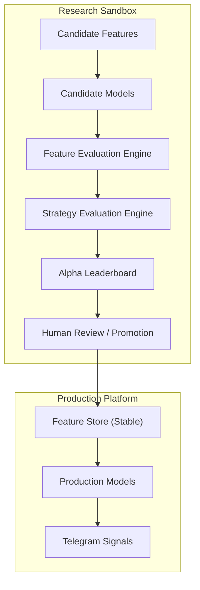
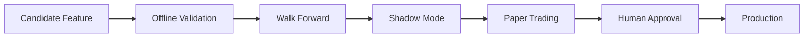

# Volume 5.5 — Alpha Research Engine

This volume specifies the Alpha Research Engine: a self-improving quantitative research subsystem that continuously discovers, evaluates, validates, and promotes new alpha signals — features, models, and strategies — without ever disrupting the production trading pipeline. Rather than relying solely on a fixed set of predefined features, QuantStack gains a research layer that automatically evaluates candidate features, ranks them by predictive power, detects feature decay over time, recommends new features for inclusion, compares new models against production models, and maintains a research leaderboard. This turns the platform into a self-improving quantitative research system rather than a static signal generator, and builds a much stronger foundation for consistently high-quality Telegram signals before Volume 6 (Risk Management & Trade Construction).

!!! note "Why this volume is mandatory"
    This is one of the biggest differences between a retail trading system and an institutional quantitative research platform. A retail system says "here are my 250 handcrafted features." A quant research platform says "I currently use 250 features, but I'm continuously searching for better ones." That mindset is how firms like Two Sigma, Citadel Securities, Jane Street, Renaissance Technologies, Hudson River Trading, and WorldQuant evolve over time — they invest heavily in **research infrastructure**, not just predictive models.

## Objective

Create a self-improving quantitative research subsystem that continuously discovers, evaluates, validates, and promotes new alpha signals (features, models, and strategies) without disrupting the production trading pipeline.

The production system must remain stable while the research engine experiments independently.

## High-Level Architecture

The platform is split into two strictly separated planes: the stable production platform that serves Telegram signals, and an isolated research sandbox where candidates are generated, evaluated, and ranked before controlled promotion.



!!! warning "Key principle"
    **Research never directly affects production.** Promotion is always controlled and validated.

## Chapter 1 — Research Philosophy

The research engine continuously asks:

- Can we create a better feature?
- Is an existing feature becoming less useful?
- Does a new market regime require different features?
- Is another ML model outperforming production?
- Has a strategy stopped working?
- Can two weak features together create a stronger one?

This subsystem should behave like an autonomous quant research assistant.

## Chapter 2 — Research Workspace

Research must be isolated from production. Create separate namespaces:

```text
research/
├── candidate_features/
├── candidate_models/
├── candidate_strategies/
├── experiments/
├── feature_rankings/
├── leaderboards/
├── papers/
├── datasets/
├── benchmarks/
├── notebooks/
└── validation/
```

Nothing in this workspace is production until it is promoted.

## Chapter 3 — Candidate Feature Generator

Automatically derive new candidate features from existing production features, with full metadata lineage, stored separately from the production feature store.

### Prompt 5.5.1

```text
Build a Candidate Feature Generator.

Automatically generate new candidate features from existing ones.

Support:
- Arithmetic Combinations
- Ratios
- Rolling Statistics
- Rolling Correlations
- Cross-Asset Features
- Cross-Sector Features
- Interaction Features
- Lag Features
- Lead-Lag Features
- Time Features
- Event Features
- Market Structure Features

Generate metadata describing:
- parents
- calculation
- complexity
- dependencies
- expected usefulness

Store candidates separately from production features.
```

## Chapter 4 — Automated Feature Discovery

Instead of manually inventing features forever, let the system search the feature space itself.

### Prompt 5.5.2

```text
Build an Automated Feature Discovery Engine.

Use:
- Feature Crossing
- Polynomial Features
- Rolling Window Transformations
- Statistical Transforms
- Interaction Terms
- Frequency Domain Features
- Entropy Features
- Seasonality Features
- Market Microstructure Features

Generate thousands of candidate features.
Deduplicate mathematically equivalent features.
Track computational cost.
```

## Chapter 5 — Feature Evaluation Engine

A feature should earn its place. Every candidate is scored against a consistent battery of predictive-power and stability metrics, with the complete evaluation history retained.

### Prompt 5.5.3

```text
Build a Feature Evaluation Engine.

Evaluate every candidate using:
- Mutual Information
- Information Coefficient (IC)
- Rank Information Coefficient (Rank IC)
- SHAP Importance
- Permutation Importance
- Correlation
- Variance
- Predictive Stability
- Rolling Performance
- Cross-Regime Performance

Generate:
- Feature Score
- Feature Confidence
- Generalization Score
- Computational Cost

Store complete evaluation history.
```

## Chapter 6 — Alpha Decay Engine

One of the most important additions. Markets evolve, and features decay — the platform must detect deterioration in production features before it degrades signal quality.

### Prompt 5.5.4

```text
Build an Alpha Decay Engine.

Continuously monitor production features.

Detect:
- Declining Information Coefficient
- Declining SHAP Importance
- Performance Drift
- Regime Sensitivity
- Distribution Drift
- Predictive Decay

Generate:
- Half-life
- Decay Rate
- Replacement Recommendation
- Retirement Recommendation

Alert whenever alpha deteriorates.
```

## Chapter 7 — Feature Stability Engine

A feature must be stable across market conditions, not merely predictive in one regime.

### Prompt 5.5.5

```text
Evaluate feature robustness.

Test across:
- Bull Markets
- Bear Markets
- Range Markets
- High Volatility
- Low Volatility
- Liquidity Stress
- Macro Events

Generate:
- Stability Score
- Robustness Score
- Cross-Regime Consistency
- Failure Modes
```

## Chapter 8 — Research Model Zoo

Production uses only approved models. Research can test anything.

### Prompt 5.5.6

```text
Build a Model Zoo.

Support:
- LightGBM
- CatBoost
- XGBoost
- Random Forest
- Extra Trees
- Logistic Regression
- Transformer Models
- Temporal CNN
- LSTM
- TabNet
- NGBoost

Store:
- hyperparameters
- training data
- performance
- training cost
- inference latency
- version
- status
```

## Chapter 9 — Model Tournament

Every new model must compete against production before it can replace it.

### Prompt 5.5.7

```text
Build a Model Tournament Engine.

Compare candidate models against production.

Evaluate:
- Accuracy
- Precision
- Recall
- F1
- AUC
- Calibration
- Sharpe
- Profit Factor
- Drawdown
- Latency
- Stability
- Cross-Regime Performance

Promote only statistically superior models.
```

## Chapter 10 — Strategy Research Engine

Don't only evaluate models — evaluate complete strategies end to end.

### Prompt 5.5.8

```text
Build a Strategy Research Engine.

Each strategy defines:
- Entry Logic
- Exit Logic
- Holding Rules
- Position Filters
- Risk Filters

Evaluate:
- Sharpe
- Sortino
- Profit Factor
- Drawdown
- Expectancy
- Turnover
- Win Rate
- Calmar
- Ulcer Index
- Cross-Regime Robustness
```

## Chapter 11 — Walk-Forward Validation

Never optimize on the future. All research validation must be time-aware.

### Prompt 5.5.9

```text
Implement Walk-Forward Optimization.

Support:
- Rolling Windows
- Expanding Windows
- Purged K-Fold
- Embargo
- Nested Validation

Store every validation run.
Generate robustness reports.
```

## Chapter 12 — Feature Interaction Discovery

Sometimes two mediocre features become powerful together.

### Prompt 5.5.10

```text
Automatically discover feature interactions.

Search for:
- Pairwise interactions
- Triple interactions
- Higher-order interactions

Evaluate incremental predictive power.
Reject redundant interactions.
Generate interaction graphs.
```

## Chapter 13 — Research Leaderboard

The leaderboard becomes the platform's "Hall of Fame" — a ranked, historical record of every alpha source.

### Prompt 5.5.11

```text
Build a Research Leaderboard.

Rank:
- Features
- Models
- Strategies
- Feature Groups
- Researchers (optional)

Metrics:
- Predictive Power
- Sharpe Contribution
- Stability
- Generalization
- Inference Cost
- Training Cost

Maintain historical rankings.
```

## Chapter 14 — Research Notebook Generator

Every experiment should be documented automatically, so no research effort is lost.

### Prompt 5.5.12

```text
Automatically generate research reports.

Include:
- Objective
- Dataset
- Methodology
- Metrics
- Plots
- Failures
- Conclusions
- Recommendation

Store reports in Markdown.
Link every report to experiment IDs.
```

## Chapter 15 — Promotion Pipeline

The production platform must remain protected. Every candidate passes through a strict, staged pipeline before reaching production, and the final gate is always human.



### Prompt 5.5.13

```text
Build a Promotion Pipeline.

Candidate Feature
  -> Offline Validation
  -> Walk Forward
  -> Shadow Mode
  -> Paper Trading
  -> Human Approval
  -> Production

Never promote automatically.
```

!!! warning "Never promote automatically"
    Human approval is a mandatory stage of the pipeline. No feature, model, or strategy reaches production without explicit sign-off.

## Chapter 16 — Research Dashboard

Visualize research progress. The dashboard should include:

- Top Features
- Feature Decay
- Alpha Discovery Timeline
- Experiment Queue
- Model Rankings
- Strategy Rankings
- Validation Results
- Promotion Candidates
- Research Velocity
- Compute Usage

## Chapter 17 — Alpha Knowledge Base

An extension beyond the original concept: instead of only storing experiments, build a searchable knowledge base that captures institutional memory.

### Prompt 5.5.14

```text
Build an Alpha Knowledge Base.

Store:
- Research Papers
- Experiment Results
- Successful Features
- Failed Features
- Strategy Notes
- Market Regime Notes
- Feature Failure Reasons
- Lessons Learned

Tag every item.
Enable semantic search across historical research.
Link every production feature back to its research history.
```

## Chapter 18 — Meta-Learning Engine (Advanced)

An advanced improvement that institutional platforms increasingly use: learn *about* the research process itself and feed adaptive recommendations back into production — subject to the same validation discipline.

### Prompt 5.5.15

```text
Build a Meta-Learning Engine.

Learn:
- Which model performs best in each regime.
- Which feature groups perform best.
- Which strategy families perform best.

Generate:
- Dynamic model weighting.
- Dynamic feature weighting.
- Dynamic strategy recommendation.

The production Conviction Engine should consume these recommendations
but require validation before permanent adoption.
```

## Chapter 19 — Acceptance Criteria

!!! success "Acceptance criteria — before proceeding to Volume 6"
    - Candidate features are automatically generated and evaluated.
    - Feature decay is continuously monitored.
    - Model Zoo supports multiple competing models.
    - Walk-forward validation is mandatory for research.
    - Strategy evaluation is separate from model evaluation.
    - Research Leaderboard ranks features, models, and strategies.
    - Promotion Pipeline prevents unvalidated research from reaching production.
    - Research reports are automatically generated.
    - Alpha Knowledge Base captures institutional memory.
    - Meta-Learning provides adaptive recommendations without bypassing validation.

## Looking Ahead — Volume 5.75 (Recommended)

If the long-term goal is a professional-grade quantitative research platform, one more volume is recommended **before** Risk Management:

> **Volume 5.75 — Portfolio Intelligence & Capital Allocation Engine**

Even though QuantStack currently generates Telegram signals rather than executing trades, this layer would answer questions such as:

- Which signals should be shown if 30 opportunities appear simultaneously?
- Are five signals actually the same sector bet?
- How correlated are today's opportunities?
- Which signals diversify each other?
- Which signals conflict with one another?

This intelligence improves the quality of the signal feed itself, ensuring users receive the highest-value opportunities rather than simply the highest individual conviction scores. It also lays the groundwork for optional portfolio-aware execution in the future without changing the core architecture.
