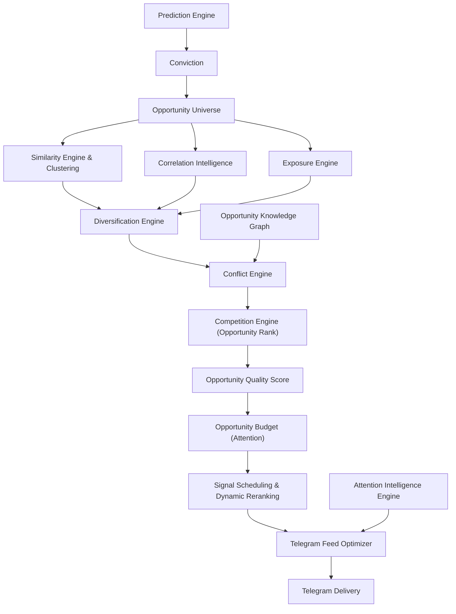
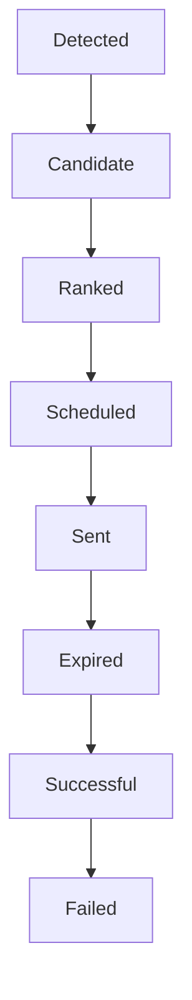

# Volume 5.75 — Opportunity Portfolio Intelligence Engine (OPIE)

The Opportunity Portfolio Intelligence Engine (OPIE) sits between the Conviction layer and Telegram delivery, and answers a question the Prediction Engine cannot: *how good is this trade compared with every other trade available right now?* Because QuantStack does not manage capital — it manages user attention through a bandwidth-limited Telegram channel — OPIE ranks, clusters, de-duplicates, schedules, and budgets every opportunity so that only high-quality, diversified, context-aware signals reach the delivery layer. This is the layer most trading systems never build, and it is closer to how professional trading desks operate than simple score-based signal feeds.

!!! note "Why the name OPIE?"
    The volume was originally titled "Portfolio Intelligence" but was renamed because the platform is **not managing capital yet — it is managing attention**. If the system produces 150 opportunities per day, sending all of them makes the platform almost useless. OPIE asks: *"Out of every opportunity in the market, which few deserve the user's attention?"*

## Mission

| Engine | Question it answers |
|---|---|
| Prediction Engine | How good is this trade? |
| Opportunity Portfolio Intelligence Engine | How good is this trade compared with every other trade available right now? |

These are entirely different optimization problems.

## New Architecture

The previous pipeline:

```text
Prediction
      ↓
Conviction
      ↓
Telegram
```

is replaced by:

```text
Prediction
      ↓
Conviction
      ↓
Opportunity Portfolio Intelligence
      ↓
Risk Budget Allocation
      ↓
Signal Prioritization
      ↓
Telegram
```



## Chapter 1 — Why Opportunity Portfolio Intelligence?

Suppose the system finds the following candidates today:

| Instrument | Direction | Score |
|---|---|---|
| INFY | LONG | 88 |
| HDFC | LONG | 90 |
| ICICI | LONG | 91 |
| SBIN | LONG | 92 |
| AXIS | LONG | 89 |
| KOTAK | LONG | 90 |

This looks great — except these are almost the same trade. If banking crashes, all six lose together.

Instead, the engine should decide:

- **Choose:** SBIN
- **Reject:** ICICI, AXIS, HDFC — *because sector exposure is too high*

!!! success "Impact"
    This single behavior — rejecting redundant, correlated signals — dramatically improves the quality of the Telegram feed.

## Chapter 2 — Opportunity Universe

Before ranking, build today's universe of qualified candidates. Every opportunity is captured with a full attribute set and a unique identifier, and snapshots are persisted so any day can be replayed.

Attributes stored per opportunity:

- Instrument, Sector, Industry
- Direction
- Expected Return, Expected Risk, Expected Volatility
- Conviction, Probability
- Liquidity, Market Structure
- Historical Analog
- Opportunity Lifetime, Expected Holding Period
- Correlation Group

### Prompt 5.75.1 — Opportunity Universe Engine

```text
Build an Opportunity Universe Engine.

Collect every qualified trade candidate.

Store:
Instrument
Sector
Industry
Direction
Expected Return
Expected Risk
Conviction
Probability
Liquidity
Market Structure
Historical Analog
Opportunity Lifetime
Expected Holding Period
Expected Volatility
Correlation Group

Assign every opportunity a unique Opportunity ID.
Persist snapshots for replay.
```

## Chapter 3 — Opportunity Similarity Engine

Retail systems compare scores. Institutional systems compare **opportunities**. The Similarity Engine measures how alike two candidates are across market-structure and statistical dimensions, produces an Opportunity Distance Matrix, and clusters similar trades.

Similarity dimensions:

- Sector and Industry
- Correlation and Historical Correlation
- Cointegration
- Feature Similarity
- Market Structure and Trend Similarity
- Liquidity Similarity
- Macro Sensitivity
- Institutional Positioning

### Prompt 5.75.2 — Opportunity Similarity Engine

```text
Build an Opportunity Similarity Engine.

Compare opportunities using:
Sector
Industry
Correlation
Historical Correlation
Cointegration
Feature Similarity
Market Structure
Trend Similarity
Liquidity Similarity
Macro Sensitivity
Institutional Positioning

Generate an Opportunity Distance Matrix.
Cluster similar trades.
Expose similarity APIs.
```

## Chapter 4 — Opportunity Clustering

Opportunities are automatically grouped so redundancy can be detected and reasoned about at the cluster level.

**Supported algorithms:** KMeans, Hierarchical Clustering, DBSCAN, Spectral Clustering.

**Example cluster types:** Banking, IT, Momentum, Breakout, Mean Reversion, Event Driven, High Volatility, Low Liquidity.

Cluster history is stored for later analysis and replay.

### Prompt 5.75.3 — Opportunity Clustering

```text
Automatically cluster opportunities.

Support:
KMeans
Hierarchical Clustering
DBSCAN
Spectral Clustering

Clusters may include:
Banking
IT
Momentum
Breakout
Mean Reversion
Event Driven
High Volatility
Low Liquidity

Store cluster history.
```

## Chapter 5 — Correlation Intelligence

Correlation must be measured beyond sector labels. The engine maintains a continuously updated correlation graph and alerts when multiple live opportunities are highly correlated.

Correlation measures computed:

- Rolling Correlation
- Partial Correlation
- Dynamic Correlation
- Tail Correlation
- Correlation Stability
- Cointegration
- Distance Correlation

### Prompt 5.75.4 — Correlation Intelligence Engine

```text
Build a Correlation Intelligence Engine.

Calculate:
Rolling Correlation
Partial Correlation
Dynamic Correlation
Tail Correlation
Correlation Stability
Cointegration
Distance Correlation

Build a continuously updated correlation graph.
Alert when multiple opportunities are highly correlated.
```

## Chapter 6 — Exposure Engine

Even without placing orders, the platform measures the aggregate exposure implied by the current signal set.

Exposure dimensions:

- Sector, Industry, Market Cap
- Beta, Volatility
- Macro, Currency, Commodity
- Interest Rates
- Global Markets

Outputs: **Exposure Map**, **Exposure Concentration**, **Diversification Score**.

### Prompt 5.75.5 — Exposure Engine

```text
Build an Exposure Engine.

Measure exposure across:
Sector
Industry
Market Cap
Beta
Volatility
Macro
Currency
Commodity
Interest Rates
Global Markets

Generate:
Exposure Map
Exposure Concentration
Diversification Score
```

## Chapter 7 — Opportunity Diversification

Given a large candidate pool (for example, 100 opportunities), select the subset that is jointly optimal — not just individually strong.

| Maximize | Minimize |
|---|---|
| Expected Return | Correlation |
| Expected Conviction | Sector Concentration |
| Expected Diversity | Factor Concentration |
| Expected Opportunity Coverage | Macro Concentration |

The engine outputs a Diversification Score for the selected subset.

### Prompt 5.75.6 — Diversification Engine

```text
Build a Diversification Engine.

Given 100 opportunities, select the subset maximizing:
Expected Return
Expected Conviction
Expected Diversity
Expected Opportunity Coverage

Minimize:
Correlation
Sector Concentration
Factor Concentration
Macro Concentration

Generate Diversification Score.
```

## Chapter 8 — Opportunity Conflict Engine

Some signals contradict others and must be detected before delivery.

Example conflicts:

- BankNifty Bullish → Private Banks Bullish → **PSU Banks Bearish**
- Nifty Bullish → **Heavyweight Bearish**

Outputs per conflict:

- Conflict Score
- Conflict Explanation
- Confidence Reduction
- Conflict Resolution Recommendation

### Prompt 5.75.7 — Opportunity Conflict Engine

```text
Detect conflicting opportunities.

Examples:
BankNifty Bullish -> Private Banks Bullish -> PSU Banks Bearish
Nifty Bullish -> Heavyweight Bearish

Generate:
Conflict Score
Conflict Explanation
Confidence Reduction
Conflict Resolution Recommendation
```

## Chapter 9 — Opportunity Competition Engine

Multiple trades compete for limited delivery slots; the Competition Engine chooses winners by ranking every candidate.

Ranking factors:

- Conviction
- Expected Return
- Liquidity
- Market Intelligence
- Historical Win Rate
- Opportunity Lifetime
- Model Agreement
- Signal Quality
- Expected Drawdown

Output: **Opportunity Rank**.

### Prompt 5.75.8 — Opportunity Competition Engine

```text
Build an Opportunity Competition Engine.

Rank candidates using:
Conviction
Expected Return
Liquidity
Market Intelligence
Historical Win Rate
Opportunity Lifetime
Model Agreement
Signal Quality
Expected Drawdown

Generate Opportunity Rank.
```

## Chapter 10 — Opportunity Budget

Even without trade execution, every signal consumes a scarce resource: user attention. **Treat attention like capital.**

Each opportunity consumes: Telegram Attention, Research Bandwidth, User Focus.

Budget limits enforced:

| Limit | Purpose |
|---|---|
| Maximum signals per hour | Prevent flooding the channel |
| Maximum signals per sector | Prevent sector pile-ups |
| Maximum correlated signals | Prevent hidden concentration |
| Maximum duplicate signals | Prevent redundancy |

The engine tracks and exposes the remaining opportunity budget.

### Prompt 5.75.9 — Opportunity Budget Engine

```text
Build an Opportunity Budget Engine.

Every opportunity consumes:
Telegram Attention
Research Bandwidth
User Focus

Limit:
Maximum signals per hour
Maximum signals per sector
Maximum correlated signals
Maximum duplicate signals

Generate remaining opportunity budget.
```

## Chapter 11 — Dynamic Opportunity Ranking

Rankings are not computed once — they are continuously recomputed whenever conditions change, and the Telegram queue is updated dynamically.

Rerank triggers:

- Market Regime changes
- Liquidity changes
- Volatility changes
- Event Risk changes
- Model Confidence changes
- Institutional Flow changes

### Prompt 5.75.10 — Dynamic Opportunity Ranking

```text
Implement Dynamic Opportunity Ranking.

Recompute rankings whenever:
Market Regime changes
Liquidity changes
Volatility changes
Event Risk changes
Model Confidence changes
Institutional Flow changes

Update Telegram queue dynamically.
```

## Chapter 12 — Signal Scheduling

Not every signal should be sent immediately — a nuance most retail systems ignore. The Scheduling Engine assigns each signal a delivery decision, under configurable scheduling policies:

- **Immediate** — send now
- **Delayed** — send later
- **Wait Confirmation** — hold until confirming conditions appear
- **Discard** — never send
- **Batch** — group with other signals
- **Expiration** — drop once the opportunity window closes

### Prompt 5.75.11 — Signal Scheduling Engine

```text
Build a Signal Scheduling Engine.

Determine:
Immediate
Delayed
Wait Confirmation
Discard
Batch
Expiration

Support configurable scheduling policies.
```

## Chapter 13 — Opportunity Lifecycle

Every opportunity moves through a tracked lifecycle:



For each opportunity, the platform stores: Creation, Ranking, Promotion, Delay, Expiration, Outcome, Success Rate, and Lifetime — maintaining a complete history.

### Prompt 5.75.12 — Opportunity Lifecycle Tracking

```text
Track every opportunity.

Store:
Creation
Ranking
Promotion
Delay
Expiration
Outcome
Success Rate
Lifetime

Maintain complete history.
```

## Chapter 14 — Attention Intelligence Engine (New)

A feature rarely found in open-source trading systems: learn how users actually consume signals, and adapt delivery accordingly — **without changing trading logic**.

The engine learns:

- When users respond to signals
- Which signals get ignored
- Which sectors receive more engagement
- Which signal lengths perform best
- Which confidence levels users trust

Outputs: Engagement Score, User Interest Score, Signal Timing Recommendation, Content Recommendation.

### Prompt 5.75.13 — Attention Intelligence Engine

```text
Build an Attention Intelligence Engine.

Learn:
When users respond to signals.
Which signals get ignored.
Which sectors receive more engagement.
Which signal lengths perform best.
Which confidence levels users trust.

Generate:
Engagement Score
User Interest Score
Signal Timing Recommendation
Content Recommendation

This engine improves Telegram delivery without changing trading logic.
```

## Chapter 15 — Opportunity Replay

Any trading day can be replayed end-to-end for auditing and research. The replay shows:

- All opportunities detected that day
- Ranking changes over the day
- Dropped opportunities
- Suppressed signals
- Final Telegram messages

and explains **why every opportunity was or was not delivered**.

### Prompt 5.75.14 — Opportunity Replay

```text
Replay any trading day.

Show:
All opportunities
Ranking changes
Dropped opportunities
Suppressed signals
Final Telegram messages

Explain why every opportunity was or was not delivered.
```

## Chapter 16 — Opportunity Knowledge Graph (New)

This is where the platform becomes genuinely research-oriented: a graph linking every entity in the system.

**Node types:** Stocks, Sectors, Market Regimes, Macro Events, Features, Signals, Models, Historical Outcomes, Strategies.

**Edge types:** `influences`, `correlates_with`, `depends_on`, `invalidates`, `supports`.

**Graph applications:** conflict detection, similarity search, research, explainability, historical exploration.

### Prompt 5.75.15 — Opportunity Knowledge Graph

```text
Build an Opportunity Knowledge Graph.

Represent:
Stocks
Sectors
Market Regimes
Macro Events
Features
Signals
Models
Historical Outcomes
Strategies

Connections:
influences
correlates_with
depends_on
invalidates
supports

Use the graph for:
Conflict detection
Similarity search
Research
Explainability
Historical exploration.
```

## Chapter 17 — Opportunity Quality Score

The last score computed before Telegram delivery. Instead of relying only on conviction, OPIE computes a comprehensive quality assessment.

Inputs combined:

- Conviction
- Market Intelligence
- Signal Quality
- Diversification
- Correlation
- Historical Reliability
- Market Confidence
- Liquidity
- Model Agreement

Outputs: **Opportunity Score**, **Opportunity Grade**, **Priority**, **Confidence**, **Risk Class**, **Telegram Readiness**.

### Prompt 5.75.16 — Opportunity Quality Engine

```text
Build an Opportunity Quality Engine.

Combine:
Conviction
Market Intelligence
Signal Quality
Diversification
Correlation
Historical Reliability
Market Confidence
Liquidity
Model Agreement

Generate:
Opportunity Score
Opportunity Grade
Priority
Confidence
Risk Class
Telegram Readiness
```

## Chapter 18 — Telegram Feed Optimizer

The final decision-maker before any message is sent. For each delivery cycle it selects the optimal set of opportunities.

Goals:

- Maximize information value
- Minimize redundancy
- Prevent alert fatigue
- Respect user attention budgets

Configurable delivery modes:

| Mode | Character |
|---|---|
| Conservative | Fewest, highest-confidence signals |
| Balanced | Default trade-off |
| Aggressive | More signals, higher tolerance |
| Research | Broader, exploration-oriented feed |
| Institutional | Desk-style prioritized feed |

### Prompt 5.75.17 — Telegram Feed Optimizer

```text
Build a Telegram Feed Optimizer.

Goals:
Maximize information value.
Minimize redundancy.
Prevent alert fatigue.
Respect user attention budgets.

Select the optimal set of opportunities for each delivery cycle.

Support configurable delivery modes:
Conservative
Balanced
Aggressive
Research
Institutional
```

## Chapter 19 — Acceptance Criteria

!!! success "Acceptance criteria — before moving to Volume 6"
    - Every opportunity is compared against every other opportunity.
    - Similar opportunities are clustered.
    - Correlation and factor exposure are measured.
    - Diversification is optimized.
    - Opportunity conflicts are detected and explained.
    - Telegram messages are scheduled intelligently rather than immediately.
    - Attention budgets prevent signal overload.
    - Opportunity replay explains every ranking decision.
    - Knowledge Graph links opportunities, features, regimes, and historical outcomes.
    - Only high-quality, diversified, and context-aware signals reach the Telegram delivery layer.

## Recommended Architectural Change: Volume 5.9 — Decision Intelligence & Meta-Orchestrator

!!! warning "Foundational volume to insert before Risk Management"
    Reviewing the complete system, one more foundational volume should be inserted before Risk Management: **Volume 5.9 — Decision Intelligence & Meta-Orchestrator**. Instead of each engine making independent decisions, a central orchestration layer:

    - Collects outputs from every engine.
    - Resolves conflicts between modules.
    - Applies business rules and policy constraints.
    - Produces a single, auditable decision object.
    - Tracks why a signal was approved, delayed, modified, or rejected.
    - Feeds the LLM with a structured explanation instead of raw metrics.

    This creates a clean separation between **analysis** (everything built so far) and **decision-making** (what ultimately becomes a Telegram signal), making the platform easier to debug, audit, and extend over time.
