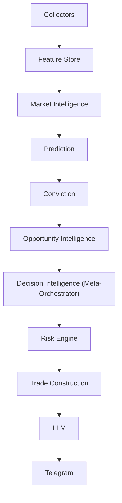
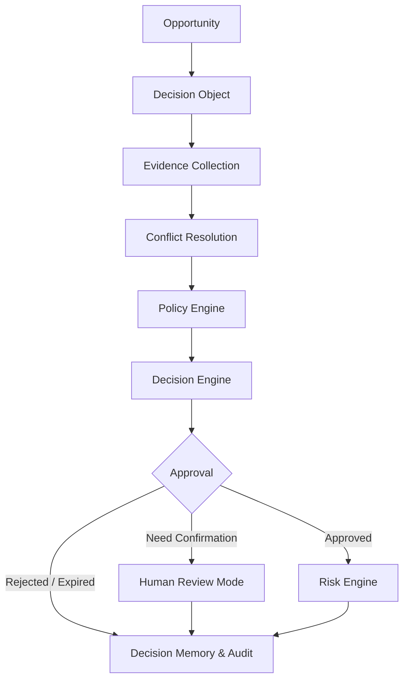

# Volume 5.9 — Decision Intelligence & Meta-Orchestrator

Volumes 1 through 5.75 gave QuantStack a full analytical stack — collectors, features, market intelligence, prediction, conviction, and opportunity ranking — but no single component with the authority to say "yes, send this signal." Volume 5.9 closes that architectural gap by introducing a Decision Intelligence layer and a Meta-Orchestrator: the only component allowed to approve signals. Every engine stops making independent decisions and instead submits evidence, which is resolved, scored against policies and rules, and turned into an auditable, replayable Decision Object that flows onward to risk and trade construction.

## Mission

The Decision Intelligence layer becomes the **brain of the entire platform**. Instead of every engine deciding independently, they all submit evidence, and the Meta-Orchestrator becomes the only component allowed to approve signals.

!!! note "Why a decision layer?"
    Think of the system like a company: Collectors → Features → Market Intelligence → Prediction → Opportunity Ranking. Every department produces its report — but nobody acts as the CEO who decides "yes, send this signal." Institutional systems almost always include an explicit **Decision Layer** for exactly this reason.

## New Architecture

**Current pipeline**

```text
Collectors
  ↓
Feature Store
  ↓
Market Intelligence
  ↓
Prediction
  ↓
Conviction
  ↓
Opportunity Engine
  ↓
Telegram
```

**New pipeline**

```text
Collectors
  ↓
Feature Store
  ↓
Market Intelligence
  ↓
Prediction
  ↓
Conviction
  ↓
Opportunity Intelligence
  ↓
Decision Intelligence
  ↓
Risk Engine
  ↓
Trade Construction
  ↓
LLM
  ↓
Telegram
```

Everything now goes through one place.



## Why This Matters

Consider a realistic conflict:

| Subsystem | Verdict |
|---|---|
| Prediction | BUY |
| Market Intelligence | Market unstable |
| Opportunity Engine | Best opportunity today |
| Risk Engine | High event risk |

Which one wins? Without orchestration — nobody knows.

## The Decision Object

Every candidate becomes a **Decision Object**, the universal handoff format consumed by every downstream system. It contains:

- Market State
- Feature Snapshot
- Prediction
- Conviction
- Opportunity Rank
- Risk
- Market Structure
- Sector
- Macro
- Historical Analog
- LLM Context
- Decision
- Reason

## Chapter 1 — Decision Philosophy

The Decision Engine never predicts. Instead, it **integrates**. Its responsibility is:

> Combine every subsystem into one coherent decision.

## Chapter 2 — Decision Pipeline

```text
Opportunity
  ↓
Decision Object
  ↓
Evidence Collection
  ↓
Conflict Resolution
  ↓
Policy Engine
  ↓
Decision Engine
  ↓
Approval
  ↓
Risk Engine
```



## Chapter 3 — Decision Context

Every decision must know:

- Current Regime
- Current Volatility
- Liquidity
- Market Confidence
- Macro Risk
- Sector Rotation
- Institutional Flow
- Historical Analogs
- Feature Quality
- Prediction Quality
- Opportunity Quality

!!! warning
    No decision happens without context.

## Chapter 4 — Evidence Engine

Every subsystem contributes evidence.

### Prompt 5.9.1 — Evidence Engine

```text
Build an Evidence Engine.

Collect evidence from:
- Market Intelligence
- Prediction Engine
- Conviction Engine
- Opportunity Engine
- Historical Analog Engine
- Feature Quality Engine
- Market Structure
- Risk Engine

Each evidence item contains:
- Source
- Weight
- Confidence
- Explanation
- Timestamp
- Version
- Evidence Score

Store complete evidence history.
```

## Chapter 5 — Evidence Graph

Don't keep evidence flat — build relationships between evidence items.

### Prompt 5.9.2 — Evidence Graph

```text
Create an Evidence Graph.

Nodes:
- Features
- Predictions
- Models
- Signals
- Regimes
- Historical Analogs
- Strategies

Edges:
- supports
- contradicts
- depends_on
- invalidates
- reinforces

Use graph traversal during decision making.
```

## Chapter 6 — Conflict Resolution Engine

Contradictory evidence is the norm, not the exception. Example:

| Source | Reading |
|---|---|
| Prediction | Bullish |
| Macro | Bearish |
| Breadth | Weak |
| Sector | Strong |

How do you decide? The Conflict Resolution Engine answers that question systematically.

### Prompt 5.9.3 — Conflict Resolution Engine

```text
Build a Conflict Resolution Engine.

Detect conflicting evidence.

Classify:
- Minor
- Moderate
- Critical

Resolve using:
- Evidence weights
- Historical reliability
- Current regime
- Confidence

Generate:
- Conflict Report
- Resolution
- Confidence Reduction
- Escalation Flag
```

## Chapter 7 — Policy Engine

The Policy Engine separates business rules from analytics.

### Prompt 5.9.4 — Policy Engine

```text
Build a Policy Engine.

Policies include:
- No trades during exchange outages.
- No signals during data degradation.
- No signals before high-impact events.
- No duplicate opportunities.
- Sector concentration limits.
- Maximum daily alerts.
- Confidence thresholds.

Policies must be configurable.
Support policy versioning.
```

## Chapter 8 — Decision Rules Engine

Prediction alone isn't enough — decisions must pass explicit, inspectable rules.

### Prompt 5.9.5 — Rule Engine

```text
Implement a Rule Engine.

Support:
- Boolean Rules
- Weighted Rules
- Decision Trees
- Rule Priorities
- Rule Overrides

Every decision must list:
- Rules Passed
- Rules Failed
- Rules Ignored
```

## Chapter 9 — Decision Score

Instead of relying on standalone Conviction, create a composite **Decision Score**.

### Prompt 5.9.6 — Decision Score

```text
Combine:
- Prediction
- Conviction
- Opportunity
- Market Intelligence
- Risk
- Liquidity
- Historical Analog
- Feature Quality
- Model Agreement
- Policy Compliance

Generate:
- Decision Score
- Decision Confidence
- Decision Grade
- Decision Stability
```

## Chapter 10 — Decision States

Instead of a binary BUY / SELL, decisions use richer states — much easier to debug:

| State | Meaning |
|---|---|
| Approved | Signal cleared for the Risk Engine |
| Pending | Awaiting evaluation |
| Need Confirmation | Requires additional validation |
| Delayed | Held back temporarily |
| Rejected | Failed policy, rule, or score checks |
| Expired | No longer valid |
| Escalated | Routed for human review |
| Research Only | Tracked for study, never sent |

## Chapter 11 — Human Review Mode

Because the system sends Telegram signals, some decisions may warrant manual confirmation before delivery.

### Prompt 5.9.7 — Human Review Mode

```text
Build Human Review Mode.

Allow decisions to require approval.

Conditions:
- Low confidence.
- Major macro event.
- High uncertainty.
- Model disagreement.
- Policy violation.

Support manual comments.
Persist review history.
```

## Chapter 12 — Decision Memory

The engine should remember its own history and learn from it.

### Prompt 5.9.8 — Decision Memory

```text
Store every decision.

Record:
- Evidence
- Decision
- Outcome
- Confidence
- Time
- Regime
- Features

Learn:
- Good decisions
- Bad decisions
- Frequently overridden decisions

Generate decision statistics.
```

## Chapter 13 — Decision Audit

Every signal should be explainable.

### Prompt 5.9.9 — Decision Audit Reports

```text
Generate Decision Audit Reports.

Include:
- Evidence
- Conflicts
- Policy Evaluation
- Rule Evaluation
- Decision Path
- Final Reason
- Confidence

Store reports permanently.
```

## Chapter 14 — Decision Knowledge Graph

Extend the Evidence Graph into a full knowledge graph over decisions.

### Prompt 5.9.10 — Decision Knowledge Graph

```text
Represent:
- Evidence
- Policies
- Rules
- Signals
- Historical Outcomes
- Models
- Regimes
- Predictions

Support:
- Root Cause Analysis
- Decision Replay
- Graph Queries
- Explainability
```

## Chapter 15 — Decision Replay

Any signal can be replayed after the fact.

### Prompt 5.9.11 — Decision Replay

```text
Replay decisions.

Show:
- Evidence
- Conflicts
- Rule Execution
- Policy Evaluation
- Final Decision
- Historical Outcome

Support timestamp replay.
```

## Chapter 16 — Meta-Orchestrator

The Meta-Orchestrator becomes the CEO of the platform.

### Prompt 5.9.12 — Meta-Orchestrator

```text
Build the Meta-Orchestrator.

Responsibilities:
- Coordinate all engines.
- Trigger workflows.
- Manage dependencies.
- Schedule inference.
- Handle retries.
- Manage state.
- Publish Decision Objects.
- Maintain workflow history.
```

## Chapter 17 — Workflow Engine

Everything becomes event-driven:

```text
Market Update
  ↓
Collector
  ↓
Features
  ↓
Market Intelligence
  ↓
Prediction
  ↓
Decision
  ↓
Risk
  ↓
Trade Construction
  ↓
Telegram
```

### Prompt 5.9.13 — Event-Driven Workflow Engine

```text
Implement an event-driven workflow engine.

Support:
- Async execution
- Dependency graphs
- Workflow recovery
- Partial retries
- Workflow tracing
- Workflow versioning
```

## Chapter 18 — Decision Dashboard

The dashboard displays:

- Decision Queue
- Pending Decisions
- Approved
- Rejected
- Policy Violations
- Evidence Graph
- Workflow Status
- Replay
- Decision Confidence
- Human Reviews

## Chapter 19 — Acceptance Criteria

!!! success "Acceptance criteria — before entering Volume 6"
    - Every engine produces evidence rather than independent decisions.
    - Decision Objects become the universal handoff format.
    - Policy Engine enforces configurable business constraints.
    - Conflict Resolution handles contradictory signals.
    - Decision Score replaces standalone conviction.
    - Meta-Orchestrator coordinates the complete workflow.
    - Every decision is replayable and auditable.
    - Human Review mode supports exceptional cases.
    - The platform can explain not only **what** decision it made, but **why**, **how**, and **which evidence contributed**.

## Looking Ahead — Volume 5.95: Simulation & Digital Twin Engine

After reviewing the complete architecture, one final foundational layer is worth inserting before Risk Management: a **Simulation & Digital Twin Engine** (Volume 5.95) — something rarely seen outside professional quantitative firms.

Instead of sending a signal immediately after the Decision Engine approves it, the platform creates a **Digital Twin of the market state** and simulates the signal under multiple scenarios:

- Different volatility spikes.
- Gap-up and gap-down openings.
- Sudden macro news.
- Liquidity deterioration.
- Higher slippage.
- Different holding periods.
- Alternate stop-loss and target placements.

The engine would answer questions like:

- How sensitive is this signal to a 1% overnight gap?
- What happens if volatility doubles?
- Does the signal still have positive expectancy if spreads widen?
- Is the setup robust or fragile?

!!! note
    Only signals that remain resilient across realistic simulated conditions receive the highest quality grade before moving into **Volume 6: Risk Management & Trade Construction**.

At this point, the platform is no longer just an AI signal generator — it functions as a complete **institutional quantitative research, decision-support, and signal-generation platform** with strong emphasis on reproducibility, explainability, robustness, and continuous improvement.
