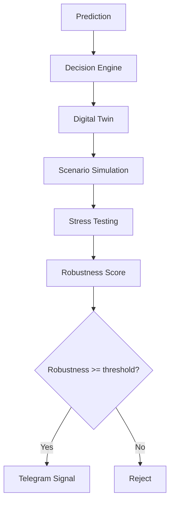
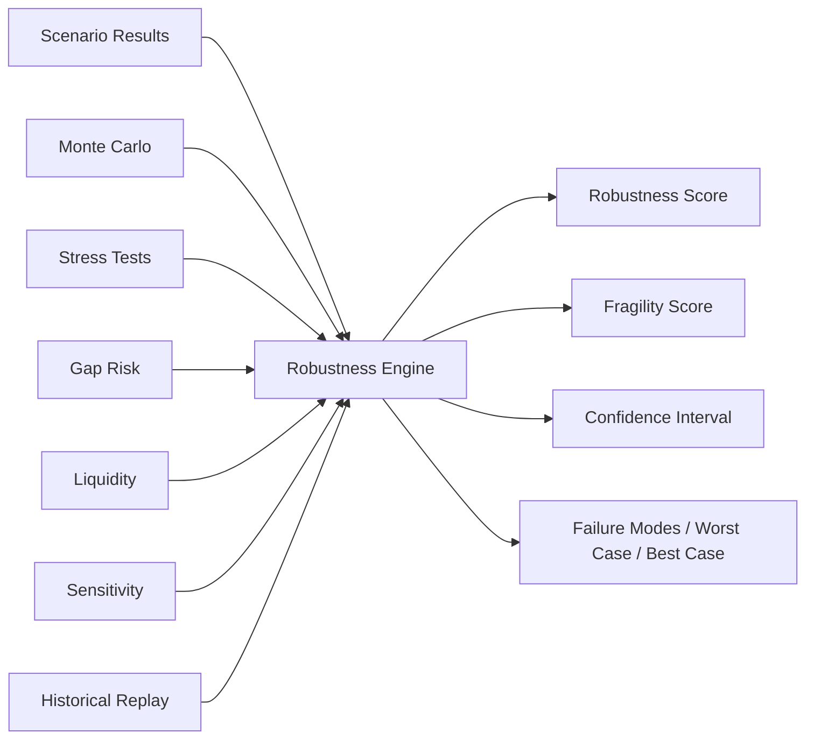

# Volume 5.95 — Simulation & Digital Twin Engine

Volume 5.95 is the last foundational layer before Risk Management. It transforms QuantStack from a prediction engine into a decision-support system that stress-tests every idea before exposing it to the user: before any approved signal reaches Telegram, the platform simulates how it behaves under dozens or hundreds of plausible future scenarios. The design draws on concepts from aerospace, autonomous systems, industrial control, and modern quantitative finance. Instead of asking *"Will this trade work?"*, the engine asks *"How robust is this trade if reality is different from our assumptions?"*

---

## Core Philosophy

The traditional pipeline sends predictions almost directly to the user:

```text
Prediction → Conviction → Telegram
```

The new pipeline inserts a full simulation layer between the Decision Engine and delivery:



This dramatically reduces fragile signals.

---

## Chapter 1 — What is a Digital Twin?

A Digital Twin is a complete snapshot of the market at one moment. It contains:

- Market
- Features
- Regime
- Liquidity
- Volatility
- Macro
- Breadth
- Sector Rotation
- Historical Analogs
- Prediction
- Decision
- Risk

!!! warning "Production isolation"
    The simulator never modifies production data. It always works on a digital copy:

    ```text
    Current Market → Digital Copy → Experiments
    ```

---

## Chapter 2 — Digital Twin Builder

### Prompt 5.95.1

```text
Build a Digital Twin Engine.

Given a Decision Object, clone:
- Market State
- Feature Snapshot
- Collector Outputs
- Market Intelligence
- Prediction
- Opportunity Ranking
- Decision Context
- Risk Inputs

Version every Digital Twin.
Support replay from any timestamp.
```

---

## Chapter 3 — Scenario Generator

Instead of testing one future, generate hundreds.

### Prompt 5.95.2

```text
Build a Scenario Generator.

Generate realistic scenarios including:
- Bull Continuation
- Bear Continuation
- Gap Up
- Gap Down
- Volatility Spike
- Volatility Collapse
- Liquidity Reduction
- Spread Expansion
- Sector Rotation
- Macro News
- Unexpected Earnings
- Global Selloff
- Global Rally
- Flash Crash
- Short Squeeze
- Stop Hunt

Generate probability for every scenario.
Store scenarios independently.
```

---

## Chapter 4 — Monte Carlo Engine

Institutional systems rarely trust one future.

### Prompt 5.95.3

```text
Build a Monte Carlo Simulation Engine.

Support:
- Price Paths
- Volatility Paths
- Correlation Paths
- Liquidity Paths

Generate 1,000+ independent simulations.

Output:
- Expected Return
- Worst Return
- Best Return
- Distribution
- Confidence Interval
```

---

## Chapter 5 — Market Shock Library

Instead of random shocks, maintain historical templates.

### Prompt 5.95.4

```text
Build a Market Shock Library.

Include:
- COVID Crash
- Flash Crash
- Budget Day
- Fed Surprise
- War
- Election
- Circuit Breakers
- Banking Crisis
- Commodity Shock
- Currency Shock
- Interest Rate Shock

Recreate historical market behavior.
Replay against Digital Twins.
```

---

## Chapter 6 — Liquidity Stress Engine

Prediction assumes liquidity. Reality doesn't.

### Prompt 5.95.5

```text
Simulate:
- Spread widening
- Reduced volume
- Order book thinning
- Execution delays
- Slippage
- Partial fills

Measure:
- Execution Quality
- Fill Probability
- Execution Risk
```

---

## Chapter 7 — Gap Risk Engine

Overnight gap risk is a huge omission in retail systems.

### Prompt 5.95.6

```text
Generate overnight gaps.

Support gap sizes:
- 0.5%
- 1%
- 2%
- 3%
- 5%

Directions:
- Gap Up
- Gap Down

Measure:
- Stop survivability
- Target survivability
- Expected Recovery
- Expected Loss
```

---

## Chapter 8 — Volatility Stress

### Prompt 5.95.7

```text
Stress test using:
- ATR ×2
- ATR ×3
- ATR ×4
- VIX Expansion
- Compression

Measure:
- Signal Stability
- Target Reach Probability
- Stop Probability
- Expected Holding Time
```

---

## Chapter 9 — Regime Switch Simulation

Suppose the market changes tomorrow.

### Prompt 5.95.8

```text
Change market regime.

Examples:
- Trending → Range
- Bull → Bear
- Risk On → Risk Off
- High Liquidity → Low Liquidity

Recompute prediction.
Measure sensitivity.
```

---

## Chapter 10 — Historical Replay

Instead of synthetic scenarios only, replay history.

### Prompt 5.95.9

```text
Replay historical periods.

Examples:
- COVID
- Budget
- Election
- Fed
- MSCI
- Bank Crisis

Measure how the signal would have behaved.
```

---

## Chapter 11 — Parameter Sensitivity

Every model has assumptions.

### Prompt 5.95.10

```text
Perturb inputs.

Change:
- Feature values
- Probability
- Conviction
- Liquidity
- Macro

Measure output stability.
Generate sensitivity report.
```

---

## Chapter 12 — Stop Loss Simulation

Instead of one stop, test many.

### Prompt 5.95.11

```text
Evaluate:
- ATR Stops
- Swing Stops
- Support Stops
- Fixed Stops
- Adaptive Stops

Output:
- Expected Drawdown
- Stop Frequency
- Average Loss
- Best Stop
```

---

## Chapter 13 — Target Simulation

### Prompt 5.95.12

```text
Evaluate:
- 1R
- 1.5R
- 2R
- 3R
- Dynamic Targets
- Resistance Targets
- Trailing Targets

Generate:
- Expected Profit
- Hit Probability
- Expected Holding Time
```

---

## Chapter 14 — Position Size Simulation

!!! note
    Even though the platform delivers signals via Telegram and does not execute trades, position-size robustness is still evaluated.

### Prompt 5.95.13

```text
Simulate risk per trade:
- 0.25%
- 0.5%
- 1%
- 2%
- 5%

Measure:
- Expected Drawdown
- Risk of Ruin
- Capital Curve
```

---

## Chapter 15 — Multi-Agent Debate

One of the most valuable additions. Instead of one opinion, simulate multiple experts.

### Prompt 5.95.14

```text
Create specialist reasoning agents:
- Bull Analyst
- Bear Analyst
- Macro Analyst
- Market Structure Analyst
- Risk Analyst
- Options Analyst

Each agent critiques the trade.

Generate:
- Consensus
- Disagreement
- Confidence
- Decision Summary

These agents provide analysis only—they do not override the
quantitative decision engine.
```

!!! warning "Advisory only"
    Multi-agent critiques are qualitative context. They never override the quantitative decision engine.

---

## Chapter 16 — Robustness Engine

This becomes the final score.



### Prompt 5.95.15

```text
Combine:
- Scenario Results
- Monte Carlo
- Stress Tests
- Gap Risk
- Liquidity
- Sensitivity
- Historical Replay

Generate:
- Robustness Score
- Fragility Score
- Confidence Interval
- Failure Modes
- Worst Case
- Best Case
```

---

## Chapter 17 — Decision Stress Test

### Prompt 5.95.16

```text
Stress test the Decision Engine.

Introduce:
- Missing Data
- Delayed Data
- Incorrect Predictions
- Collector Failures
- Feature Drift

Verify:
- Decision Stability
- Policy Compliance
- Recovery Time
```

---

## Chapter 18 — Simulation Dashboard

The dashboard displays:

- Digital Twin
- Scenario Explorer
- Monte Carlo Distribution
- Stress Tests
- Gap Analysis
- Liquidity Analysis
- Robustness Timeline
- Failure Modes
- Historical Replay
- Decision Sensitivity

---

## Chapter 19 — Promotion Rules

A signal should NOT reach Telegram if its Robustness Score is below a configurable threshold. Robustness becomes another important filter alongside conviction.

| Example | Conviction | Robustness | Outcome |
|---------|-----------:|-----------:|---------|
| High conviction, fragile signal | 95 | 32 | Reject |
| Moderate conviction, robust signal | 82 | 91 | Approve |

---

## Chapter 20 — APIs

Expose the following via API:

- Digital Twin
- Simulation Results
- Monte Carlo
- Stress Tests
- Scenario Library
- Robustness Reports
- Historical Replay
- Failure Modes

---

## Chapter 21 — Acceptance Criteria

!!! success "Acceptance criteria — before moving to Volume 6"
    - Every approved opportunity is converted into a Digital Twin.
    - Multiple realistic market scenarios are simulated.
    - Monte Carlo analysis estimates outcome distributions.
    - Historical crises can be replayed against current opportunities.
    - Liquidity, volatility, and gap-risk stress tests are available.
    - Multi-agent qualitative critiques accompany quantitative simulations.
    - A Robustness Score and Fragility Score are computed for every signal.
    - Only signals meeting configurable robustness thresholds proceed to Telegram.

---

## One Final Improvement Before Volume 6

Having reviewed the architecture end-to-end, one final "bridge" layer is inserted between simulation and risk management:

### Volume 5.99 — Execution Feasibility & Signal Packaging Engine

Its role is not to place trades, but to answer:

- Can this signal actually be traded in the real market?
- Is the spread acceptable?
- Is there enough liquidity at the proposed entry?
- Would the target still make sense after expected slippage?
- Should this be sent as an **Immediate Entry**, **Wait for Pullback**, **Breakout Confirmation**, or **Watchlist** signal?
- How should the signal be packaged for Telegram (summary, rationale, confidence, risk, invalidation conditions, follow-up rules)?

!!! note "Why this matters"
    This separates **"a statistically good idea"** from **"an actionable signal"**, ensuring that by the time Volume 6 (Risk Management & Trade Construction) begins, every opportunity has already been validated for realism, robustness, feasibility, and communication quality. It prevents excellent research ideas from becoming poor user-facing signals.
