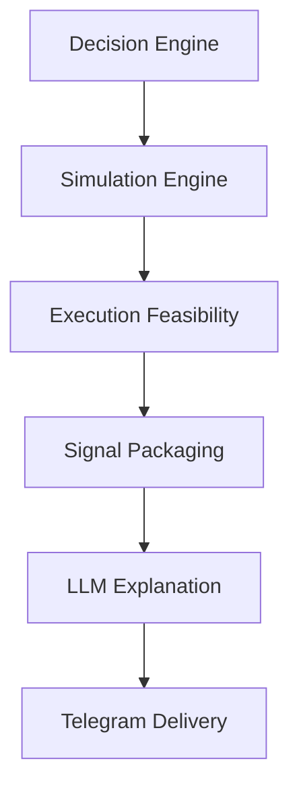
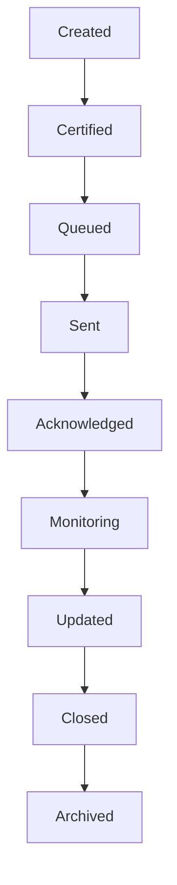

# Volume 5.99 — Signal Orchestration & Execution Feasibility Engine (SOEFE)

This volume defines the final architectural layer of QuantStack before the implementation-specific volumes (Risk Management, Trade Construction, LLM Synthesis, Telegram, Dashboard, Paper Trading, and Deployment). Where every preceding layer answers *"Is this statistically a good opportunity?"*, SOEFE answers *"Is this actually a high-quality signal that a human trader should receive right now?"*. It acts as the **Product Manager** of the entire AI system — transforming approved Decision Objects into human-actionable, certified, well-timed trading signals, and rejecting anything that cannot realistically be executed or communicated well.

!!! note "Why the rename?"
    This layer was originally scoped as "Execution Feasibility", but it is much more than checking liquidity. It orchestrates readiness, entry strategy, timing, expiration, packaging, personalization, urgency, deduplication, bundling, follow-ups, certification, and delivery — hence **Signal Orchestration & Execution Feasibility Engine (SOEFE)**.

## Mission

Transform an approved Decision Object into a **human-actionable trading signal**.

This layer decides:

- Is the signal executable?
- Is the timing correct?
- Is the entry realistic?
- Should it wait?
- Should it be rejected?
- How should it be presented?
- Should it even interrupt the user?

## Complete Pipeline



!!! note "Role of the LLM"
    In this pipeline the LLM is responsible **only for communication** — never for decision making. Every decision is made deterministically upstream; the LLM merely explains a structured Explainability Package.

## Chapter 1 — Signal Philosophy

A signal must satisfy four ascending layers of quality. A signal failing **any** stage is rejected.

1. **Statistical Quality**
2. **Execution Quality**
3. **Communication Quality**
4. **User Value**

## Chapter 2 — Signal Readiness Engine

The Signal Readiness Engine is the final gate before a signal is considered for delivery.

### Prompt 5.99.1

```text
Build a Signal Readiness Engine.

Consume:
- Decision Object
- Simulation Results
- Risk Assessment
- Market Structure
- Execution Feasibility

Evaluate:
- Can this trade realistically be executed?

Generate:
- Readiness Score
- Readiness Confidence
- Readiness Grade: Ready / Not Ready / Research Only / Watchlist
```

## Chapter 3 — Execution Feasibility Engine

The prediction may be excellent. Execution may not. This engine rejects opportunities that cannot be executed realistically.

### Prompt 5.99.2

```text
Build an Execution Feasibility Engine.

Evaluate:
- Current Bid Ask Spread
- Order Book Depth
- Average Volume
- Execution Latency
- Estimated Slippage
- Market Impact
- Tick Size
- Price Volatility

Generate:
- Execution Score
- Execution Confidence
- Execution Cost
- Execution Risk

Reject opportunities that cannot be executed realistically.
```

## Chapter 4 — Entry Strategy Engine

Instead of assuming a single entry, this engine determines the best execution style for the current market context.

### Prompt 5.99.3

```text
Determine the optimal entry method.

Support:
- Immediate Market Entry
- Limit Order
- Breakout Confirmation
- Pullback Entry
- VWAP Entry
- Opening Range Breakout
- Retest Entry

Generate:
- Recommended Entry Style
- Entry Window
- Expected Fill Probability
- Entry Confidence
```

## Chapter 5 — Timing Intelligence Engine

Good trade, wrong timing — still bad. This engine decides *when* a signal should reach the trader.

### Prompt 5.99.4

```text
Determine signal timing.

Analyze:
- Time of Day
- Market Open
- Lunch Session
- Closing Hour
- Volatility Window
- Macro Events

Generate:
- Timing Verdict: Immediate / Wait / Delay / Expire
- Best Entry Time
- Signal Timing Score
```

## Chapter 6 — Opportunity Expiration Engine

Every opportunity dies. This engine models how quickly, and auto-expires stale signals.

### Prompt 5.99.5

```text
Estimate opportunity lifetime.

Calculate:
- Time Until Invalid
- Expected Opportunity Duration
- Signal Half Life
- Confidence Decay

Auto expire stale signals.
Generate expiration timestamps.
```

## Chapter 7 — Signal Packaging Engine

This is where engineering meets product design: the approved decision becomes a structured, machine-readable Signal Package.

### Prompt 5.99.6

```text
Create a Signal Package.

Include:
- Instrument
- Direction
- Entry Zone
- Stop
- Target
- Risk Reward
- Confidence
- Opportunity Grade
- Market Regime
- Reason Codes
- Historical Analog Summary
- Simulation Summary
- Execution Recommendation
- Signal Expiration

Package everything into structured JSON.
Do not generate natural language.
```

## Chapter 8 — User Profile Engine (Future Ready)

Even if today there is only one Telegram channel, the architecture prepares for personalization.

### Prompt 5.99.7

```text
Build a User Profile Engine.

Support profiles:
- Conservative
- Swing
- Intraday
- Scalper
- Research
- Institutional

Customize per profile:
- Signal Threshold
- Risk
- Detail Level
- Frequency
- Preferred Sectors
- Preferred Holding Period
```

## Chapter 9 — Signal Severity Engine

Not all alerts deserve the same urgency.

### Prompt 5.99.8

```text
Assign urgency.

Levels:
- Critical
- High
- Medium
- Low
- Research

Factors:
- Opportunity Lifetime
- Market Volatility
- Confidence
- Historical Success
- Execution Window

Generate urgency score.
```

## Chapter 10 — Signal Deduplication Engine

Prevent alert fatigue by suppressing near-duplicate signals.

### Prompt 5.99.9

```text
Suppress duplicate signals.

Compare:
- Instrument
- Sector
- Direction
- Market Structure
- Historical Similarity
- Time Window

Keep highest quality signal.
Merge supporting evidence.
```

## Chapter 11 — Signal Bundling Engine

Sometimes several signals belong together and should be delivered as one coherent unit.

### Prompt 5.99.10

```text
Bundle related signals.

Examples:
- Banking Basket
- IT Basket
- Breakout Basket
- Momentum Basket
- Mean Reversion Basket

Generate:
- Bundle Summary
- Bundle Score
- Bundle Confidence
```

## Chapter 12 — Follow-Up Signal Engine

Signals should evolve after delivery, not go silent.

### Prompt 5.99.11

```text
Track every active signal.

Generate updates:
- Entry Filled
- Target 1 Hit
- Target 2 Hit
- Stop Moved
- Break Even
- Invalidated
- Expired

Generate follow-up messages automatically.
```

## Chapter 13 — Signal Quality Certification

One final audit across every quality dimension before a signal may be delivered.

### Prompt 5.99.12

```text
Certify every signal.

Verify:
- Data Quality
- Feature Quality
- Prediction Quality
- Simulation Quality
- Execution Quality
- Communication Quality

Generate verdict:
- Certified
- Rejected
- Needs Review
- Research Only
```

## Chapter 14 — Explainability Package

The Explainability Package is the **only** input the LLM receives — structured evidence, never raw model access.

### Prompt 5.99.13

```text
Create an Explainability Package.

Include:
- Evidence Graph
- Top SHAP Features
- Historical Analogs
- Simulation Summary
- Market State
- Decision Path
- Execution Assessment
- Communication Metadata

Output structured JSON only.
```

## Chapter 15 — Telegram Delivery Contract

Instead of free text, Telegram delivery uses a formal, versioned schema.

### Prompt 5.99.14

```text
Create a Telegram Delivery Schema.

Required fields:
- Header
- Instrument
- Direction
- Entry
- Stop
- Target
- Risk Reward
- Confidence
- Grade
- Market Regime
- Key Reasons
- Simulation Verdict
- Expiration
- Follow Up ID

Version every schema.
```

## Chapter 16 — Signal Lifecycle Manager

Every signal becomes a first-class entity with a persisted, replayable lifecycle.



### Prompt 5.99.15

```text
Track every lifecycle stage.

Persist:
- Timestamps
- State Changes
- User Actions
- Signal Updates
- Final Outcome

Replay history.
```

## Chapter 17 — Delivery Optimization Engine

Even perfect signals can be delivered poorly.

### Prompt 5.99.16

```text
Optimize signal delivery.

Goals:
- Reduce notification fatigue
- Prioritize urgent opportunities
- Avoid redundant alerts
- Respect user attention budget
- Learn ideal delivery cadence
```

## Chapter 18 — Quality Gates

A signal must pass **every** gate in sequence. Any failure at any gate results in rejection.

| Order | Gate | Purpose |
|-------|---------------|--------------------------------------------------|
| 1 | Prediction | Statistical quality of the model output |
| 2 | Simulation | Historical / scenario validation of the trade |
| 3 | Execution | Realistic executability (liquidity, cost, risk) |
| 4 | Certification | Final multi-dimension quality audit |
| 5 | Packaging | Structured, complete Signal Package |
| 6 | Telegram | Schema-conformant, versioned delivery payload |

!!! warning "Fail-closed behavior"
    Any failure at any gate rejects the signal. There is no partial pass — a signal either clears the entire chain or is never delivered.

## Chapter 19 — Dashboard

The SOEFE dashboard displays:

- Ready Signals
- Waiting Signals
- Bundles
- Certified Signals
- Rejected Signals
- Expiring Signals
- Delivery Queue
- Follow-Ups
- User Engagement
- Notification Analytics

## Chapter 20 — Acceptance Criteria

!!! success "Acceptance criteria — required before entering Volume 6"
    - Every Decision Object is converted into a Signal Package.
    - Execution feasibility is validated.
    - Entry strategy is selected.
    - Timing is optimized.
    - Opportunity expiration is tracked.
    - Signals are deduplicated and bundled when appropriate.
    - Every signal is certified before delivery.
    - Explainability Packages are generated for the LLM.
    - Telegram receives structured, versioned payloads rather than raw model outputs.
    - Signal lifecycle management supports updates, monitoring, and replay.

## Final Architectural Recommendation — Enterprise Plugin & Strategy SDK Layer

Having reviewed the complete system from Volume 1 through Volume 5.99, one more major enhancement is recommended before starting Volume 6.

Today, new collectors, features, models, and strategies would still require changes to the core codebase. Instead, create a formal SDK so third-party or internal developers can extend the platform **without modifying core modules**.

### SDK plugin categories

- Custom collectors (new brokers, exchanges, alternative data)
- Feature plugins
- Market intelligence plugins
- Prediction model plugins
- Strategy plugins
- Risk model plugins
- Signal formatter plugins
- Notification channel plugins (Telegram, Slack, Discord, email, mobile push)
- Dashboard widgets
- Research experiments

### Plugin manifest requirements

Each plugin declares:

| Manifest field | Purpose |
|---------------------------|--------------------------------------------------|
| Name and version | Identity and release tracking |
| Dependencies | Other plugins/services it requires |
| Configuration schema | Validated, typed configuration |
| Input/output contracts | Formal data contracts with the core platform |
| Health checks | Liveness/readiness reporting |
| Permissions | What platform capabilities it may access |
| Compatibility requirements | Supported core platform versions |

!!! note "Why this matters"
    This transforms QuantStack from a powerful application into a **true quantitative trading platform**, where new capabilities can be added modularly over time without destabilizing the production system. It is strongly recommended as the architectural foundation before implementing the remaining volumes (Risk Management, Trade Construction, LLM Synthesis, Telegram, Dashboard, Paper Trading, and Deployment).
