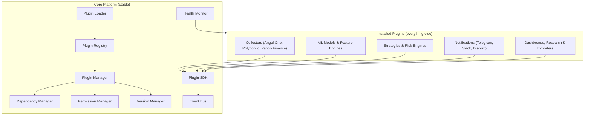
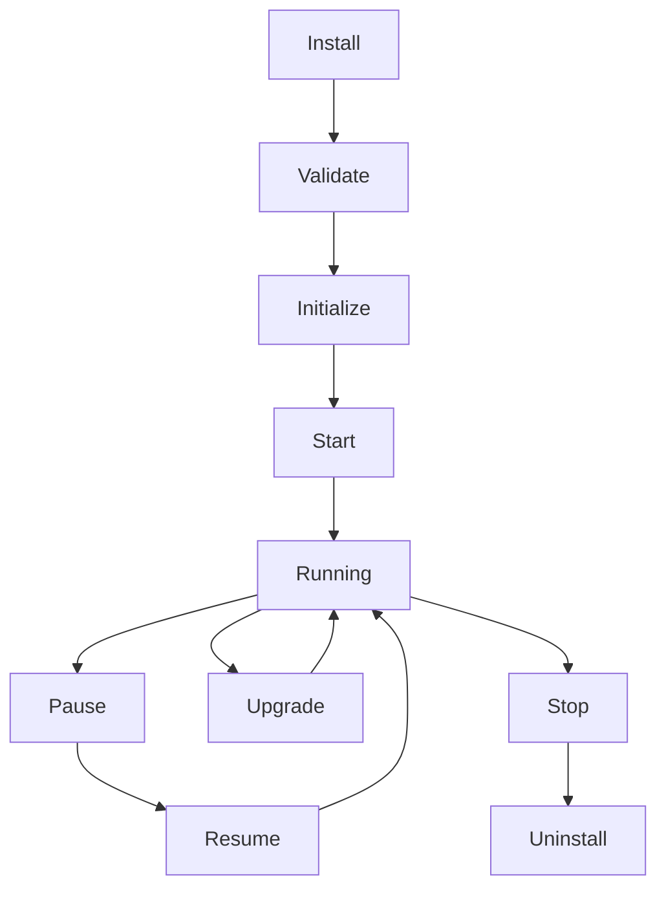

# Volume 5.999 — Enterprise SDK & Plugin Ecosystem

This volume completes the QuantStack architecture by transforming the system from an *application* into a *platform*. Every capability — data collectors, indicators, ML models, strategies, risk engines, notification channels, dashboards — becomes an installable plugin built against a stable SDK, so new functionality can be added without touching core code. It defines the plugin manifest, SDK surfaces, lifecycle management, registry, dependency resolution, permissions, sandboxing, developer tooling, and enterprise governance, and closes with the recommendation to freeze the architecture and move to implementation.

!!! note "Design lineage"
    This is the same architectural philosophy used by mature enterprise software: **Kubernetes** (plugins), **Grafana** (plugins), **VS Code** (extensions), **Apache Airflow** (operators), and **ElasticSearch** (plugins). Instead of writing features directly into the core, everything is pluggable — the largest architectural improvement of the entire roadmap.

## Mission

Turn the platform from an **Application** into a **Platform**.

A platform means: other developers → install plugins → restart → new capabilities appear — **without touching the core code**.

## Philosophy

The core system stays **stable**; plugins provide **everything else**. The core should know nothing about:

- Angel One
- Telegram
- OpenAI
- News APIs
- Specific indicators
- Specific models
- Specific strategies

Everything should be plugins.

## New Architecture

```text
                     CORE PLATFORM
------------------------------------------------------
  Plugin Loader        Plugin Registry     Plugin Manager
  Dependency Manager   Permission Manager  Version Manager
  SDK                  Event Bus           Configuration
  Health Monitor
------------------------------------------------------
                   Installed Plugins
  Collectors      Indicators      Feature Engines
  ML Models       Strategies      Risk Engines
  LLMs            Notifications   Dashboards
  Research        Reports         Exporters
```



## Chapter 1 — SDK Philosophy

Every extension must implement the same contract chain:

```text
Plugin → Manifest → Configuration → Lifecycle → Health Check → Events
```

Everything behaves identically.

## Chapter 2 — Plugin Types

The platform supports the following plugin types. Never hardcode plugin types.

| Category | Plugin Types |
|---|---|
| Data | Collector Plugin, Storage Plugin, Export Plugin |
| Analytics | Feature Plugin, Market Intelligence Plugin, Prediction Plugin |
| Trading Logic | Strategy Plugin, Risk Plugin, Decision Plugin, Simulation Plugin, Signal Plugin |
| Presentation | Dashboard Plugin, Visualization Plugin, Notification Plugin |
| Platform | Research Plugin, Authentication Plugin |

## Chapter 3 — Plugin Manifest

Every plugin declares its identity, requirements, and contracts through a manifest.

### Prompt 5.999.1

```text
Build a Plugin Manifest Specification.

Every plugin declares:

Plugin ID
Plugin Name
Version
Author
Description
Dependencies
Permissions
Compatible Platform Version
Configuration Schema
Entry Point
Health Endpoint
Supported Events
Output Contracts

Support semantic versioning.
Reject incompatible plugins.
```

## Chapter 4 — Plugin SDK

Plugins must never access internal modules directly — the SDK exposes stable interfaces only.

### Prompt 5.999.2

```text
Build a Plugin SDK.

Expose APIs for:

Logging
Configuration
Database
Redis
Feature Store
Market State
Decision Objects
Event Bus
Metrics
Health Checks
Authentication

Plugins must never access internal modules directly.
Expose stable interfaces only.
```

## Chapter 5 — Plugin Lifecycle

Every plugin behaves the same, moving through a managed lifecycle:



### Prompt 5.999.3

```text
Implement Plugin Lifecycle.

Support:

Installation
Initialization
Validation
Upgrade
Downgrade
Restart
Rollback
Removal

Track lifecycle events.
Persist plugin state.
```

## Chapter 6 — Plugin Registry

### Prompt 5.999.4

```text
Build a Plugin Registry.

Store:

Installed Plugins
Plugin Metadata
Dependencies
Configuration
Permissions
Versions
Health

Enable:

Search
Install
Update
Disable
Remove
Rollback
```

## Chapter 7 — Dependency Resolver

### Prompt 5.999.5

```text
Automatically resolve dependencies.

Detect:

Version conflicts
Circular dependencies
Missing plugins
Incompatible APIs

Prevent startup if dependencies fail.
```

## Chapter 8 — Permission Engine

Plugins shouldn't do everything. Access is explicit and audited.

### Prompt 5.999.6

```text
Build Plugin Permissions.

Permissions include:

Read Features
Write Features
Read Decisions
Publish Events
Database Access
Internet Access
Notification Access
Trading Access
Dashboard Access
Research Access

Audit every permission usage.
```

## Chapter 9 — Event SDK

!!! note
    Plugins communicate **only** through events — never by calling each other directly.

### Prompt 5.999.7

```text
Expose Event SDK.

Plugins subscribe to:

Market Updates
Feature Updates
Predictions
Signals
Risk
Simulation
News
Custom Events

Support:

Priority
Retries
Filtering
Dead Letter Queue
```

## Chapter 10 — Collector Plugins

Every data source becomes a plugin — for example: **Angel One** → plugin, **Polygon.io** → plugin, **Yahoo Finance** → plugin, **Custom Exchange** → plugin.

### Prompt 5.999.8

```text
Build Collector Plugin API.

Plugins expose:

Collect
Validate
Normalize
Publish
Health
Schedule

Support multiple collectors simultaneously.
```

## Chapter 11 — ML Plugin SDK

Instead of hardcoding LightGBM, support **any** model as a plugin.

### Prompt 5.999.9

```text
Build Model Plugin SDK.

Support:

Training
Prediction
Explainability
Calibration
Validation
Versioning
Metadata
Model Health
Inference Metrics
```

## Chapter 12 — Strategy Plugin SDK

Strategies become installable.

### Prompt 5.999.10

```text
Build Strategy SDK.

Every strategy exposes:

Entry Logic
Exit Logic
Risk
Filters
Parameters
Supported Markets
Version
Expected Features
```

## Chapter 13 — Dashboard SDK

Users create their own dashboards.

### Prompt 5.999.11

```text
Build Dashboard Plugin SDK.

Support:

Widgets
Charts
Tables
Heatmaps
Indicators
Custom Panels
Permissions
Theme Integration
```

## Chapter 14 — Notification SDK

Telegram today; tomorrow Discord, Slack, Email, Push — all as plugins.

### Prompt 5.999.12

```text
Build Notification SDK.

Support:

Telegram
Slack
Discord
Email
Webhooks
Push Notifications
SMS

Allow third-party notification plugins.
```

## Chapter 15 — Research SDK

Researchers build experiments on top of the platform.

### Prompt 5.999.13

```text
Expose Research SDK.

Support:

Candidate Features
Models
Experiments
Benchmarks
Validation
Leaderboard
Paper Generation
```

## Chapter 16 — Marketplace (Future)

The end-state vision: community → shares plugin → click install → works.

### Prompt 5.999.14

```text
Design a Plugin Marketplace.

Support:

Publishing
Ratings
Reviews
Security Verification
Compatibility Checks
Auto Updates
Licensing
Digital Signatures
```

## Chapter 17 — Security Sandbox

!!! warning "Never trust plugins"
    All plugins execute in a sandbox with hard resource and access restrictions. Malicious behavior is detected and compromised plugins are disabled automatically.

### Prompt 5.999.15

```text
Sandbox plugins.

Restrict:

Filesystem
Network
Database
Secrets
Memory
CPU

Detect malicious behavior.
Automatically disable compromised plugins.
```

## Chapter 18 — Plugin Testing Framework

### Prompt 5.999.16

```text
Provide testing SDK.

Support:

Unit Tests
Integration Tests
Mock Event Bus
Mock Feature Store
Mock Market State
Performance Benchmarks
Compatibility Validation
```

## Chapter 19 — Developer CLI

A dedicated CLI is a huge productivity gain for plugin developers.

### Prompt 5.999.17

```text
Build Platform CLI.

Commands:

create-plugin
validate-plugin
install-plugin
remove-plugin
upgrade-plugin
test-plugin
publish-plugin
benchmark-plugin
generate-docs
```

## Chapter 20 — Plugin Documentation Generator

Automatically document plugins from their metadata and interfaces.

### Prompt 5.999.18

```text
Generate documentation.

Include:

Interfaces
Configuration
Permissions
Dependencies
Events
Examples
API Reference

Markdown + HTML output.
```

## Chapter 21 — Plugin Health Engine

Every plugin gets monitored continuously.

### Prompt 5.999.19

```text
Measure:

Latency
Errors
Memory
CPU
Health
Availability
Restarts
Version

Generate plugin health dashboard.
```

## Chapter 22 — Enterprise Governance

For institutional users, plugin operations are governed by policy.

### Prompt 5.999.20

```text
Implement governance.

Support:

Plugin Approval Workflow
Role-Based Access
Organization Policies
Plugin Signing
Audit Logs
Compliance Reports
Version Locking
```

## Chapter 23 — Acceptance Criteria

!!! success "Acceptance criteria"
    Before starting **Volume 6**, the platform must satisfy all of the following.

    **Platform Foundation**

    - Core services run independently of plugins.
    - All major capabilities are exposed through stable SDK interfaces.

    **Extensibility**

    - New collectors, models, strategies, risk engines, dashboards, and notification channels can be added without modifying the core application.
    - Plugins declare metadata, permissions, and compatibility through manifests.

    **Reliability**

    - Plugin lifecycle (install, upgrade, rollback, uninstall) is fully managed.
    - Dependency resolution prevents incompatible combinations.
    - Plugin failures are isolated and do not crash the platform.

    **Security**

    - Plugins run with explicit permissions.
    - Sensitive resources (credentials, database, network) are governed by policy.
    - Audit logs capture installation, upgrades, permission changes, and runtime actions.

    **Developer Experience**

    - SDKs exist for all major extension points.
    - CLI tooling supports plugin creation, testing, packaging, and publishing.
    - Documentation is generated automatically from plugin metadata and interfaces.

    **Operations**

    - Plugin health is monitored continuously.
    - Governance supports enterprise deployment and compliance requirements.

## Final Architectural Recommendation

At this point, the architecture should be **frozen**. From **Volume 1** through **Volume 5.999**, the design covers:

- A modular data collection platform.
- A feature engineering and feature store system.
- A market intelligence layer.
- Ensemble prediction and conviction engines.
- A self-improving research platform.
- Opportunity portfolio optimization.
- Decision orchestration with auditable evidence.
- Digital twin simulation and stress testing.
- Signal orchestration and packaging.
- A fully extensible enterprise plugin ecosystem.

This is no longer just a Telegram signal generator — it is the blueprint for a **general-purpose quantitative intelligence platform**.

!!! warning "Do not add more architectural layers"
    No further architectural layers should be added before implementation. Any additional layer now is likely to increase complexity more than it increases value.

The next phase shifts from **architecture** to **implementation**, beginning with **Volume 6: Risk Management & Trade Construction** — deterministic position sizing, entry zones, stop-loss logic, profit targets, trade management rules, and capital allocation policies that consume the Decision Object and produce the final executable trade plan.
