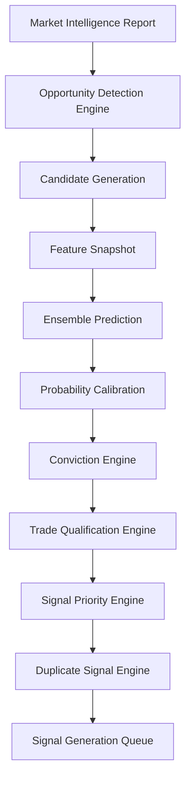
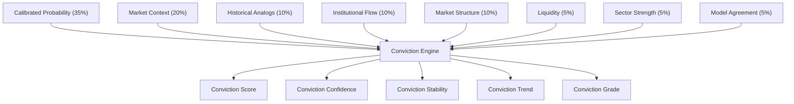

# Volume 5 — Opportunity Detection, Prediction & Conviction Engine

This volume specifies the decision-making core of QuantStack — the "brain" of the platform. Volumes 1–4 prepare information; Volume 5 is where the system actually decides whether a trading opportunity is worth acting on. It transforms the Market Intelligence Report into statistically validated trading opportunities through a hierarchical pipeline of opportunity detection, candidate generation, ensemble prediction, probability calibration, conviction scoring, and trade qualification — culminating in a prioritized, de-duplicated signal queue.

## Objective

Transform the Market Intelligence Report into a statistically validated trading opportunity.

Instead of asking:

> Is this stock bullish?

the system asks:

> Is this opportunity statistically better than all other opportunities available right now?

This subtle difference makes a huge impact.

## Architectural Decision: Hierarchical Decision Architecture

The original design used a simple linear flow:

```text
Features → LightGBM → Conviction
```

That is too simplistic. Institutional trading systems rarely let a single model directly decide trades. Instead, they use a **hierarchical decision architecture**, which replaces the original design:



!!! note "The ML model does not create trades"
    In this architecture, the ML model **only estimates probability** — it never creates trades directly. Detection, qualification, prioritization, and delivery are separate, auditable stages. This dramatically improves explainability.

## Chapter 1 — Opportunity Detection Engine

Most systems score every stock continuously. That is inefficient. Instead, every market update should first answer:

> **Is there anything worth evaluating?**

The engine consumes:

- Market State Report
- Market Structure
- Sector Rotation
- Breadth
- Institutional Flow
- Liquidity
- Volatility

Opportunity candidates are generated **only** when one of these conditions holds:

- Significant breakout probability
- Structural trend change
- Liquidity sweep detected
- Regime transition
- Institutional accumulation/distribution
- Exceptional relative strength
- High volatility expansion
- Event-driven opportunity

Opportunities are ranked by priority, avoiding unnecessary model inference on low-quality candidates.

### Prompt 5.1

```text
Build an Opportunity Detection Engine.

Consume:
- Market State Report
- Market Structure
- Sector Rotation
- Breadth
- Institutional Flow
- Liquidity
- Volatility

Generate Opportunity Candidates only when:
- Significant breakout probability
- Structural trend change
- Liquidity sweep detected
- Regime transition
- Institutional accumulation/distribution
- Exceptional relative strength
- High volatility expansion
- Event-driven opportunity

Rank opportunities by priority.

Avoid unnecessary model inference on low-quality candidates.
```

## Chapter 2 — Candidate Generator

Instead of evaluating everything, generate the **Top 20** possible trades. Each candidate carries:

| Field | Purpose |
|---|---|
| Instrument | The tradable symbol |
| Direction | Long or short bias |
| Reason | Why the opportunity was detected |
| Priority | Rank among current candidates |
| Supporting Features | Evidence backing the candidate |
| Feature Snapshot ID | Link to the frozen market state |
| Estimated Opportunity Lifetime | How long the setup is expected to remain valid |
| Current Market Regime | Regime at detection time |
| Market Confidence | Overall market quality at detection |

Candidates are stored independently from predictions.

### Prompt 5.2

```text
Build a Candidate Generation Engine.

For each opportunity generate:
- Instrument
- Direction
- Reason
- Priority
- Supporting Features
- Feature Snapshot ID
- Estimated Opportunity Lifetime
- Current Market Regime
- Market Confidence

Store candidates independently from predictions.
```

## Chapter 3 — Feature Snapshot

One of the biggest missing pieces in retail systems: every prediction must **freeze the market** first.

The flow must be `Snapshot → Prediction`, **not** `Live Market → Prediction`.

The snapshot stores:

- Timestamp
- Feature Versions
- Market Report
- Regime
- Feature Values
- Collector Versions
- Model Version
- Prediction Version

!!! warning "Reproducibility requirement"
    The snapshot must allow **exact historical reconstruction** of every prediction. Predicting against live, unfrozen market data breaks auditability and makes backtests unreliable.

### Prompt 5.3

```text
Build a Feature Snapshot Engine.

Freeze every feature used for prediction.

Store:
- Timestamp
- Feature Versions
- Market Report
- Regime
- Feature Values
- Collector Versions
- Model Version
- Prediction Version

The snapshot must allow exact historical reconstruction.
```

## Chapter 4 — Multi-Horizon Prediction

Do not predict "price". Predict probabilities across **multiple horizons**:

| Horizon |
|---|
| 5 min |
| 15 min |
| 30 min |
| 1 hour |
| End of Day |
| Next Day |

Outputs are probabilities only — no buy/sell recommendations — and every probability is stored independently.

### Prompt 5.4

```text
Build a Multi-Horizon Prediction Engine.

Generate probabilities for:
- 5 min
- 15 min
- 30 min
- 1 hour
- End of Day
- Next Day

Probability outputs only.

Do not generate buy/sell recommendations.

Store every probability independently.
```

## Chapter 5 — Triple Barrier Labeling

The original triple-barrier idea is retained — but expanded with additional barrier types.

Supported barriers:

- Dynamic Profit Target
- Dynamic Stop
- Maximum Holding Time
- Gap Events
- Trailing Barrier
- Event Barrier
- Liquidity Barrier

Generated labels:

- Win
- Loss
- Timeout
- Partial Success
- Label Quality

Labels are stored separately from features.

### Prompt 5.5

```text
Implement Triple Barrier Labeling.

Support:
- Dynamic Profit Target
- Dynamic Stop
- Maximum Holding Time
- Gap Events
- Trailing Barrier
- Event Barrier
- Liquidity Barrier

Generate:
- Win
- Loss
- Timeout
- Partial Success
- Label Quality

Store labels separately from features.
```

## Chapter 6 — Ensemble Prediction

Do not trust a single model. Train an ensemble:

- LightGBM
- CatBoost
- XGBoost
- Random Forest
- Extra Trees
- Logistic Regression (baseline)

The ensemble generates:

- Probability
- Confidence
- Uncertainty
- Per-model explanations
- Disagreement Score

Predictions are blended using weighted averaging.

### Prompt 5.6

```text
Build an Ensemble Prediction Engine.

Train:
- LightGBM
- CatBoost
- XGBoost
- Random Forest
- Extra Trees
- Logistic Regression (baseline)

Generate:
- Probability
- Confidence
- Uncertainty
- Per-model explanations
- Disagreement Score

Blend predictions using weighted averaging.
```

## Chapter 7 — Bayesian Probability Calibration

Raw ML probabilities are often overconfident. Calibration corrects this.

Supported methods:

- Platt Scaling
- Isotonic Regression
- Temperature Scaling

The best calibration method is chosen automatically. Output per prediction:

- Raw Probability
- Calibrated Probability
- Calibration Confidence

### Prompt 5.7

```text
Implement Probability Calibration.

Support:
- Platt Scaling
- Isotonic Regression
- Temperature Scaling

Choose the best calibration method.

Output:
- Raw Probability
- Calibrated Probability
- Calibration Confidence
```

## Chapter 8 — Model Agreement Engine

Very important. If the models disagree, do not trade:

```text
LightGBM → Bullish
CatBoost → Bearish
        ↓
   Don't trade.
```

The engine calculates:

- Prediction Variance
- Agreement %
- Confidence Spread
- Consensus Probability
- Model Reliability

Only high-agreement predictions proceed.

### Prompt 5.8

```text
Build a Model Agreement Engine.

Calculate:
- Prediction Variance
- Agreement %
- Confidence Spread
- Consensus Probability
- Model Reliability

Only high-agreement predictions proceed.
```

## Chapter 9 — Historical Similarity Prediction

A huge improvement over pure model output. For every candidate, retrieve the **Top 20 historical analogs** and compute:

- Historical Win Rate
- Average Return
- Worst Drawdown
- Best Run-up
- Probability Distribution

These historical statistics feed directly into the Conviction Engine.

### Prompt 5.9

```text
For every candidate:

Retrieve Top 20 Historical Analogs.

Calculate:
- Historical Win Rate
- Average Return
- Worst Drawdown
- Best Run-up
- Probability Distribution

Pass historical statistics into the Conviction Engine.
```

## Chapter 10 — Market Context Adjustment

Models do not know context. This engine does. Model probabilities are adjusted using:

- Market Confidence
- Liquidity
- Event Risk
- Regime Stability
- Institutional Participation
- Volatility

Confidence is reduced whenever market quality deteriorates.

### Prompt 5.10

```text
Adjust model probabilities using:
- Market Confidence
- Liquidity
- Event Risk
- Regime Stability
- Institutional Participation
- Volatility

Reduce confidence whenever market quality deteriorates.
```

## Chapter 11 — Conviction Engine

This replaces the old scoring logic. Instead of a simple `Rule 40% / ML 60%` split, conviction blends eight weighted evidence sources:

| Evidence Source | Weight |
|---|---|
| ML Probability (calibrated) | 35% |
| Market Context | 20% |
| Historical Analog | 10% |
| Institutional Flow | 10% |
| Market Structure | 10% |
| Liquidity | 5% |
| Sector Strength | 5% |
| Model Agreement | 5% |

!!! note "Configurable weights"
    The weights should be configurable — and eventually learnable — rather than hard-coded.



The engine outputs, with every contribution explained:

- Conviction Score
- Conviction Confidence
- Conviction Stability
- Conviction Trend
- Conviction Grade

### Prompt 5.11

```text
Build the Conviction Engine.

Combine:
- Calibrated Probability
- Market Intelligence
- Historical Analogs
- Sector Rotation
- Liquidity
- Institutional Flow
- Market Structure
- Model Agreement

Generate:
- Conviction Score
- Conviction Confidence
- Conviction Stability
- Conviction Trend
- Conviction Grade

Explain every contribution.
```

## Chapter 12 — Trade Qualification Engine

Another strongly recommended layer: even with high conviction, some trades should never be sent.

A trade is rejected if any of the following holds:

- Liquidity too low
- Spread too large
- Event Risk too high
- Model disagreement high
- Feature Quality poor
- Market Confidence poor
- Historical analog reliability poor

Every rejection produces explicit rejection reasons. Only qualified trades continue.

### Prompt 5.12

```text
Build a Trade Qualification Engine.

Reject trades if:
- Liquidity too low
- Spread too large
- Event Risk too high
- Model disagreement high
- Feature Quality poor
- Market Confidence poor
- Historical analog reliability poor

Generate rejection reasons.

Only qualified trades continue.
```

## Chapter 13 — Signal Priority Engine

Suppose 40 signals appear at once — Telegram should not receive all 40. Qualified trades are ranked using:

- Conviction
- Opportunity Quality
- Risk
- Liquidity
- Sector Leadership
- Historical Reliability
- Expected Reward
- Expected Opportunity Lifetime

Only the **Top N** signals are output.

### Prompt 5.13

```text
Build a Signal Priority Engine.

Rank qualified trades using:
- Conviction
- Opportunity Quality
- Risk
- Liquidity
- Sector Leadership
- Historical Reliability
- Expected Reward
- Expected Opportunity Lifetime

Output Top N signals.
```

## Chapter 14 — Duplicate Signal Engine

Avoid spam. The engine detects:

- Repeated Opportunities
- Correlated Stocks
- Repeated Breakouts
- Sector Duplication

Duplicate alerts are suppressed and signal diversity is maintained.

### Prompt 5.14

```text
Build a Duplicate Signal Engine.

Detect:
- Repeated Opportunities
- Correlated Stocks
- Repeated Breakouts
- Sector Duplication

Suppress duplicate alerts.

Maintain signal diversity.
```

## Chapter 15 — Opportunity Lifecycle

Signals evolve. Every opportunity moves through a tracked lifecycle:

```text
Detected → Confirmed → Qualified → Sent → Monitoring → Expired → Succeeded / Failed
```

The lifecycle manager persists timestamps at every stage and measures:

- Detection Delay
- Signal Age
- Signal Lifetime
- Expiration Reason
- Outcome

### Prompt 5.15

```text
Implement an Opportunity Lifecycle Manager.

Track every stage.

Persist timestamps.

Measure:
- Detection Delay
- Signal Age
- Signal Lifetime
- Expiration Reason
- Outcome
```

## Chapter 16 — Explainability

Every signal must be fully explainable. The Explainability Report includes:

- Top SHAP Features
- Market Regime
- Historical Analogs
- Model Agreement
- Confidence Breakdown
- Conviction Breakdown
- Reason Codes
- Natural Language Summary

### Prompt 5.16

```text
Generate an Explainability Report.

Include:
- Top SHAP Features
- Market Regime
- Historical Analogs
- Model Agreement
- Confidence Breakdown
- Conviction Breakdown
- Reason Codes
- Natural Language Summary
```

## Chapter 17 — APIs

The volume exposes the following surfaces:

- Opportunity Candidates
- Predictions
- Convictions
- Qualified Trades
- Opportunity History
- Explainability Reports
- Model Agreement
- Probability Calibration

## Chapter 18 — Acceptance Criteria

!!! success "Acceptance criteria — before proceeding to Volume 6"
    - Opportunities are detected before inference.
    - Candidate generation is independent of prediction.
    - Feature snapshots ensure reproducibility.
    - Multi-horizon probabilities are generated.
    - Ensemble models are calibrated.
    - Model agreement is evaluated.
    - Conviction combines quantitative evidence, not just model output.
    - Trade Qualification filters unsuitable trades.
    - Signal Priority ranks the best opportunities.
    - Explainability reports accompany every qualified trade.

## Recommended Extension: Volume 5.5 — Alpha Research Engine

At this point the system is already beyond most retail signal generators. One additional capability is recommended before generating entry, stop-loss, and targets: instead of relying only on predefined features, build a subsystem that **continuously searches for new predictive signals**.

The Alpha Research Engine would:

- Evaluate candidate features automatically.
- Rank them by predictive power.
- Detect feature decay over time.
- Recommend new features for inclusion.
- Compare new models against production models.
- Maintain a research leaderboard of features and strategies.

!!! note "Why this matters"
    This turns the platform into a **self-improving quantitative research system** rather than a static signal generator. By the time Volume 6 (Risk Management & Trade Construction) is reached, the platform has a much stronger foundation for producing consistently high-quality Telegram signals.
