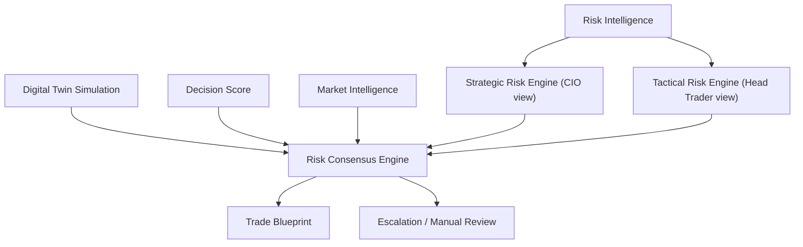
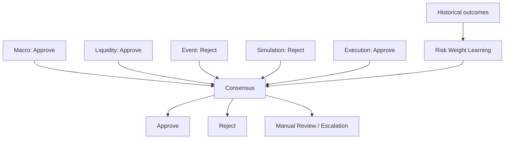

# Volume 6.1 — Dual Risk Intelligence Framework

This volume replaces the single monolithic Risk Engine with a **Dual Risk Intelligence Framework** that separates strategic risk (should we participate at all?) from tactical risk (can we execute this safely?). The two independent engines feed a Risk Consensus Engine that resolves conflicts transparently, learns weights from historical outcomes, predicts likely failure modes, and attaches a fully explainable risk assessment to every Trade Blueprint. The design mirrors institutional practice, where risk is never owned by one team.

## Rationale: Why Risk Should Not Be a Single Engine

Institutional firms do not have one risk engine — they run several independent risk functions, for example:

- Portfolio Risk
- Market Risk
- Execution Risk
- Counterparty Risk
- Model Risk
- Operational Risk

Since QuantStack generates signals rather than directly executing trades, not every category is needed — but **strategic and tactical risk must be separated**.

### Architecture

Instead of a single `Risk Engine`, the platform builds:

```text
                    Risk Intelligence
                           │
        ┌──────────────────┴──────────────────┐
        │                                     │
Strategic Risk Engine               Tactical Risk Engine
        │                                     │
        └──────────────┬──────────────────────┘
                       ▼
              Risk Consensus Engine
                       ▼
                Trade Blueprint
```



This architecture is significantly more robust.

### Why split them?

Imagine this situation:

| Signal input | Assessment |
|---|---|
| Nifty | Bullish |
| Liquidity | Excellent |
| Entry | Perfect |
| Spread | Excellent |

Everything looks great. But tomorrow is **RBI Policy**.

Should you trade?

- **Strategic Risk says:** No
- **Tactical Risk says:** Excellent setup

!!! warning
    Without two engines, you cannot explain this conflict. A single blended risk score silently hides the fact that a perfectly executable trade may be strategically unwise.

## Strategic Risk Engine

This engine thinks like a **Chief Investment Officer**. It asks:

> **Should we even participate?**

### Implementation Prompt 6.1.1

```text
Build Strategic Risk Engine.

Evaluate:

Market Regime

Macro Environment

Sector Rotation

Breadth

Institutional Flow

Correlation

Tail Risk

Geopolitical Events

Economic Calendar

Volatility Regime

Market Confidence

Historical Analogs

Portfolio Exposure (future)

Generate:

Strategic Risk Score

Strategic Confidence

Strategic Approval

Strategic Risk Category

Strategic Risk Explanation
```

### Strategic Risk Dimensions

Instead of one score, strategic risk is broken into independent dimensions:

- Macro Risk
- Market Risk
- Sector Risk
- Volatility Risk
- Tail Risk
- Event Risk
- Regime Risk
- Correlation Risk
- Systemic Risk

Every dimension receives its own:

- **Probability**
- **Severity**
- **Confidence**

### Strategic Risk Heatmap

The engine produces a dashboard-ready heatmap of the strategic dimensions:

```text
Macro    ██████░░░
Event    █████████
Sector   ███░░░░░░
Tail     ████░░░░░
```

## Tactical Risk Engine

Now think like a **Head Trader**. The question becomes:

> **Can we execute this safely?**

### Implementation Prompt 6.1.2

```text
Build Tactical Risk Engine.

Evaluate:

Spread

Slippage

Liquidity

Market Depth

Execution Delay

Position Size

Entry Quality

Stop Placement

Target Quality

Expected Holding Time

ATR

Order Book

Gap Risk

Execution Cost

Generate:

Execution Risk

Entry Risk

Exit Risk

Position Risk

Execution Confidence

Execution Grade
```

### Tactical Risk Metrics

The Tactical Risk Engine generates:

- Entry Quality
- Execution Cost
- Fill Probability
- Partial Fill Probability
- Stop Stability
- Target Probability
- Position Efficiency
- Execution Complexity

### Tactical Simulation

Use the **Digital Twin** for tactical testing. Run perturbation scenarios:

| Perturbation | Scenarios |
|---|---|
| Entry | ±0.25%, ±0.5%, ±1% |
| Slippage | ATR ×2 |
| Spread | ×3 |
| Volume | ÷2 |

Measure the resulting **execution degradation**.

## Risk Consensus Engine

Instead of a single opaque score such as `Risk: 82`, the consensus layer generates:

| Component | Score |
|---|---|
| Strategic | 72 |
| Tactical | 94 |
| **Consensus** | **81** |

### Implementation Prompt 6.1.3

```text
Build Risk Consensus Engine.

Combine:

Strategic Risk

Tactical Risk

Simulation

Decision Score

Market Intelligence

Generate:

Consensus Risk

Risk Confidence

Conflict Level

Approval

Escalation

Risk Explanation
```

### Conflict Resolution

| Case | Strategic | Tactical | Resolution |
|---|---|---|---|
| 1 | 95 | 20 | Reject |
| 2 | 80 | 82 | Approve |
| 3 | 55 | 98 | Manual review |

!!! note
    Conflicting assessments must trigger escalation or manual review — never a silent override of one engine by the other.

### Risk Voting

Every engine votes, and the votes are combined into consensus:

| Voter | Vote |
|---|---|
| Macro | Approve |
| Liquidity | Approve |
| Event | Reject |
| Simulation | Reject |
| Execution | Approve |



### Risk Weight Learning

Don't freeze voting weights. Instead, learn them:

1. Analyze **historical outcomes**
2. **Improve weights** based on which engines predicted correctly
3. Apply the improved weights to produce the **new consensus**

## Failure Prediction

The framework predicts: *what is most likely to fail?*

| Failure mode | Probability |
|---|---|
| False breakout | 41% |
| Macro | 22% |
| Trend exhaustion | 17% |
| Gap | 12% |
| Liquidity | 8% |

## Risk Memory

Every failed trade updates the **Risk Database**, so the system learns **which risks actually mattered** — not just which risks were flagged.

## Early Warning Engine

Before a trade fails, warn. The Early Warning Engine continuously monitors:

- Liquidity
- Spread
- Volatility
- Market Structure
- Breadth
- Institutional Flow
- Correlation
- Macro

Escalation path:

```text
Warning → Critical → Exit recommendation
```

## Adaptive Risk

Most current systems use a fixed rule such as `Stop: 2%, always`. The adaptive approach derives stops from live conditions:

```text
Current regime
    ↓
Current volatility
    ↓
Current liquidity
    ↓
Current spread
    ↓
Current event risk
    ↓
Adaptive stop
```

This makes a huge difference in practice.

## Risk Explainability

Every Trade Blueprint receives a complete explanation chain:

1. Why risk was approved
2. Why risk was rejected
3. Top 10 risk contributors
4. Historical comparison
5. Simulation evidence

## New Database Tables

| Table | Purpose |
|---|---|
| `strategic_risk` | Strategic Risk Engine outputs (score, confidence, approval, category, explanation) |
| `tactical_risk` | Tactical Risk Engine outputs (execution/entry/exit/position risk, grade) |
| `risk_votes` | Per-engine approve/reject votes |
| `risk_consensus` | Combined consensus risk, conflict level, approval, escalation |
| `risk_history` | Historical risk assessments over time |
| `risk_failures` | Failed trades and the risks that actually mattered |
| `risk_warnings` | Early Warning Engine alerts and escalations |
| `risk_models` | Risk weight learning models |
| `adaptive_risk` | Adaptive stop and risk parameters per regime/conditions |
| `risk_explainability` | Explanation chains attached to Trade Blueprints |

## Dashboard

The risk dashboard displays:

- Strategic Risk
- Tactical Risk
- Consensus
- Conflict
- Macro Heatmap
- Execution Heatmap
- Failure Probability
- Warning Timeline
- Risk Trend
- Historical Risk

## Acceptance Criteria

!!! success "Acceptance criteria"
    Before moving to **Volume 7**, verify that:

    - Strategic and Tactical Risk are completely independent modules.
    - Each engine generates its own score, confidence, and explanation.
    - The Risk Consensus Engine combines outputs transparently.
    - Conflicting assessments trigger escalation or manual review instead of silent overrides.
    - Risk weights adapt based on historical outcomes without bypassing governance.
    - Early Warning continuously monitors active trades for deteriorating conditions.
    - Every Trade Blueprint includes a complete, explainable risk assessment with supporting evidence.

## Next Recommended Volume

With Data Collection, Feature Store, Market Intelligence, Prediction, Alpha Research, Opportunity Intelligence, Decision Intelligence, Simulation, Signal Orchestration, and Strategic & Tactical Risk in place, the next logical step is **not** Telegram or the LLM layer.

### Volume 6.5 — Trade Lifecycle & Adaptive Management Engine

This engine manages a trade **after** the signal has been generated. Responsibilities:

- Monitor every active signal in real time.
- Detect when market conditions invalidate the original thesis.
- Decide whether to hold, scale in, scale out, move stops, take partial profits, or exit early.
- Continuously compare the live market against the original Decision Object and Digital Twin.
- Learn from the complete trade lifecycle to improve future trade construction.

!!! note
    This creates a clear separation between **planning a trade** and **managing a live trade**, mirroring how professional trading desks operate. Inserting it before the LLM and Telegram communication layers ensures signals remain intelligent throughout their lifetime, not just at the moment they are created.
