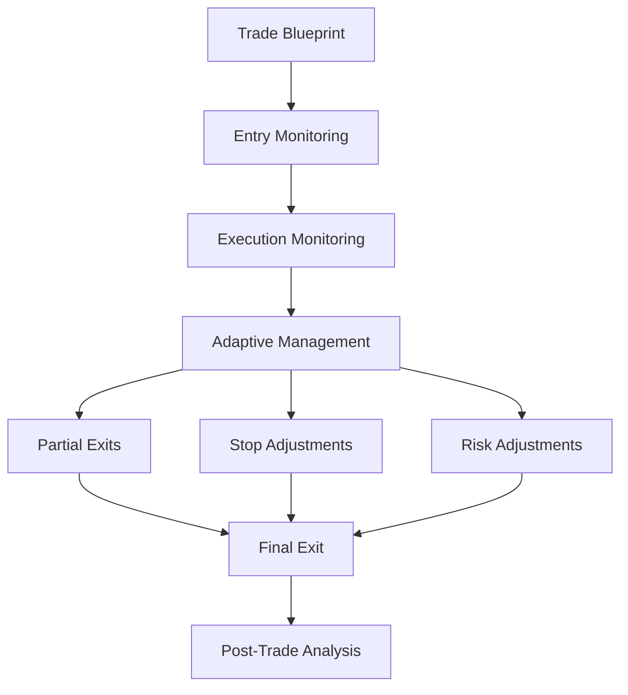
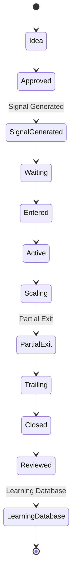

# Volume 6.5 — Trade Lifecycle & Adaptive Management Engine

Most trading systems stop thinking after a signal is generated — professional trading desks do not. This volume defines QuantStack's **Trade Manager**: an engine that treats every trade as a *living object* which continuously evolves from creation until it reaches a terminal state. It covers the full trade state machine, entry monitoring, thesis validation, adaptive stops, partial exits, scaling, live risk monitoring, event response, and the feedback loop into the Learning Engine.

!!! note "Design principle: implementation over architecture"
    At this point over 95% of the platform architecture has been designed. From here onward, the project deliberately avoids adding more architectural layers just because it can — otherwise the result is an architecture that is incredibly sophisticated but takes years to build. Volume 6.5 is the last purely architectural volume; the remaining volumes focus on **implementation**: communicating, operating, monitoring, deploying, and continuously improving the system in production.

---

## Mission

A trade is considered a **living object**. Once created, it continuously evolves until it reaches one of several terminal states.

Instead of the naive pipeline:

- Signal → Entry → Target → Done

QuantStack builds a full management pipeline:



This engine becomes the **Trade Manager**.

---

## Trade Lifecycle

Every trade follows the same lifecycle, and **every state transition is recorded permanently**.



---

## Chapter 1 — Trade State Engine

The core state machine that every trade runs on.

### Prompt 6.5.1

```text
Build a Trade State Engine.

Support states:
- Created
- Waiting Entry
- Entered
- Active
- Scaling In
- Scaling Out
- Break Even
- Trailing Stop
- Target One
- Target Two
- Target Three
- Stopped Out
- Expired
- Cancelled
- Closed

Persist:
- timestamps
- state transitions
- transition reasons
- manual overrides
- system overrides
```

---

## Chapter 2 — Entry Monitoring Engine

Sometimes price never reaches the planned entry. The Entry Monitoring Engine decides whether a planned entry is still valid.

### Prompt 6.5.2

```text
Monitor entry conditions.

Evaluate:
- Current Price
- Entry Zone
- Market Structure
- Liquidity
- Spread
- Market Regime

Generate:
- Entry Valid
- Entry Delayed
- Entry Cancelled
- Entry Expired
- Entry Confidence
```

---

## Chapter 3 — Thesis Validation Engine

Every trade is based on a thesis (for example: *trend continuation*). The engine continuously asks:

> Is the original thesis still valid?

### Prompt 6.5.3

```text
Track original trade thesis.

Monitor:
- Trend
- Volume
- Breadth
- Sector
- Institutional Flow
- Market Structure
- Macro
- Historical Analog

Generate:
- Thesis Strength
- Thesis Deterioration
- Thesis Invalidated
- Recommended Action
```

---

## Chapter 4 — Adaptive Stop Engine

Stops should evolve rather than remain static for the life of the trade.

### Prompt 6.5.4

```text
Manage dynamic stops.

Support:
- Break Even
- ATR Trail
- Swing Trail
- Structure Trail
- Time Trail
- VWAP Trail
- Volatility Trail

Generate:
- Updated Stop
- Reason
- Expected Protection
- Risk Reduction
```

---

## Chapter 5 — Partial Exit Engine

Professional traders rarely exit everything at once; exits are staged across multiple targets.

### Prompt 6.5.5

```text
Support staged exits.

Generate:
- Target One
- Target Two
- Target Three
- Exit Percentage
- Remaining Position
- Expected Value
- Probability

Update Trade Blueprint automatically.
```

---

## Chapter 6 — Scaling Engine

Sometimes conviction increases; sometimes it decreases. The Scaling Engine decides how position size should respond.

### Prompt 6.5.6

```text
Evaluate whether to:
- Scale In
- Hold
- Scale Out
- Close

Inputs:
- Market Intelligence
- Risk
- Simulation
- Trade Performance

Generate:
- Scaling Recommendation
- Updated Position Size
- Updated Risk
```

---

## Chapter 7 — Live Risk Monitor

Risk changes continuously while a trade is open.

### Prompt 6.5.7

```text
Monitor:
- Gap Risk
- Liquidity
- Spread
- Volatility
- Macro
- News
- Execution

Generate:
- Current Risk
- Risk Change
- Emergency Risk
- Updated Trade Rating
```

---

## Chapter 8 — Early Exit Engine

!!! warning "Not every losing trade should wait for the stop"
    When the reason for being in a trade disappears, waiting for the stop-loss simply donates money to the market. The Early Exit Engine detects these conditions and recommends action before the stop is hit.

### Prompt 6.5.8

```text
Detect:
- Thesis Failure
- Market Regime Change
- Liquidity Collapse
- Macro Shock
- Feature Drift

Generate:
- Exit Now
- Reduce Position
- Continue
- Hold
- Confidence
```

---

## Chapter 9 — Opportunity Upgrade Engine

Sometimes a trade improves after entry, and the plan should improve with it.

### Prompt 6.5.9

```text
Evaluate whether:
- Conviction increased
- Risk decreased
- Liquidity improved
- Historical probability improved

Generate:
- Upgrade Score
- Revised Blueprint
- Updated Targets
- Updated Stops
```

---

## Chapter 10 — Opportunity Degradation Engine

The mirror of the Upgrade Engine: monitor deterioration in an open opportunity.

### Prompt 6.5.10

```text
Detect:
- Conviction Loss
- Breadth Weakness
- Sector Weakness
- Macro Risk
- Institutional Selling
- Feature Drift

Generate:
- Degradation Score
- Urgency
- Updated Recommendation
```

---

## Chapter 11 — Trade Health Engine

Every active trade receives a continuously updated health score.

### Prompt 6.5.11

```text
Generate:
- Trade Health
- Trade Momentum
- Trade Stability
- Trade Confidence
- Trade Quality

Update continuously.
```

---

## Chapter 12 — Live Digital Twin

Simulation does not stop at signal time — the Digital Twin keeps running while the trade is active.

### Prompt 6.5.12

```text
Keep the Digital Twin synchronized.

Replay:
- Current market
- Current risk
- Current volatility
- Current liquidity

Recompute robustness continuously.
```

---

## Chapter 13 — Event Response Engine

React to unexpected events during the trade.

### Prompt 6.5.13

```text
Monitor:
- Breaking News
- Economic Releases
- Corporate Announcements
- Market Halts

Generate:
- Pause
- Reduce
- Exit
- Continue

Update users automatically.
```

---

## Chapter 14 — Learning Engine

The lifecycle itself becomes training data for the platform.

### Prompt 6.5.14

```text
Record:
- Every state transition
- Every stop movement
- Every exit
- Every manual intervention
- Every missed opportunity

Generate:
- Lifecycle Statistics
- Optimization Suggestions
- Updated Trade Patterns
```

---

## Chapter 15 — Lifecycle Dashboard

The dashboard displays:

- Active Trades
- Waiting Entries
- Health Scores
- Thesis Strength
- Risk Trend
- Stop History
- Target Progress
- Partial Exits
- Scaling History
- Live Digital Twin
- Trade Timeline

---

## Chapter 16 — Acceptance Criteria

!!! success "Acceptance criteria — before entering Volume 7"
    - Every trade is treated as a state machine.
    - Trade thesis is continuously validated.
    - Stops adapt dynamically.
    - Partial exits and scaling are supported.
    - Risk is monitored throughout the trade.
    - Trade Health is continuously recalculated.
    - Unexpected events automatically trigger reassessment.
    - Every lifecycle event feeds back into the Learning Engine.

---

## Architectural Note

At this point, the platform covers:

- Market understanding
- Prediction
- Decision making
- Simulation
- Risk management
- Trade construction
- Live trade management

The remaining volumes are no longer about *how to trade*. They are about **how to communicate, operate, monitor, deploy, and continuously improve** the system in production.

### Remaining roadmap

Rather than continuing to add intermediate architecture, the remainder of the project is structured as follows:

| Volume | Focus |
| ------ | ----- |
| Volume 7 | LLM Intelligence & Explainability Engine |
| Volume 8 | Telegram, Dashboard & User Experience |
| Volume 9 | Backtesting, Paper Trading & Evaluation |
| Volume 10 | Production Infrastructure (Docker, Kubernetes, CI/CD, Monitoring, Security) |
| Volume 11 | Enterprise Operations (multi-user, RBAC, audit, billing, organizations) |
| Volume 12 | Future AI Roadmap (autonomous research agents, reinforcement learning, portfolio optimization, plugin marketplace, multi-broker support) |

This is the point where the architecture is complete and coherent. From Volume 7 onward, every addition should directly support building and operating the platform rather than expanding the architecture further.
