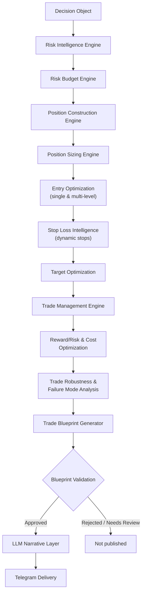
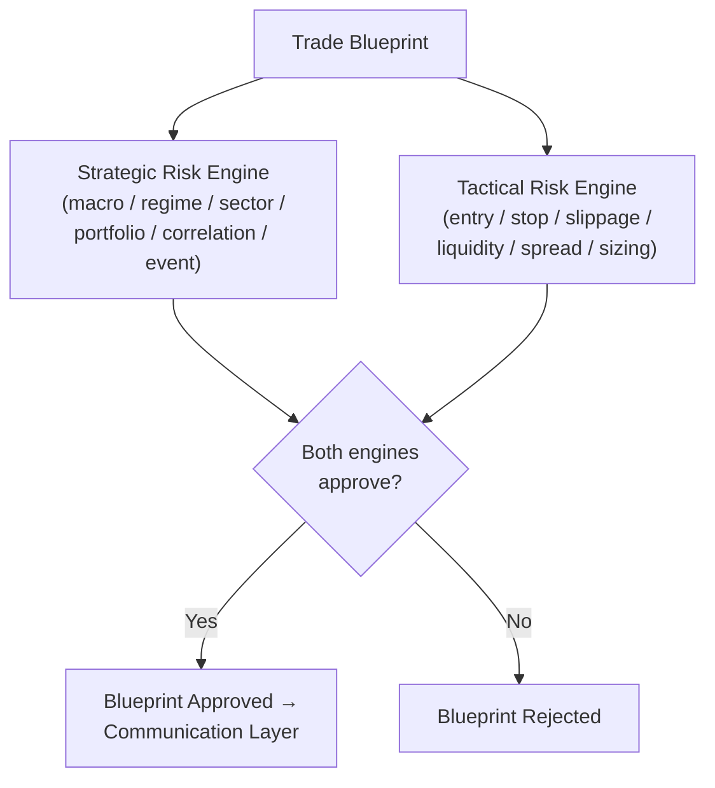

# Volume 6 — Risk Intelligence & Trade Construction Engine

With the platform architecture completed in Volumes 1–5, Volume 6 shifts from designing the platform to designing **trading intelligence**. It converts an approved Decision Object into an optimal, executable **Trade Blueprint** by treating trade construction as a constrained optimization problem — not a simplistic entry/stop/target calculation. This volume acts as the platform's **Chief Risk Officer**: every trade is risk-analyzed, sized, optimized, stress-tested, and validated before it ever reaches the communication layer.

!!! note "Why this volume exists"
    Most retail systems calculate an entry, a stop loss, and a target using ATR, support, and resistance — and stop there. That is far too simplistic. Institutional systems instead ask: *"Given current volatility, liquidity, expected move, execution quality, market structure, historical analogs, and acceptable risk, what is the optimal trade structure?"* That is a completely different problem, and it is the problem this volume solves.

## Mission

Convert an approved Decision Object into the **optimal executable trade plan** — not merely `BUY / Entry / Stop / Target`, but a full trade-construction pipeline:

1. Trade Blueprint
2. Risk Analysis
3. Position Structure
4. Entry Optimization
5. Stop Optimization
6. Target Optimization
7. Trade Management
8. Execution Plan

## Architecture

The Decision Object produced by the upstream decision layer flows through risk intelligence and trade construction before anything is communicated to users:



## Chapter 1 — Risk Philosophy

The platform never asks *"How much can I make?"* Instead it asks:

> "What is the worst realistic outcome?"

If that answer is unacceptable, **the trade never exists**. Risk first. Always.

## Chapter 2 — Risk Intelligence Engine

Everything starts here. The Risk Intelligence Engine consumes the full upstream context and produces a multi-dimensional risk assessment.

### Prompt 6.1

```text
Build a Risk Intelligence Engine.

Consume:
- Decision Object
- Market State
- Simulation Results
- Market Structure
- Liquidity
- Historical Analog
- Macro Events

Calculate:
- Market Risk
- Execution Risk
- Liquidity Risk
- Gap Risk
- Volatility Risk
- Model Risk
- Feature Risk
- Correlation Risk
- Event Risk
- Tail Risk

Generate:
- Overall Risk Score
- Risk Confidence
- Risk Stability
- Risk Trend

Store complete risk history.
```

## Chapter 3 — Risk Budget Engine

Professional firms never think "take every trade." Instead, every day begins with a **risk budget**. Available budget is reduced dynamically after losses or during elevated market risk.

### Prompt 6.2

```text
Build a Risk Budget Engine.

Manage:
- Daily Risk Budget
- Weekly Risk Budget
- Sector Risk Budget
- Correlation Budget
- Volatility Budget
- News Budget
- Tail Risk Budget
- Opportunity Budget

Reduce available budget dynamically after losses or elevated market risk.

Publish remaining risk capacity.
```

## Chapter 4 — Position Construction Engine

With risk understood and budget available, the engine builds the initial shape of the trade.

### Prompt 6.3

```text
Construct the initial trade blueprint.

Determine:
- Trade Direction
- Holding Style
- Expected Duration
- Confidence
- Expected Return
- Expected Drawdown
- Expected Volatility
- Position Complexity

Generate Position Blueprint.
```

## Chapter 5 — Position Sizing Engine

Never "buy 100 shares." Everything is **volatility-adjusted**.

### Prompt 6.4

```text
Build Position Sizing Engine.

Support:
- Fixed Fractional
- ATR Risk
- Volatility Scaling
- Kelly Fraction (bounded)
- Expected Shortfall
- Risk Parity (future portfolio support)

Generate:
- Suggested Position Size
- Maximum Position
- Minimum Position
- Confidence Adjusted Size
- Risk Adjusted Size
- Position Size Explanation
```

## Chapter 6 — Entry Optimization Engine

This replaces simplistic entries with an execution-quality-aware assessment of where to enter.

### Prompt 6.5

```text
Optimize entry.

Evaluate:
- Current Price
- VWAP
- Volume Profile
- Liquidity Zones
- Order Blocks
- Fair Value Gaps
- ATR
- Expected Move
- Spread
- Execution Cost

Generate:
- Optimal Entry
- Acceptable Entry Zone
- Worst Acceptable Entry
- Expected Fill Probability
- Entry Quality Score
```

## Chapter 7 — Multi-Level Entry Engine

Institutional systems rarely enter once. Staged entries are a first-class capability.

### Prompt 6.6

```text
Support staged entries.

Generate:
- Entry 1
- Entry 2
- Entry 3
- Scaling Rules
- Maximum Slippage
- Cancel Conditions
- Expected Average Price
```

## Chapter 8 — Stop Loss Intelligence

This is where most systems fail. Instead of a single ATR- or support-based stop, the engine generates **multiple stop candidates**, evaluates each, and selects the optimal one.

### Prompt 6.7

```text
Generate candidate stop losses.

Support:
- ATR
- Swing Low
- Liquidity Zone
- Structure Break
- VWAP
- Support
- Adaptive Stop
- Time Stop
- Volatility Stop
- Simulation Stop

Evaluate:
- Expected Loss
- Hit Probability
- Noise Sensitivity
- Gap Survivability

Choose optimal stop.
```

## Chapter 9 — Dynamic Stop Engine

Markets evolve — the stop must evolve with them.

### Prompt 6.8

```text
Manage stop dynamically.

Support:
- Break Even
- Trailing ATR
- Swing Trail
- VWAP Trail
- Time Trail
- Volatility Trail

Generate update conditions.

Track stop history.
```

## Chapter 10 — Target Optimization

Targets are never hardcoded (e.g. a fixed 2R). Multiple candidate targets are generated from structure, statistics, and simulation.

### Prompt 6.9

```text
Generate multiple targets.

Support:
- Volume Profile
- Resistance
- Expected Move
- ATR
- Measured Move
- Historical Analog
- Simulation

Generate:
- Target 1
- Target 2
- Target 3
- Probability
- Expected Holding Time
- Expected Reward
```

## Chapter 11 — Trade Management Engine

The trade isn't over after entry. A complete management plan is generated **before** entry.

### Prompt 6.10

```text
Build Trade Management Engine.

Support:
- Scale In
- Scale Out
- Partial Exit
- Trailing Stop
- Risk Reduction
- Time Exit
- Emergency Exit

Generate management plan before entry.
```

## Chapter 12 — Reward/Risk Optimization

Professional systems don't pick a trade structure — they **optimize** across candidate structures.

### Prompt 6.11

```text
Evaluate candidate trade structures.

Optimize:
- Expected Return
- Risk
- Probability
- Holding Time
- Execution Quality
- Simulation Results

Generate:
- Optimal Trade Structure
- Expected R Multiple
- Efficiency Score
```

## Chapter 13 — Execution Cost Engine

Real returns are returns **minus costs**. Costs must be modeled, not ignored.

### Prompt 6.12

```text
Estimate:
- Slippage
- Brokerage
- Taxes
- Exchange Fees
- Spread
- Market Impact

Generate:
- Expected Cost
- Worst Cost
- Cost Confidence
- Net Expected Return
```

## Chapter 14 — Trade Robustness Engine

Simulation meets execution: the proposed trade structure is stress-tested by perturbing its parameters.

### Prompt 6.13

```text
Stress test trade structure.

Perturb:
- Entry
- Stop
- Target
- Position Size
- Liquidity
- Volatility

Measure:
- Robustness
- Fragility
- Sensitivity
- Trade Stability
```

## Chapter 15 — Risk/Reward Intelligence

Not a naive "2:1" ratio — everything is **probability-weighted**.

### Prompt 6.14

```text
Generate:
- Expected Value
- Probability Weighted RR
- Expected Drawdown
- Tail Risk
- Expected Utility
- Risk Efficiency
- Sharpe Contribution
- Sortino Contribution
```

## Chapter 16 — Failure Mode Engine

Every trade should know **how it fails** before it begins.

### Prompt 6.15

```text
Predict likely failure modes.

Examples:
- False Breakout
- Liquidity Sweep
- Gap
- Macro Event
- Sector Rotation
- Volatility Expansion
- Weak Breadth

Generate:
- Failure Probability
- Mitigation
- Early Warning Signals
```

## Chapter 17 — Trade Blueprint Generator

Everything produced by the preceding engines is assembled into **one object** — the Trade Blueprint — and stored permanently.

### Prompt 6.16

```text
Generate Trade Blueprint.

Include:
- Direction
- Entry
- Scaling Plan
- Position Size
- Stop
- Targets
- Risk
- Expected Return
- Trade Management
- Execution Plan
- Failure Modes
- Simulation Summary

Store blueprint permanently.
```

## Chapter 18 — Blueprint Validation

Nothing leaves the engine without validation.

### Prompt 6.17

```text
Validate:
- Risk
- Execution
- Simulation
- Policy
- Market State
- Signal Quality
- Decision

Generate:
- Approved
- Rejected
- Needs Review
```

## Chapter 19 — Risk Dashboard

The risk dashboard displays the live state of the risk and trade-construction layer:

- Current Risk Budget
- Active Trade Risk
- Position Sizes
- Sector Exposure
- Gap Risk
- Tail Risk
- Stop Quality
- Target Quality
- Blueprint Queue
- Trade Robustness
- Failure Warnings

## Chapter 20 — Acceptance Criteria

!!! success "Acceptance criteria — before moving to Volume 7"
    - Every trade has a formal **Trade Blueprint**.
    - Position sizing is risk-based, not fixed.
    - Entries are optimized using market structure and execution quality.
    - Multiple stop-loss candidates are evaluated before selecting the best one.
    - Targets are probability-weighted rather than fixed multiples.
    - Trade management rules are defined before the trade begins.
    - Execution costs are incorporated into expected returns.
    - Failure modes are identified proactively.
    - Every blueprint passes validation before reaching the communication layer.

## Design Improvement — Split Risk Into Two Independent Systems

One major improvement to Volume 6, and something most retail platforms do not do: **split risk into two independent engines**. A Trade Blueprint is only approved if **both engines independently approve it**.

| Engine | Concerns |
| --- | --- |
| **Strategic Risk Engine** | Macro exposure, regime risk, sector concentration, cross-asset risk, portfolio-level risk, event risk, correlation risk |
| **Tactical Risk Engine** | Entry quality, stop placement, slippage, liquidity, spread, execution timing, intraday volatility, position sizing |



!!! note "Why the split matters"
    This separation makes the platform much easier to audit, explain, and improve, because long-term strategic concerns and short-term execution concerns evolve for different reasons. It also aligns with how professional trading organizations separate portfolio risk oversight from execution risk management.
