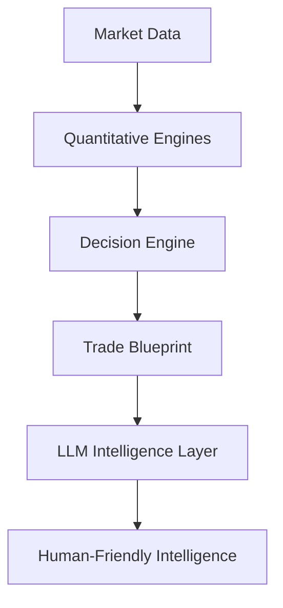
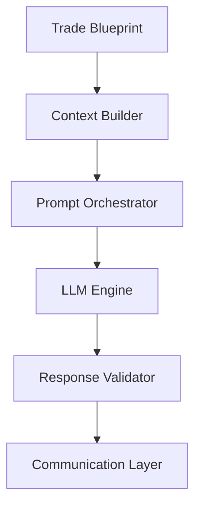

# Volume 7 — AI Intelligence, Explainability & Communication Engine

Everything before Volume 7 has been quantitative: the platform understands the market, features, predictions, risk, simulation, and the trade lifecycle — but it cannot yet **reason**, **explain**, **communicate**, or **interact**. Volume 7 transforms the system from a quantitative engine into an **AI Analyst**. The objective is **not** to allow the LLM to make trading decisions; instead, the LLM becomes an intelligence layer that explains, summarizes, communicates, and assists while remaining grounded in the deterministic outputs of the quantitative engines.

## Core Philosophy

Never allow the LLM to invent signals. Instead:



!!! note "The LLM translates — it never decides"
    The LLM never replaces quantitative logic. It translates it.

## Architecture



## Chapter 1 — AI Philosophy

The AI should answer questions such as:

- Why was this trade selected?
- Why is the confidence high?
- Why is the stop located there?
- Why is today different from yesterday?
- What changed since the previous signal?
- What risks should traders monitor?
- What market regime are we currently in?

!!! warning "No invented numbers"
    The AI should **never** invent numbers. It should only use structured data from the platform.

## Chapter 2 — Context Builder

The LLM should never receive raw databases. Instead it receives a structured context package.

### Prompt 7.1

```text
Build a Context Builder.

Collect:
- Decision Object
- Trade Blueprint
- Market Intelligence Report
- Risk Assessment
- Simulation Results
- Historical Analogs
- Trade Lifecycle
- Feature Importance
- Evidence Graph

Output structured JSON.
Limit context size.
Version every context package.
```

## Chapter 3 — Prompt Orchestrator

Different tasks require different prompts.

### Prompt 7.2

```text
Build a Prompt Orchestrator.

Support prompt templates for:
- Trade Explanation
- Market Summary
- Signal Summary
- Risk Summary
- Morning Report
- Evening Report
- Sector Analysis
- Research Assistant
- Post Trade Review

Prompt versions must be tracked.
Support A/B testing.
```

## Chapter 4 — AI Personas

Different communication styles for different audiences.

### Prompt 7.3

```text
Implement AI Personas.

Examples:
- Quant Analyst
- Risk Manager
- Macro Strategist
- Technical Analyst
- Research Assistant
- Market Commentator
- Educational Tutor

Each persona has:
- Tone
- Vocabulary
- Detail Level
- Audience
```

## Chapter 5 — Explainability Engine

Every signal should be fully explainable.

### Prompt 7.4

```text
Generate Explainability Reports.

Include:
- Decision Summary
- Top SHAP Features
- Market Regime
- Risk Factors
- Historical Analogs
- Simulation Summary
- Evidence Chain
- Reason Codes

Output:
- Technical Version
- Simplified Version
- Executive Summary
```

## Chapter 6 — Natural Language Generator

Convert structured data into readable reports.

### Prompt 7.5

```text
Generate natural language reports.

Support:
- Daily Reports
- Weekly Reports
- Monthly Reports
- Trade Reports
- Research Reports
- Portfolio Reports

Maintain factual consistency.
Never invent statistics.
```

## Chapter 7 — AI Fact Verification

Hallucinations are unacceptable.

### Prompt 7.6

```text
Build an AI Verification Engine.

Every generated statement must reference:
- Trade Blueprint
- Decision Object
- Market Report
- Risk Report

Reject unsupported statements.
Generate confidence for each sentence.
```

## Chapter 8 — Multi-Agent Reasoning

Use specialist agents, each producing an opinion, with a moderator generating the final summary.

### Prompt 7.7

```text
Create AI specialist agents.

- Quant Analyst
- Macro Analyst
- Risk Analyst
- Options Analyst
- News Analyst
- Technical Analyst
- Moderator

Each produces an opinion.
Moderator generates final summary.
Record disagreements.
```

## Chapter 9 — Conversation Memory

Maintain continuity across interactions.

### Prompt 7.8

```text
Build Conversation Memory.

Track:
- Previous Questions
- Previous Signals
- Previous Reports
- User Preferences
- Research Topics

Support long-term memory.
Version conversation history.
```

## Chapter 10 — Educational Engine

Explain concepts to users at their level.

### Prompt 7.9

```text
Build an Educational Engine.

Explain:
- Indicators
- Strategies
- Market Regimes
- Risk Concepts
- Trade Decisions

Support:
- Beginner
- Intermediate
- Advanced
- Expert
```

## Chapter 11 — Comparative Analysis Engine

Users often ask: *"What changed?"*

### Prompt 7.10

```text
Compare:
- Today vs Yesterday
- Signal vs Previous Signal
- Current Regime vs Historical Regime
- Current Risk vs Previous Risk

Generate:
- Differences
- Reasons
- Expected Impact
```

## Chapter 12 — Market Narrative Engine

Generate a coherent market story.

### Prompt 7.11

```text
Build Market Narrative Engine.

Combine:
- Macro
- Sector Rotation
- Institutional Flow
- Breadth
- Market Structure

Generate:
- Market Story
- Bullish Drivers
- Bearish Drivers
- Key Risks
- Opportunities

Maintain chronological consistency.
```

## Chapter 13 — Research Assistant

Assist quantitative research.

### Prompt 7.12

```text
Build Research Assistant.

Answer:
- Feature Questions
- Model Questions
- Experiment Questions
- Strategy Questions
- Simulation Questions

Use internal research database.
Never fabricate results.
```

## Chapter 14 — Signal Explanation Engine

Every Telegram signal receives an explanation.

### Prompt 7.13

```text
Generate Signal Explanation.

Include:
- Trade Thesis
- Supporting Evidence
- Risk Summary
- Simulation Summary
- Failure Conditions
- Confidence
- Expected Holding Time

Keep explanation concise.
Support multiple verbosity levels.
```

## Chapter 15 — Post-Trade Review Engine

Once a trade ends, the AI explains the outcome.

### Prompt 7.14

```text
Generate Post Trade Review.

Include:
- Original Thesis
- Actual Outcome
- Decision Quality
- Risk Management
- Missed Opportunities
- Lessons Learned

Feed insights back into the research system.
```

## Chapter 16 — Report Generation Engine

Automatically generate documents.

### Prompt 7.15

```text
Generate:
- Morning Brief
- Pre-Market Report
- Intraday Updates
- Closing Report
- Weekly Review
- Monthly Intelligence Report
- Research Digest
- Risk Digest

Export as:
- Markdown
- PDF
- HTML
```

## Chapter 17 — AI Governance

The AI should have strict boundaries.

### Prompt 7.16

```text
Implement AI Governance.

Rules:
- Never generate unsupported facts.
- Never modify quantitative outputs.
- Never recommend trades outside approved Decision Objects.
- Always cite internal evidence.
- Maintain complete audit logs.
- Version prompts.
- Version responses.
```

## Chapter 18 — AI Dashboard

The AI dashboard displays:

- Active AI Conversations
- Generated Reports
- Prompt Versions
- Context Packages
- AI Confidence
- Verification Results
- Persona Usage
- Hallucination Checks
- User Feedback
- Report History

## Chapter 19 — APIs

Expose the following APIs:

- Context Builder
- Explainability Reports
- Market Narratives
- Educational Content
- Research Assistant
- Report Generator
- AI Verification
- Conversation Memory

## Chapter 20 — Acceptance Criteria

!!! success "Acceptance criteria — before entering Volume 8"
    - The LLM never generates trading decisions independently.
    - Every AI response is grounded in structured platform data.
    - Explainability reports accompany every signal.
    - Market narratives are generated automatically.
    - AI outputs are verified against quantitative evidence.
    - Multiple AI personas support different communication needs.
    - Conversation memory enables contextual interactions.
    - Prompt templates and AI responses are versioned and auditable.
    - Educational and research assistance are integrated without compromising factual accuracy.

## Recommended AI Model Architecture

Instead of using a single LLM for every task, build a routing layer:

```text
                AI Gateway
                     │
     ┌───────────────┼────────────────┐
     │               │                │
Fast LLM      Reasoning LLM     Offline LLM
     │               │                │
Notifications   Deep Analysis   Research Reports
```

Recommended routing:

| Model tier | Routed workloads |
| --- | --- |
| **Fast model** | Telegram updates, dashboards, short explanations |
| **Reasoning model** | Complex trade reviews, research assistance, multi-step analysis |
| **Offline model** | Nightly reports, documentation, post-trade learning, research summaries |

The router should choose the appropriate model based on latency requirements, complexity, cost, and response quality while preserving a common interface for the rest of the platform.

## Recommended Enhancement: Volume 7.5 — AI Agent Ecosystem

!!! note "Beyond this volume"
    Instead of one assistant, the platform would include specialized autonomous agents — Market Analyst, News Analyst, Macro Analyst, Research Scientist, Risk Officer, Strategy Reviewer, Compliance Auditor, and Report Writer — coordinated by an **Agent Orchestrator**. These agents collaborate using the structured outputs of the quantitative platform while remaining governed by the same deterministic evidence model established in Volume 7. This makes the AI layer modular and extensible in the same way the plugin architecture made the platform itself extensible.
