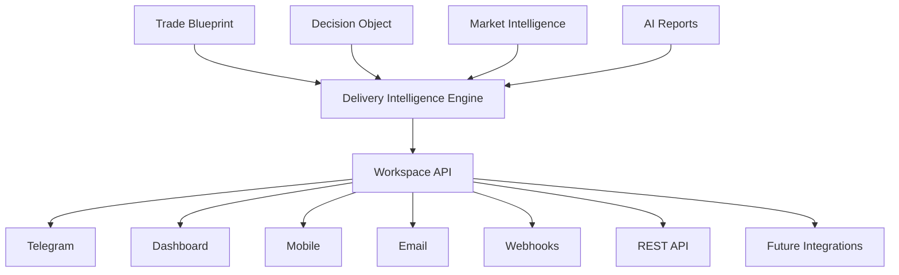
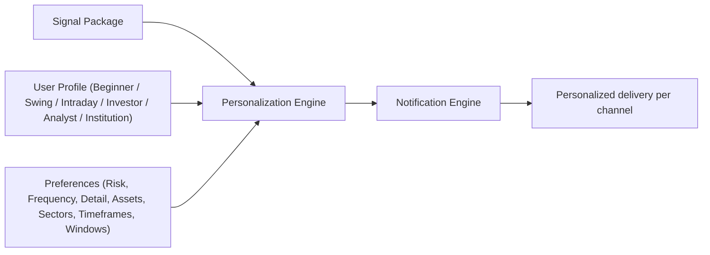

# Volume 8 — User Experience, Delivery & Intelligence Workspace

Volumes 1–7 built a sophisticated quantitative intelligence engine — but users never see any of that machinery directly. They only experience the delivery surfaces: Telegram, dashboard, mobile, notifications, and reports. This volume transforms QuantStack from an internal analytics engine into an **institutional-grade intelligence workspace**, whose objective is to deliver the right intelligence to the right person at the right moment with the appropriate level of detail.

!!! note "Architectural adjustment: Volume 7.5 dropped"
    A previously proposed **Volume 7.5 — AI Agent Ecosystem** has been removed from the roadmap because it would make the architecture less clean. After building the LLM layer (Volume 7), the next logical problem is *how users consume all this intelligence* — not more agents. The platform should not think "send Telegram message"; it should think "deliver the right information, to the right user, at the right time, in the right format." That is an entire engineering discipline, and it becomes Volume 8. The revised sequence is:

    | Stage | Focus |
    |---|---|
    | Volumes 1–6.5 | Platform Intelligence |
    | Volume 7 | LLM Intelligence |
    | Volume 8 | User Experience & Delivery Layer |
    | Volume 9 | Evaluation & Continuous Learning |
    | Volume 10 | Enterprise Infrastructure |
    | Volume 11 | Platform Operations |
    | Volume 12 | Future AI Research |

## Mission

Users experience the platform only through:

- Telegram
- Dashboard
- Mobile
- Notifications
- Reports

The mission of this volume is to make those surfaces as intelligent as the engine behind them:

> Deliver the right intelligence to the right person at the right moment with the appropriate level of detail.

## Core Philosophy

Do **not** build:

```text
Backend → Telegram
```

Instead build:

```text
Platform Intelligence
        ↓
Delivery Engine
        ↓
Personalization
        ↓
Communication
        ↓
User Experience
```

The delivery layer becomes another intelligence engine in its own right.

## Architecture

Platform intelligence artifacts (Trade Blueprint, Decision Object, Market Intelligence, AI Reports) flow into a Delivery Intelligence Engine, which feeds a Workspace API that fans out to every client channel.



## Chapter 1 — Delivery Intelligence Engine

For every piece of intelligence, the platform decides what form it should take:

- Breaking Alert
- Research Report
- Dashboard Update
- Silent Update
- Daily Summary
- Weekly Summary

### Prompt 8.1

```text
Build Delivery Intelligence Engine.

Determine:

Urgency

Audience

Importance

Delivery Channel

Notification Priority

Expiration

Batching

Retry Policy

Output Delivery Plan.
```

## Chapter 2 — Multi-Channel Delivery

Telegram is only one client. Every channel consumes the same Signal Package.

### Prompt 8.2

```text
Support delivery through:

Telegram

Web Dashboard

Mobile App

Email

Discord

Slack

REST API

Webhook

Future Notification Plugins

Every channel consumes the same Signal Package.
```

## Chapter 3 — User Personalization Engine

Every user sees different information, tailored to their profile and preferences.

### Prompt 8.3

```text
Support user profiles.

Examples:

Beginner

Swing Trader

Intraday Trader

Investor

Research Analyst

Institution

Customize:

Risk

Frequency

Detail Level

Preferred Assets

Preferred Sectors

Preferred Timeframes

Notification Windows
```



## Chapter 4 — Dashboard Workspace

This is not a charting application — it is an intelligence workspace. Each module consumes structured platform APIs.

Modules include:

- Market Overview
- Opportunity Feed
- Risk Center
- Simulation Center
- Trade Monitor
- Research Center
- Portfolio View
- Macro Dashboard
- Sector Dashboard
- Learning Dashboard

## Chapter 5 — Executive Dashboard

Decision-makers need summaries, not raw detail.

### Prompt 8.4

```text
Generate Executive Dashboard.

Display:

Market Intelligence Score

Risk Level

Top Opportunities

Major Risks

Macro Events

Sector Rotation

Daily Performance

System Health
```

## Chapter 6 — Quant Dashboard

A dedicated dashboard for researchers, displaying:

- Feature Drift
- SHAP Importance
- Model Agreement
- Prediction Confidence
- Research Leaderboard
- Feature Discovery
- Experiment Queue
- Simulation Results

## Chapter 7 — Trade Workspace

Every signal becomes an interactive workspace, displaying:

- Trade Blueprint
- Simulation Results
- Market Regime
- Risk Assessment
- Historical Analogs
- Live Trade Health
- AI Explanation
- Trade Timeline

## Chapter 8 — Notification Engine

Notifications are intelligent: they avoid duplication and learn from user engagement.

### Prompt 8.5

```text
Generate:

Immediate Alerts

Reminder Alerts

Target Updates

Stop Updates

Risk Warnings

News Updates

Research Updates

Lifecycle Updates

Avoid duplicate notifications.

Learn user engagement.
```

## Chapter 9 — Report Center

Automatically generate:

- Morning Brief
- Pre-Market Report
- Mid-Day Update
- Closing Report
- Weekly Review
- Monthly Review
- Quarterly Review
- Annual Intelligence Report

Reports are supported in PDF, HTML, and Markdown formats.

## Chapter 10 — Search Engine

Everything becomes searchable. Support semantic search across:

- Trades
- Signals
- Reports
- Research
- Features
- Decisions
- Simulations
- Market Narratives
- AI Conversations

## Chapter 11 — Replay Center

Replay any point in time. Users can view:

- Market State
- Decision Object
- Trade Blueprint
- Dashboard
- Telegram Messages
- Reports
- AI Reasoning

!!! warning "Fidelity requirement"
    The replay must reconstruct the **exact** platform state as it existed at that moment — not an approximation.

## Chapter 12 — Learning Center

Instead of static documentation, build an integrated learning workspace supporting:

- Interactive tutorials
- Strategy explanations
- Market regime examples
- Historical case studies
- Trade walkthroughs
- AI-assisted learning

## Chapter 13 — Collaboration

Institutional users need collaboration features:

- Shared watchlists
- Team comments
- Research notes
- Signal annotations
- Approval workflows
- Shared dashboards

## Chapter 14 — Workspace Analytics

Measure platform usage and feed it back into workspace improvements. Track:

- Dashboard usage
- Search activity
- Report readership
- Notification response
- Feature popularity
- User workflows

## Chapter 15 — Accessibility

Support:

- Keyboard navigation
- High contrast themes
- Mobile responsiveness
- Screen readers
- Multi-language
- Timezone awareness

## Chapter 16 — Workspace APIs

Expose APIs for:

- Dashboards
- Reports
- Notifications
- Search
- Replay
- Learning
- Collaboration

## Chapter 17 — Acceptance Criteria

!!! success "Acceptance criteria — before entering Volume 9"
    - All intelligence is available through a unified workspace.
    - Telegram becomes only one delivery channel.
    - Every user receives personalized information.
    - Reports are generated automatically.
    - Historical replay reconstructs the complete workspace.
    - Search covers every major platform artifact.
    - Collaboration supports institutional teams.
    - Workspace analytics continuously improve user experience.

## Recommended Technology Stack

| Layer | Technologies |
|---|---|
| Frontend | Next.js, React, TypeScript, Tailwind CSS, shadcn/ui, React Query, Zustand |
| Visualization | Apache ECharts, TradingView Charts, AG Grid, Leaflet (for macro/event maps) |
| Backend | FastAPI (or NestJS if standardizing on TypeScript), GraphQL + REST, WebSockets, Redis Streams |
| Infrastructure | NATS or Kafka, PostgreSQL, Redis, MinIO, Elasticsearch/OpenSearch |

## Architectural Observation

At this point, the project has evolved well beyond a trading bot. It now resembles an **operating system for quantitative market intelligence**, with modular services for data, research, decision support, AI communication, delivery, and user interaction. The remaining volumes (Evaluation, Infrastructure, Operations, and Future Research) are about making this platform production-ready and continuously improving, rather than adding new analytical capabilities.

## Preview of Volume 9

Volume 9 completes the quantitative platform by building the **Evaluation, Backtesting & Continuous Learning Engine**. Unlike conventional backtesting modules, this system continuously measures every feature, prediction, decision, simulation, trade, AI explanation, and user interaction. The platform becomes self-measuring and self-improving, closing the feedback loop between research, production, and user outcomes.
