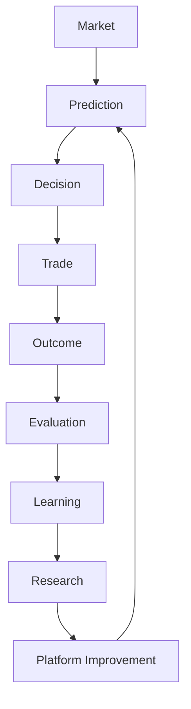
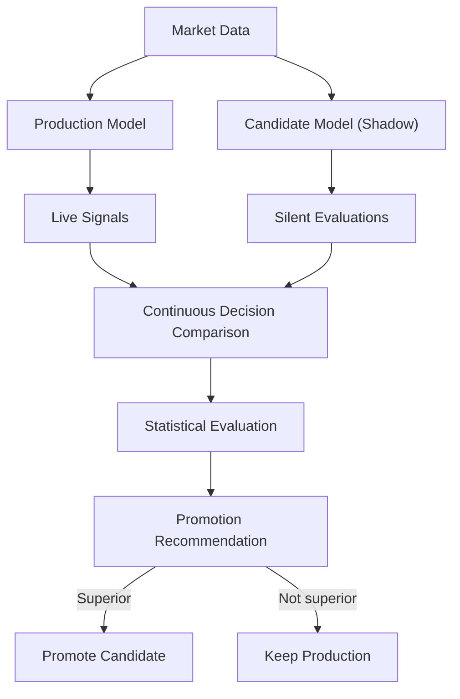

# Volume 9 — Evaluation, Backtesting & Continuous Learning Platform

Volumes 1–8 built a highly capable platform, but one question remains unanswered: **is the platform actually getting better?** Most trading systems backtest once, deploy, and hope. Volume 9 closes that gap by turning every prediction, decision, signal, report, AI explanation, user interaction, market regime, simulation, and failure into measurable data. The result is a self-improving platform that can continuously answer the question: *are we improving?*

## Mission

Everything the platform produces should become measurable:

- Every prediction
- Every decision
- Every signal
- Every report
- Every AI explanation
- Every user interaction
- Every market regime
- Every simulation

The platform should continuously answer:

> **Are we improving?**

## Core Philosophy

| Traditional systems | Institutional systems |
|---|---|
| Train → Deploy → Forget | Train → Deploy → Measure → Evaluate → Learn → Improve → Deploy Again |

!!! note
    Learning never stops. Institutional firms measure everything — every feature, every prediction, every decision, every AI explanation, every user interaction, every market regime, every failure. Everything becomes data.

## Architecture

Every component participates in a single closed feedback loop:



## Chapter 1 — Evaluation Philosophy

The platform should evaluate every dimension of quality. Nothing is exempt:

- Data Quality
- Feature Quality
- Prediction Quality
- Decision Quality
- Risk Quality
- Simulation Quality
- Trade Quality
- AI Quality
- User Quality
- Platform Quality

## Chapter 2 — Universal Evaluation Engine

Every platform module exposes a common evaluation contract so results can be compared across modules and over time.

### Prompt 9.1

```text
Build a Universal Evaluation Engine.

Every platform module exposes:

Inputs

Outputs

Expected Outcome

Actual Outcome

Confidence

Latency

Version

Generate evaluation reports.

Store complete history.

Support cross-module comparisons.
```

## Chapter 3 — Prediction Evaluation

Prediction accuracy alone is insufficient — predictions are scored across classification quality, calibration, and regime-conditional performance.

### Prompt 9.2

```text
Evaluate predictions.

Metrics:

Accuracy

Precision

Recall

F1

AUC

Calibration

Brier Score

Probability Error

Rolling Accuracy

Regime Accuracy

Generate Prediction Score.
```

## Chapter 4 — Trade Evaluation

Every trade becomes an experiment.

### Prompt 9.3

```text
Evaluate completed trades.

Metrics:

Return

Drawdown

Holding Time

Risk Reward

Slippage

Execution Cost

Simulation Accuracy

Generate:

Trade Quality

Execution Quality

Decision Quality

Risk Quality
```

## Chapter 5 — Decision Evaluation

Did the Decision Engine make good choices?

### Prompt 9.4

```text
Evaluate Decision Objects.

Compare:

Decision Score

Actual Outcome

Historical Analog

Risk

Simulation

Generate:

Decision Accuracy

Decision Stability

Decision Drift

Decision Reliability
```

## Chapter 6 — Feature Evaluation

Features should earn their place — and keep earning it.

### Prompt 9.5

```text
Monitor every feature.

Evaluate:

Information Coefficient

SHAP

Importance

Decay

Stability

Generalization

Cross-Regime Performance

Generate feature rankings continuously.
```

## Chapter 7 — Simulation Evaluation

Did simulations match reality?

### Prompt 9.6

```text
Compare:

Digital Twin

Monte Carlo

Stress Tests

Actual Market

Measure:

Simulation Accuracy

Scenario Accuracy

Calibration

Robustness

Simulation Drift
```

## Chapter 8 — AI Evaluation

Even explanations need evaluation.

### Prompt 9.7

```text
Evaluate AI outputs.

Measure:

Correctness

Grounding

Completeness

Consistency

Readability

User Feedback

Generate:

AI Quality Score

Hallucination Rate

Citation Accuracy
```

## Chapter 9 — User Feedback Engine

Users are another data source.

### Prompt 9.8

```text
Collect:

Signal Ratings

Comments

Missed Trades

False Positives

False Negatives

Notification Feedback

Dashboard Usage

Generate user satisfaction metrics.
```

## Chapter 10 — Regime Performance Engine

Performance must be evaluated separately per market regime:

- Bull Markets
- Bear Markets
- Range Markets
- Volatile Markets
- Low Volatility
- Macro Events

The engine supports **per-regime performance** reporting.

## Chapter 11 — Benchmark Engine

The platform is only good if it beats meaningful baselines.

### Prompt 9.9

```text
Benchmark against:

Buy and Hold

Nifty

Sector Index

Simple Moving Average

Baseline ML Models

Previous Platform Versions

Generate benchmark reports.
```

## Chapter 12 — Continuous Learning Engine

Every completed trade becomes training data.

### Prompt 9.10

```text
Automatically collect:

Trade Outcomes

Decision Outcomes

Risk Outcomes

Feature Snapshots

Market States

Store for future model training.

Maintain versioned learning datasets.
```

## Chapter 13 — Experiment Tracking

Everything becomes an experiment. The platform tracks:

- Models
- Features
- Strategies
- Prompts
- Risk Policies
- Decision Rules
- Simulations

Every experiment has:

- Version
- Dataset
- Metrics
- Outcome
- Recommendation

## Chapter 14 — Model Comparison Engine

Compare model generations statistically before anything changes in production.

### Prompt 9.11

```text
Compare:

Production Model

Candidate Model

Research Model

Shadow Model

Evaluate statistically.

Promote only superior models.
```

## Chapter 15 — Shadow Mode

!!! warning
    Never deploy a new model directly. Candidate models must first prove themselves silently against production.

### Prompt 9.12

```text
Support Shadow Mode.

Production generates signals.

Candidate models evaluate silently.

Compare decisions continuously.

Generate promotion recommendations.
```



## Chapter 16 — Platform Health Score

Everything contributes to a single number. Generate:

- Data Score
- Feature Score
- Prediction Score
- Decision Score
- Risk Score
- AI Score
- User Score
- Infrastructure Score

These roll up into one **Platform Health Score**.

## Chapter 17 — Root Cause Analysis

When something fails, find out why. Root cause analysis supports:

- Prediction failures
- Trade failures
- Risk failures
- Simulation failures
- Notification failures
- AI failures

Root cause reports are generated automatically.

## Chapter 18 — Continuous Improvement Dashboard

The dashboard displays:

- Platform Health
- Feature Rankings
- Model Rankings
- Prediction Accuracy
- Decision Accuracy
- Risk Accuracy
- AI Quality
- User Satisfaction
- Experiment Queue
- Learning Progress

## Chapter 19 — APIs

Expose the following via API:

- Evaluation Reports
- Experiment History
- Platform Health
- Learning Datasets
- Benchmark Reports
- Shadow Mode Results
- Root Cause Reports

## Chapter 20 — Acceptance Criteria

!!! success "Acceptance criteria — before entering Volume 10"
    - Every platform component is evaluated.
    - Every completed trade becomes training data.
    - Feature quality is continuously monitored.
    - AI explanations are measured.
    - Shadow deployment supports safe model evolution.
    - Benchmarking compares multiple platform generations.
    - Platform Health Score summarizes overall quality.
    - Root cause analysis explains every major failure.
    - Continuous learning feeds the Alpha Research Platform.

## Recommended Technology Stack

| Concern | Tools |
|---|---|
| Experiment Tracking | MLflow, Weights & Biases (optional), DVC |
| Model Registry | MLflow Registry |
| Data Validation | Great Expectations, Pandera |
| Monitoring | Evidently AI, WhyLabs (optional) |
| Metrics | Prometheus |
| Visualization | Grafana |
| Storage | PostgreSQL, Parquet, MinIO |

## Enhancement — Daily Platform Scorecard

One final improvement before Volume 10: a **Platform Scorecard**, recalculated daily. Instead of tracking isolated metrics, it publishes a single executive report containing:

- Overall Platform Health
- Alpha Generation Score
- Prediction Quality Score
- Decision Quality Score
- Risk Management Score
- AI Quality Score
- User Experience Score
- Operational Reliability Score
- Research Velocity Score
- Technical Debt Score

!!! note
    The scorecard gives operators — and eventually enterprise customers — a single place to understand whether the platform is improving over time, without digging through dozens of dashboards.

## Preview of Volume 10

Volume 10 transforms the platform from an advanced research project into an **enterprise-grade production system**. Topics include:

- Microservice deployment
- Kubernetes architecture
- Docker orchestration
- CI/CD pipelines
- Observability
- Distributed tracing
- Secrets management
- Disaster recovery
- High availability
- Auto-scaling
- Multi-region deployment
- Enterprise security
- Compliance
- Production SRE practices

After Volume 10, the platform will be architecturally complete and ready for real-world deployment.
